# SIMANSET — Sistem Informasi Manajemen Aset Kementerian Pekerjaan Umum
## Reverse-Engineered Software Design Document

| Field | Value |
|---|---|
| **System name** | SIMANSET (title on `/login`); branded "Sistem Manajemen Aset" elsewhere |
| **Target URL** | `https://manajemenaset.idampalada.com/` |
| **Document version** | 1.0 |
| **Date of analysis** | 31 July 2026 |
| **Method** | Black-box + grey-box reverse engineering: authenticated browsing, DOM/asset inspection, network capture, and the application's own exposed CodeIgniter Debug Toolbar |
| **Access level used** | Authenticated session, role `user` (session key `user_role = user`) |
| **Intended use** | Foundation for an SRS / SDD / redevelopment project |

---

## How to Read This Document

Two markers are used throughout, and they are **not** interchangeable.

> **Observation**
>
> A fact directly verified against the live application — seen in the DOM, an HTTP response, a JSON API payload, a network request, the route table, or the debug toolbar. If it is marked as an Observation, it was actually seen.

> **Assumption**
>
> An inference. The reasoning is always stated. Assumptions may be wrong and must be validated against source code or the development team before being relied upon.

Where a figure or a name is uncertain, this is said explicitly rather than smoothed over. Sections 6, 13 and 15 in particular mix hard evidence with inference, and the boundary is marked in every case.

### A note on evidence quality

This analysis is unusually well-grounded for a black-box exercise, because the application ships with **`CI_ENVIRONMENT = development`** in production. That means the CodeIgniter Debug Toolbar, Kint, full exception stack traces, the complete route table, the executed SQL, and the loaded PHP file list are all reachable from the browser. Most of what would normally be assumption in a document like this is therefore observation.

That same fact is itself the single most serious finding in this report — see [§15 Security Design](#15-security-design).

---

## Table of Contents

1. [Overview](#1-overview)
2. [Technology Assumptions](#2-technology-assumptions)
3. [Information Architecture](#3-information-architecture)
4. [Feature Breakdown](#4-feature-breakdown)
5. [Page-by-Page Design](#5-page-by-page-design)
6. [Data Model](#6-data-model)
7. [ER Diagram](#7-er-diagram)
8. [User Roles](#8-user-roles)
9. [User Flow](#9-user-flow)
10. [Business Process](#10-business-process)
11. [UI Components](#11-ui-components)
12. [Design System](#12-design-system)
13. [API Design](#13-api-design)
14. [Validation Rules](#14-validation-rules)
15. [Security Design](#15-security-design)
16. [File Storage](#16-file-storage)
17. [Notification System](#17-notification-system)
18. [Reports](#18-reports)
19. [Non-functional Requirements](#19-non-functional-requirements)
20. [Future Improvements](#20-future-improvements)
21. [Rebuild Recommendation](#21-rebuild-recommendation)
22. [Appendix](#22-appendix)

---

# 1. Overview

## 1.1 Purpose of the System

> **Observation**
>
> The public landing page states the purpose as *"Kelola Aset PU: Efisien, Terstruktur, dan Terintegrasi"* and advertises three service pillars: **Inventarisasi Aset**, **Monitoring Aset**, and **Pelaporan Aset**. The login page describes it as *"Sistem Informasi Manajemen Aset Kementerian Pekerjaan Umum secara terpadu dan efisien."* The footer carries *"Hak Cipta © Kementerian Pekerjaan Umum"* and the contact address *Jl. Pattimura No.20, Kebayoran Baru* — the Ministry of Public Works headquarters in Jakarta.

Despite the generic "asset management" framing of the marketing pages, the authenticated application is materially narrower and more specific. What is actually implemented is a **shared-resource booking, custody and accountability system** for three asset classes:

| Domain | Indonesian term | What the system actually does |
|---|---|---|
| **Vehicles** | Kendaraan | Full lifecycle: registration, borrowing request, approval, official letter generation, return, condition assessment, maintenance scheduling, damage/incident reporting |
| **Rooms** | Ruangan | Time-slot booking against 8 buildings, availability calendar, cancellation, admin schedule adjustment |
| **Goods** | Barang | QR-code-driven borrow/return, plus a BMN-structured master-data catalogue |

Layered underneath is a second, distinct purpose: a **BMN (Barang Milik Negara) master-data catalogue** mirroring the official Indonesian state asset classification, populated by synchronisation from an external national system.

> **Observation**
>
> `/user/barang` renders exactly the seven statutory BMN asset classes: *Tanah; Peralatan dan Mesin; Gedung dan Bangunan; Jalan, Irigasi dan Jaringan; Aset Tetap Lainnya; Konstruksi Dalam Pengerjaan; Aset Tak Berwujud*. Drilling into *Peralatan dan Mesin* renders the official *bidang* codes `3.01` through `3.19` (ALAT BESAR, ALAT ANGKUTAN, … PERALATAN OLAHRAGA).

> **Observation**
>
> Leaf catalogue pages expose two buttons, **Import/Sync API** and **Reset Data**, with the explanatory text: *"Import/Sync API: Mengambil data dari API Peralatan dan Mesin Non-TIK kategori 3.05 (Alat Kantor dan Rumah Tangga)"*. The route table contains a family of `siman-*` routes (`siman-sync-all`, `siman-extract-batch`, `siman-schema`, `siman-auto-sync`, and others).

> **Assumption**
>
> `SIMAN` refers to **Sistem Informasi Manajemen Aset Negara**, the national state-asset system operated by DJKN, Ministry of Finance. The catalogue module is therefore a downstream mirror of SIMAN data rather than a system of record. I could not inspect the outbound integration configuration, so the upstream host, authentication method and refresh cadence are unknown.

### 1.1.1 Purpose statement (proposed, for an SRS)

> SIMANSET provides Ministry of Public Works personnel with a single, auditable channel for requesting, approving, using and returning shared operational assets — official vehicles, meeting rooms and portable goods — while maintaining a synchronised register of the Ministry's BMN holdings and producing the statutory documentation (surat permohonan, surat jalan, berita acara) that each transaction requires.

## 1.2 Target Users

> **Observation**
>
> The registration form collects `fullname`, `username`, `email`, `unit_organisasi`, `unit_kerja`, `password`, `pass_confirm`. The `unit_organisasi` dropdown lists the eleven Echelon-I units of the Ministry (Sekretariat Jenderal, Inspektorat Jenderal, the six Directorates-General, BPIW, BPSDM, BPJT). The `unit_kerja` dropdown on `/user/profile` lists Echelon-II units (Biro Perencanaan…, Biro Keuangan, Biro Umum, Biro Pengelolaan Barang Milik Negara, Pusat Data dan Teknologi Informasi, and others).

> **Observation**
>
> The public Terms & Conditions text states: *"Pengguna harus mendaftarkan akun dengan email kedinasan @pu.go.id"* and *"Pengguna merupakan karyawan/karyawati Kementerian PUPR."*

| User group | Description | Primary need |
|---|---|---|
| **Staff / Pegawai** (`role = user`) | Any ministry employee with a `@pu.go.id` address | Book a room, request a vehicle, borrow equipment |
| **Penanggung Jawab** | The named accountable officer for a vehicle loan; may or may not be the requester | Sign for custody, provide NIP/NRP, KTP, home address, rank |
| **Pengemudi (Driver)** | Named on the vehicle request; not a system account | — (recorded as data only) |
| **Asset Administrator / Verifikator** | Reviews and approves loan and return requests, generates official letters, edits the asset register | Approve, reject, adjust booking times, issue letters |
| **Maintenance / Fleet Officer** | Schedules servicing, records damage, incidents and enforcement actions | Maintenance calendar, cost tracking |
| **Management / Pimpinan** | Consumes dashboards and statistics | Utilisation trends, compliance, cost |

> **Assumption**
>
> The last four groups are **functional** roles inferred from the feature set. The system's own technical role model is much cruder — see [§8](#8-user-roles), where evidence shows only a `user_role` session string with `user` as one confirmed value, and RBAC that is enforced inconsistently.

## 1.3 Main Business Objectives

Derived from the implemented feature set rather than from any published charter:

1. **Accountability of custody.** Every vehicle loan captures a named responsible officer with NIP/NRP, KTP number, home address, rank/grade and mobile number, and produces signed documentation. This is the dominant design theme in the vehicle module.
2. **Statutory documentation.** The system generates and stores *surat permohonan*, *surat jalan*, *surat penanggung jawab*, *surat pengembalian* and *berita acara pengembalian*, with electronic-signature variants.
3. **Utilisation visibility.** Dashboards report totals, availability, pending verifications and active loans per asset class, with monthly/weekly/daily trend charts.
4. **Preventive maintenance.** Scheduled servicing with type, date, workshop and cost, plus damage, incident, compliance and enforcement registers.
5. **BMN register alignment.** Synchronisation of the ministry's asset catalogue against SIMAN.
6. **Reduced friction for low-risk resources.** Room booking is deliberately approval-free (see the business rule in [§4.3](#43-room-booking-management)).

## 1.4 High-Level Architecture

> **Observation**
>
> The application is a **classic server-rendered PHP monolith**. There is no SPA framework: `window.React`, `window.Vue`, `window.Alpine` and `window.Livewire` are all `false`; pages are full HTML documents produced by server-side views, progressively enhanced with jQuery and vanilla `fetch()` calls to JSON endpoints on the same origin.

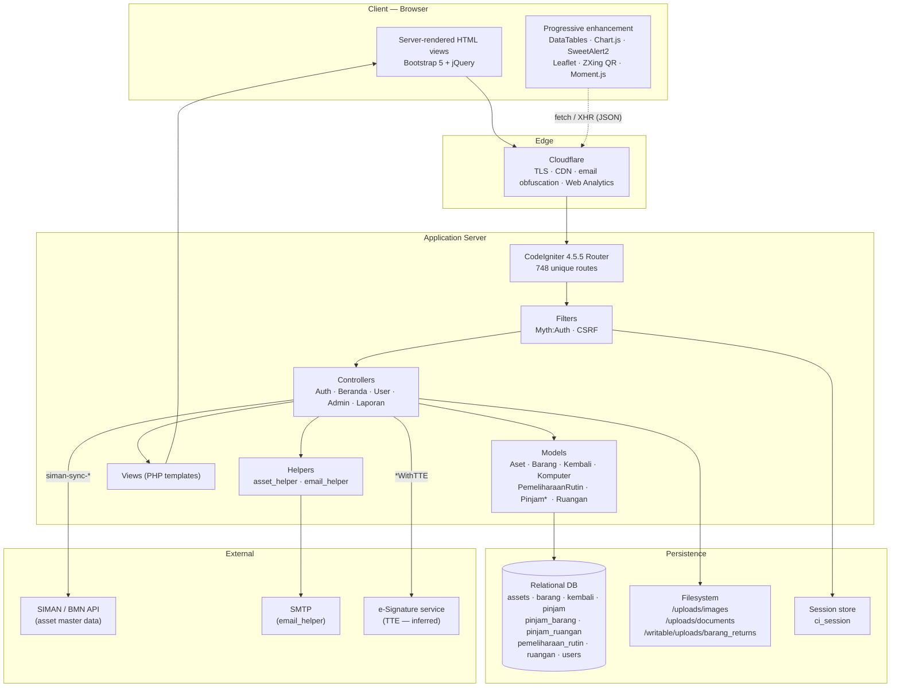

> **Observation**
>
> Cloudflare is confirmed by the `static.cloudflareinsights.com/beacon.min.js` request, the `/cdn-cgi/l/email-protection` links used to obfuscate the contact address, and the `/cdn-cgi/` path family.

> **Assumption**
>
> The TTE (Tanda Tangan Elektronik) integration is inferred from route names `admin/AsetKendaraan/updateSuratWithTTE` and `admin/AsetKendaraan/generateSuratPenanggungJawabKdfWithTTE`, plus the asset files `ttesurat.js` and `ttesuratpermohonan.js`. In Indonesian government systems this normally means **BSrE** (Balai Sertifikasi Elektronik, BSSN). **I have no direct evidence of the provider, the protocol, or whether the integration is live** — I did not exercise the signing flow. Treat the whole TTE subsystem as unverified.

## 1.5 Deployment Topology

> **Observation**
>
> The debug toolbar's System Configuration panel reports, verbatim:
>
> | Key | Value |
> |---|---|
> | CodeIgniter Version | `4.5.5` |
> | PHP Version | `8.2.12` |
> | PHP SAPI | `cli-server` |
> | Environment | `development` |
> | Base URL | `https://manajemenaset.idampalada.com/` |
> | Timezone | `Asia/Jakarta` |
> | Locale | `id` |
> | Content Security Policy Enabled | `No` |
>
> Exception traces disclose the document root as `C:\xampp\htdocs\mapu\`.

This is architecturally significant and worth stating plainly:

- **`PHP SAPI: cli-server`** means requests are being served by PHP's **built-in development web server** (`php spark serve` / `php -S`), not Apache or Nginx — despite XAMPP being installed. The PHP manual explicitly states this server is *not* intended for production use: it is single-threaded per process, has no request queueing, no static-file optimisation, and minimal hardening.
- **Windows + XAMPP** is a development-workstation stack.
- **`Environment: development`** disables production error suppression and enables the debug toolbar.

> **Assumption**
>
> The deployment is a **development build exposed to the public internet through a Cloudflare tunnel or reverse proxy**, rather than a hardened production deployment. This is consistent with the "Beta Version 1.0" badge on the landing page. I cannot see the tunnel configuration, so this is inference — but the `cli-server` SAPI combined with a public HTTPS hostname leaves few alternatives.

---

# 2. Technology Assumptions

The heading is retained for consistency with the requested structure, but most of this section is **observation, not assumption**.

## 2.1 Summary Matrix

| Layer | Technology | Confidence | Evidence |
|---|---|---|---|
| **Language** | PHP 8.2.12 | **Confirmed** | Debug toolbar System Configuration |
| **Framework** | CodeIgniter 4.5.5 | **Confirmed** | Debug toolbar; `csrf_test_name`; `/__hot-reload`; exception class `CodeIgniter\Exceptions\PageNotFoundException`; `vendor/codeigniter4/framework` in traces |
| **Authentication** | Myth:Auth (`myth/auth`) | **Confirmed** | `/forgot` renders `VENDORPATH\myth\auth\src\Views\forgot.php`; page title "Myth:Auth"; `LocalAuthenticator`, `AuthenticationBase`, `GroupModel`, `PermissionModel`, `LoginModel`, `UserModel` all loaded |
| **Web server** | PHP built-in dev server (`cli-server`) behind Cloudflare | **Confirmed** | Debug toolbar `PHP SAPI`; Cloudflare beacon + `/cdn-cgi/` |
| **OS / Host** | Windows, XAMPP, path `C:\xampp\htdocs\mapu` | **Confirmed** | Exception stack traces |
| **Database** | Relational; **PostgreSQL or SQLite** rather than MySQL | **Inferred — see 2.4** | Executed SQL uses `"double-quoted"` identifiers |
| **Templating** | CodeIgniter native PHP views | **Confirmed** | `DEBUG-VIEW START … app/Views/admin/index.php` markers |
| **CSS framework (app)** | Bootstrap 5.1.3 (JS) / 5.3.0 (CSS) | **Confirmed** | Network requests |
| **CSS framework (landing/login)** | Tailwind CSS via `cdn.tailwindcss.com` | **Confirmed** | `window.tailwind === true`; script tag |
| **Admin theme** | Mazer (or a close derivative) | **Likely** | `assets/css/app.css`, `assets/css/bootstrap.css`, `assets/vendors/iconly/bold.css`, `assets/vendors/perfect-scrollbar/` — the exact asset layout Mazer ships |
| **DOM library** | jQuery 3.6.0 | **Confirmed** | Network request |
| **Tables** | DataTables 1.11.5 **and** 1.13.6 + Responsive 2.2.9 | **Confirmed** | Network requests (both versions loaded on the same page) |
| **Charts** | Chart.js + `chartjs-plugin-datalabels@2` | **Confirmed** | Network requests |
| **Dialogs / toasts** | SweetAlert2 v11 | **Confirmed** | Network request; `Swal.fire` in `dashboard.js` |
| **Maps** | Leaflet 1.9.4 | **Confirmed** | Network request; `#trackingMapModal` "Peta Lokasi Kendaraan" |
| **Dates** | Moment.js 2.29.1 | **Confirmed** | Network request |
| **QR / barcode** | ZXing (`@zxing/library@latest`) | **Confirmed** | Script tag on `/user/scan` |
| **Icons** | Bootstrap Icons 1.11.3 + Iconly Bold | **Confirmed** | Network requests |
| **Fonts** | Nunito (Google Fonts) | **Confirmed** | `fonts.googleapis.com/css2?family=Nunito…` |
| **Debug tooling** | CI4 Debug Toolbar + Kint | **Confirmed** | `?debugbar`, `?debugbar_time=`, `.kint-rich` CSS in `/forgot` |
| **Session** | CI4 session, cookie `ci_session` | **Confirmed** | Debug toolbar cookie table |
| **CDN / Edge** | Cloudflare | **Confirmed** | Beacon, `/cdn-cgi/` |
| **Exports** | Excel + PDF server-side | **Confirmed (routes)** | `admin/pemeliharaan-rutin/export-excel`, `…/export-pdf` |
| **Excel library** | PhpSpreadsheet | **Assumption** | De facto standard for CI4; not directly observed |
| **PDF library** | Dompdf or mPDF | **Assumption** | Not directly observed |

## 2.2 Frontend

> **Observation**
>
> The application uses **two entirely different styling systems**:
>
> - The **public landing page and login page** load `https://cdn.tailwindcss.com/` — the runtime JIT CDN build of Tailwind, which compiles utility classes in the browser.
> - The **authenticated application** loads Bootstrap 5, a Mazer-style `app.css`/`bootstrap.css` pair, Iconly, and perfect-scrollbar.

This split is a maintainability problem worth flagging early. It means two design vocabularies, two sets of spacing and colour scales, and no shared component layer. It also means the login page depends on a third-party CDN executing at runtime — Tailwind's own documentation states `cdn.tailwindcss.com` must not be used in production.

> **Observation**
>
> Two different DataTables versions (1.11.5 and 1.13.6) plus two Bootstrap versions (5.1.3 JS, 5.3.0 CSS) are loaded on the same page, and two copies of `dashboard.js` are requested (one cache-busted, one not). Several assets 404/503: `/js/dashboard_chart.js` → **503**, `/assets/js/letterhead-surat.js` → **503**.

> **Assumption**
>
> There is no build pipeline. Scripts are hand-included per view with `?v=<unix-timestamp>` cache-busting, and a global "kitchen sink" include block loads ~18 module scripts on every page regardless of need. The duplicate library versions are accidental rather than deliberate.

**Per-module JavaScript observed** (all under `/assets/js/`, all loaded globally):

| File | Purpose |
|---|---|
| `main.js` | Shared bootstrap |
| `homepage.js`, `homepageextend.js` | Vehicle catalogue, borrow/return modals |
| `mainpage.js` | Landing dashboard statistics |
| `dashboard.js` (93 KB) | Admin dashboard, verification, charts, user role management |
| `booking-ruangan.js`, `daftar-booking.js`, `calendar-booking.js`, `ubah-jam.js` | Room booking, my-bookings list, calendar, admin time adjustment |
| `scanbarang.js`, `pinjam-barang.js` | QR scan and goods borrowing |
| `timeline-peminjaman.js` | Per-asset loan timeline |
| `laporan.js` | Maintenance report table, filters, exports |
| `ttesurat.js`, `ttesuratpermohonan.js` | Letter generation and e-signature |
| `letterhead-surat.js` | **Returns HTTP 503 — missing** |
| `image-preview.js` | Image lightbox |
| `auth.js` | Login / register / forgot AJAX validation |

## 2.3 Backend

> **Observation**
>
> Loaded application classes, harvested from the debug toolbar's Files panel across nine pages:
>
> **Controllers:** `BaseController`, `Beranda`, `Auth`, `Admin\Aset`, `Admin\Dashboard`, `Admin\Riwayat`, `Laporan`, `User\Barang`, `User\Homepage`, `User\Mainpage`, `User\Ruangan`, `User\Scan`
> **Models:** `AsetModel`, `BarangModel`, `KembaliModel`, `KomputerModel`, `PemeliharaanRutinModel`, `PinjamBarangModel`, `PinjamModel`, `PinjamRuanganModel`, `RuanganModel`
> **Helpers:** `asset_helper`, `email_helper`
> **Myth:Auth:** `UserModel`, `GroupModel`, `PermissionModel`, `LoginModel`, `User` entity, `LocalAuthenticator`, `AuthenticationBase`
>
> The route table additionally references controllers not loaded on the pages I sampled — including `AsetKendaraan`, `PemeliharaanRutin`, `SuratJalan`, `Ruangan`, `Admin\Users`, `Admin\VerifikasiRuangan`, `Siman*`.

> **Observation**
>
> The route table contains **748 unique route definitions**: 546 `GET`, 198 `POST`, **3 `DELETE`**, 1 `CLI`.

The verb distribution is itself a design finding. With 198 POST routes and only 3 DELETE routes and zero PUT/PATCH, the API is **RPC-over-POST**, not REST. Deletion is almost always modelled as `POST …/delete/{id}`.

## 2.4 Database

> **Observation**
>
> Confirmed physical table names, extracted from SQL captured in the debug toolbar across eleven pages:
>
> `assets`, `barang`, `kembali`, `pemeliharaan_rutin`, `pinjam`, `pinjam_barang`, `pinjam_ruangan`, `ruangan`, `users`
>
> Example captured query:
> ```sql
> SELECT "pinjam"."tanggal_pinjam", "pinjam"."tanggal_kembali", "pinjam"."status",
>        "assets"."no_polisi", "assets"."merk"
> FROM "pinjam"
> LEFT JOIN "assets" ON "assets"."id" = "pinjam"."kendaraan_id"
> ORDER BY "pinjam"."tanggal_pinjam" DESC LIMIT 10
> ```

> **Assumption — flagged as uncertain**
>
> The DBMS is **not MySQL/MariaDB**. CodeIgniter 4's MySQLi driver escapes identifiers with backticks (`` `users` ``); the captured SQL consistently uses double quotes (`"users"`), which is the escaping used by CI4's **Postgre** and **SQLite3** drivers. Given the XAMPP host, SQLite is plausible for a development build; PostgreSQL is plausible for a system intended to scale.
>
> **I could not confirm which.** This should be the first thing verified against `app/Config/Database.php`. It materially affects the rebuild plan in [§21](#21-rebuild-recommendation).

> **Observation**
>
> Soft deletes are in use. `assets`, `pinjam`, `kembali`, `barang` and `users` all carry a `deleted_at` column, and every captured query appends `AND "…"."deleted_at" IS NULL`. This is CodeIgniter's `$useSoftDeletes = true` model behaviour.
>
> One captured query shows a duplicated predicate — `WHERE "kembali"."status" = 'pending' AND "kembali"."deleted_at" IS NULL AND "kembali"."deleted_at" IS NULL` — indicating a manual `where()` clause layered on top of the model's automatic soft-delete scope.

## 2.5 Authentication

> **Observation**
>
> Authentication is **Myth:Auth**, confirmed beyond doubt: `/forgot` renders `VENDORPATH\myth\auth\src\Views\forgot.php` inside `…\layout.php`, its `<body>` contains the literal string "Myth:Auth", and the session-check query originates from `myth\auth\src\Authentication\AuthenticationBase.php:130` via `LocalAuthenticator.php:67`.

Myth:Auth brings a fixed schema: `users`, `auth_groups`, `auth_groups_users`, `auth_permissions`, `auth_groups_permissions`, `auth_users_permissions`, `auth_logins`, `auth_tokens`, `auth_reset_attempts`, `auth_activation_attempts`. Password hashing is PHP `password_hash()` with bcrypt.

> **Observation**
>
> The route table exposes the standard Myth:Auth account lifecycle: `activate-account`, `resend-activate-account`, `forgot`, `reset-password`, plus AJAX validators `POST check-username`, `POST check-email`, `POST check-email-forgot`.

> **Observation — important discrepancy**
>
> Although `GroupModel` and `PermissionModel` are loaded, the session does **not** rely on Myth:Auth groups for authorisation. The session payload is:
> ```
> logged_in    27
> user_role    user
> redirect_url https://manajemenaset.idampalada.com/mainpage
> ```
> A bespoke `user_role` string sits alongside Myth:Auth. See [§8](#8-user-roles) and [§15](#15-security-design).

## 2.6 Storage

> **Observation**
>
> Three distinct upload locations are referenced in client code:
>
> | Path | Content | Referenced by |
> |---|---|---|
> | `/uploads/images/{filename}` | Vehicle photographs | `dashboard.js` |
> | `/uploads/documents/{filename}` | Room booking `surat_permohonan` PDFs | `daftar-booking.js` |
> | `/writable/uploads/barang_returns/{filename}` | Goods return photographs | `scanbarang.js` |
>
> Stored filenames follow CodeIgniter's `getRandomName()` convention: `1759826516_626e4e421e7df04280f7.jpg`, `1745568510_b2317b74ad0342c281fb.pdf` — a Unix timestamp, underscore, 20 hex characters.

> **Observation — security-relevant**
>
> `/writable/uploads/…` is served over HTTP. In a correct CodeIgniter deployment the document root is `public/` and `writable/` sits **above** it, unreachable by URL. Its reachability here confirms the document root is the project root, not `public/`.

## 2.7 Deployment

Covered in [§1.5](#15-deployment-topology). In summary: Windows/XAMPP, PHP built-in server, `development` environment, fronted by Cloudflare, no evidence of CI/CD, containers, or a build step. Asset cache-busting is manual `?v=<timestamp>`.

---

# 3. Information Architecture

## 3.1 Navigation Model

> **Observation**
>
> The authenticated application uses a **horizontal top navigation bar only**. There is no sidebar anywhere in the authenticated area — a notable divergence from the Mazer admin theme whose CSS it loads, which is sidebar-first. The bar is fixed at the top, left-aligned ministry logo, centre-aligned menu, right-aligned logout and username.

### Top bar — exact contents

| Label | Type | Target |
|---|---|---|
| *(logo)* | Link | `/mainpage` |
| Home | Link | `/mainpage` |
| Barang | Link | `/user/barang` |
| Scan | Link | `/user/scan` |
| Kendaraan | Link | `/homepage` |
| Ruangan | Link | `/user/ruangan` |
| Profile | Link | `/user/profile` |
| Dashboard | Link | `/admin/dashboard` |
| History | **Dropdown** | → Peminjaman & Pengembalian `/admin/riwayat`<br/>→ Pemeliharaan `/admin/laporan/pemeliharaan-rutin` |
| Daftar | **Dropdown** | → Daftar Pengguna `/admin/daftar-pengguna`<br/>→ Daftar Aset `/admin/daftar-aset` |
| Logout | Link | `/logout` |
| *username* | Text/link | — |

> **Observation — IA inconsistency**
>
> Route naming is inconsistent in a way that will confuse maintainers:
> - **Vehicles** live at `/homepage` — not `/user/kendaraan`.
> - **Home/dashboard-for-users** lives at `/mainpage`.
> - Rooms, goods, scan and profile correctly live under `/user/…`.
> - Controller casing is mixed in routes: `/AsetKendaraan/pinjam`, `/User/Ruangan/getBookingPublik`, `/admin/User/Barang/verifikasiPeminjaman`, `/admin/user/barang/verifikasiPeminjaman` — the same logical endpoint appears with different capitalisation.

> **Observation**
>
> The `Dashboard`, `History` and `Daftar` items — all pointing into `/admin/…` — are rendered **unconditionally**, including for a session whose `user_role` is `user`. Menu visibility is not role-filtered.

## 3.2 Site Tree

```
SIMANSET
│
├── PUBLIC (unauthenticated)
│   ├── /                                    Landing (Beranda)
│   │   ├── #beranda                         Hero
│   │   ├── #services                        Layanan Kami (3 cards)
│   │   └── #faq                             FAQ accordion (4 items)
│   ├── /login                               SIMANSET — Masuk
│   ├── /register                            Daftar (+ T&C, Privacy modals)
│   ├── /forgot                              Lupa kata sandi        [Myth:Auth view]
│   ├── /reset-password                                             [Myth:Auth view]
│   ├── /activate-account                                           [Myth:Auth view]
│   └── /resend-activate-account                                    [Myth:Auth view]
│
└── AUTHENTICATED
    │
    ├── /mainpage                            Home — statistics + status tables + trend charts
    │   └── /mainpage/status-kendaraan
    │
    ├── /homepage                            KENDARAAN (vehicle catalogue)
    │   ├── card view / list view toggle
    │   ├── filters: Cari · Kategori · Status
    │   └── per-asset actions
    │       ├── Pinjam Kendaraan            → modal, 2-step wizard
    │       ├── Kembalikan Kendaraan        → modal (when Dipinjam)
    │       ├── Status                      → Peta Lokasi Kendaraan (Leaflet)
    │       ├── Timeline                    → Verifikasi Peminjaman & Pengembalian
    │       ├── Dokumen                     → letters (when Dipinjam)
    │       ├── Edit                        → Form Edit Kendaraan
    │       └── Hapus
    │
    ├── /user/ruangan                        RUANGAN — building picker (8 buildings)
    │   └── /user/ruangan/{gedung}
    │       ├── Tab: Booking Ruangan         room cards + availability
    │       ├── Tab: Daftar Booking Saya
    │       ├── Tab: Pengaturan Ruangan      [Admin Only]
    │       ├── Pemberitahuan Booking Ruangan (collapsible)
    │       └── Kalender Booking Ruangan     (collapsible)
    │
    ├── /user/barang                         BARANG — BMN catalogue root (7 classes)
    │   ├── /user/tanah/kelompoktanah
    │   ├── /user/barang/peralatandanmesin           (bidang 3.01–3.19)
    │   │   └── /{bidang}/kelompok{bidang}           leaf: table + Import/Sync + Reset
    │   ├── /user/barang/gedungdanbangunan
    │   │   └── bangunangedung · monumen · tugutitikkontrol
    │   ├── /user/barang/jalanirigasijaringan
    │   │   └── jalandanjembatan · bangunanair · instalasi · jaringan
    │   ├── /user/barang/asettetaplainnya
    │   ├── /user/barang/konstruksidp
    │   └── /user/barang/asettakberwujud
    │
    ├── /user/scan                           SCAN — QR borrow/return for goods
    │   ├── QR Code Scanner (camera)
    │   ├── Manual code entry
    │   ├── Hasil Scan
    │   └── Riwayat Peminjaman Saya
    │
    ├── /user/profile                        Profil Saya
    ├── /user/riwayat                        My loan history
    │
    ├── /admin/dashboard                     ADMIN DASHBOARD
    │   ├── 12 statistic cards (3 domains × 4 metrics)
    │   ├── Quick actions: Tambah · Buat Jadwal Pemeliharaan · Verifikasi · Buat Laporan
    │   └── 3 chart panels, each Bulanan/Mingguan/Harian
    │
    ├── /admin/riwayat                       HISTORY hub
    │   ├── /admin/riwayat/kendaraan         tabs: Peminjaman | Pengembalian
    │   ├── /admin/riwayat/ruangan
    │   └── /admin/riwayat/barang
    │
    ├── /admin/daftar-aset                   Asset register table
    ├── /admin/daftar-pengguna               User register            [BLOCKED for role=user]
    │
    └── /admin/laporan                       REPORTS
        ├── /pemeliharaan-rutin              Jadwal Pemeliharaan Rutin  (+ Excel/PDF export)
        ├── /riwayat-pemeliharaan            Riwayat Pemeliharaan
        ├── /kerusakan                       Laporan Kerusakan Kendaraan
        ├── /insiden                         Laporan Insiden Kendaraan
        ├── /kepatuhan                       Pemantauan Kepatuhan
        ├── /penertiban                      Tindakan Penertiban
        ├── /statistik-aset                  Statistik Aset Kendaraan
        ├── /statistik
        └── /analisis                        [HTTP 500 — broken]
```

## 3.3 Dashboard Layout

> **Observation** — `/admin/dashboard`, top to bottom:
>
> 1. Greeting `Selamat Datang, {fullname}` + subtitle "Dashboard Manajemen Aset", with a right-aligned date badge (`31 July 2026`).
> 2. **A 4 × 3 grid of statistic cards** — one row per asset class, four metrics per row:
>
> | Row | Total | Available | Awaiting verification | In use |
> |---|---|---|---|---|
> | Kendaraan | 18 | 14 | 0 | 1 (Peminjaman Aktif) |
> | Ruangan | 18 | 18 | 0 | 0 (Ruangan Digunakan) |
> | Barang | 8 | 7 | 1 | 1 (Barang Digunakan) |
>
> 3. Quick-action buttons: **Tambah**, **Buat Jadwal Pemeliharaan**, **Verifikasi**, **Buat Laporan**.
> 4. Three chart panels, each with a `Tampilkan Berdasarkan` selector offering **Bulanan / Mingguan / Harian**, rendering Chart.js line charts with datalabels (e.g. "Statistik Peminjaman Bulanan").

> **Observation — data inconsistency worth investigating**
>
> `/mainpage` and `/admin/dashboard` disagree, on the same day, for the same tenant:
>
> | Metric | `/mainpage` | `/admin/dashboard` | `/homepage` |
> |---|---|---|---|
> | Total Kendaraan | 18 | 18 | 18 |
> | Kendaraan Tersedia | 14 | 14 | **17** |
> | Total Ruangan | **19** | **18** | — |
> | Ruangan Tersedia | **19** | **18** | — |
>
> Three different pages compute the same statistic differently. Almost certainly three independent aggregation queries with different `WHERE` clauses (some counting `Dalam Verifikasi` as available, some not; some including soft-deleted or inactive rooms).

## 3.4 User Menu

> **Observation**
>
> There is no user dropdown. The top bar shows a plain `Logout` link and the username as static text. Profile editing is a separate top-level nav item (`Profile` → `/user/profile`). There is no avatar, no notification bell, no settings menu, and no theme switcher.

---

# 4. Feature Breakdown

## 4.1 Vehicle Asset Management

### Purpose
Maintain the register of official vehicles (kendaraan dinas) with BMN-compatible identifiers and operational condition.

### Main Actions

| Action | Route | Verb | Confirmed |
|---|---|---|---|
| List / browse | `/homepage` | GET | ✅ |
| Fetch as JSON | `/AsetKendaraan/getKendaraan` | GET | ✅ |
| Create | `/admin/AsetKendaraan/tambah` | POST | ✅ (route) |
| Edit | `/admin/AsetKendaraan/edit/{id}` | POST | ✅ (route + modal `#modalEditAset`) |
| Delete | `/admin/AsetKendaraan/delete/{id}` | DELETE | ✅ (route) |
| Detail | `/admin/daftar-aset/detail/{id}` | GET | ✅ (JSON verified) |
| Timeline | `/aset/get-timeline-data/{id}` | GET | ✅ (JSON verified) |
| Location map | modal `#trackingMapModal` + `tracking-api` | GET | ✅ (route) |

### CRUD Capability

| C | R | U | D |
|---|---|---|---|
| ✅ | ✅ | ✅ | ✅ (soft delete — `deleted_at`) |

### Fields

> **Observation** — the `Form Edit Kendaraan` modal (`#modalEditAset`) posts exactly:
> `id`, `kategori_id`, `kode_barang`, `nup`, `merk`, `warna`, `tahun_pembuatan`, `kapasitas`, `no_polisi`, `nomor_mesin`, `no_rangka`, `no_stnk`, `no_bpkb`, `kondisi`, `gambar_mobil` (file), with `enctype="multipart/form-data"`.

### Categories

> **Observation** — the `Kategori` filter on `/homepage` offers three values, and `kategori_id` is stored as a **string code**, not a numeric FK (verified: `"kategori_id": "KDF"`):
>
> | Code | Filter label as rendered |
> |---|---|
> | `KDJ` | Kendaraan Dinamis Jalan |
> | `KDO` | Kendaraan Dinamis Off-road |
> | `KDF` | Kendaraan Dinamis Fasilitas |

> **Assumption**
>
> "Dinamis" is almost certainly a typo for **"Dinas"** (official/service vehicle) — *Kendaraan Dinas Jalan / Operasional / Fasilitas* is standard Indonesian government fleet terminology, and "dynamic off-road vehicle" is not a meaningful category. Worth correcting on rebuild.

### Status Lifecycle

> **Observation** — `assets.status_pinjam` values seen in live data: `Tersedia`, `Dipinjam`, `Dalam Verifikasi`, `Dalam Verifikasi Pengembalian`.

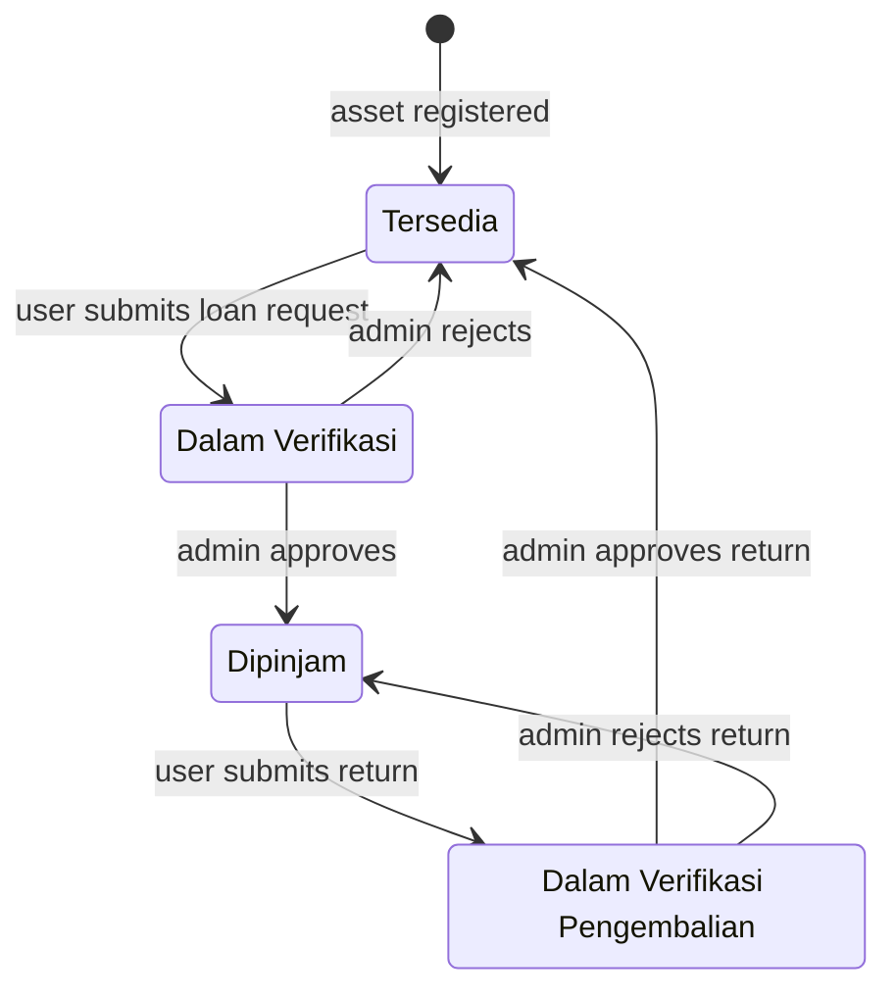

### Condition
> **Observation** — `kondisi` values seen: `Baik`, `Rusak Ringan`. Rebuild should assume the standard BMN scale: `Baik` / `Rusak Ringan` / `Rusak Berat`.

### Business Rules

| # | Rule | Evidence |
|---|---|---|
| BR-V-01 | An asset in `Dipinjam` cannot be borrowed again — the card renders `Kembalikan Kendaraan` instead of `Pinjam Kendaraan` | **Observed** in UI |
| BR-V-02 | `status_pinjam` transitions automatically on request submission and on verification | **Observed** — statuses correlate with pending records |
| BR-V-03 | Deletion is soft (`deleted_at`); records remain queryable | **Observed** |
| BR-V-04 | A borrowed asset displays its `Tanggal kembali` on the card | **Observed** ("Tanggal kembali 17/12/2025") |
| BR-V-05 | Overdue loans are detected by a scheduled job | **Observed** — `CLI cron/check-overdue` + `GET cron/check-overdue/(.*)` + `GET test-overdue` |
| BR-V-06 | An asset cannot be deleted while on loan | **Assumption** — standard, but the `Hapus` button is rendered on borrowed cards too, so this may not be enforced |

### Dependencies
`users` (owner `user_id`), `pinjam`, `kembali`, `pemeliharaan_rutin`, filesystem (`/uploads/images/`).

### Output
Vehicle cards/list, asset register table, detail JSON, timeline JSON, statistics feeding all three dashboards.

---

## 4.2 Vehicle Loan & Return (Peminjaman & Pengembalian)

This is the most developed module in the system and the one that carries the most business weight.

### Purpose
Capture a legally accountable custody chain for an official vehicle: who requested it, who is responsible, who drove it, for what official purpose, over what dates, with what supporting letters, and in what condition it came back.

### Loan Request — Form Peminjaman Kendaraan

> **Observation** — `#formPeminjaman`, `POST /AsetKendaraan/pinjam`, `multipart/form-data`. A **two-step wizard** (`Selanjutnya »` / `« Kembali` / `Ajukan Peminjaman`).

**Step 1 — Requester & purpose** (every field carries the HTML `required` attribute):

| Field | Type | Notes |
|---|---|---|
| `nama_penanggung_jawab` | text | Responsible officer |
| `nip_nrp` | text | Civil-service / police-service number |
| `no_ktp` | text | National ID number |
| `alamat_rumah` | textarea | Home address |
| `unit_organisasi` | select | 11 Echelon-I units |
| `jabatan` | select | **Renders with only the placeholder option "Pilih" — no values** |
| `pangkat_golongan` | select | `IV A – Pembina`, `IV B – Pembina Tingkat 1`, `IV C – Pembina Tingkat Muda`, `IV D – Pembina Tingkat Madya`, `IV E – Pembina Utama` |
| `kendaraan_id` | select | Available vehicles as `{merk} - {no_polisi}` |
| `pengemudi` | text | Driver name |
| `no_hp` | text | Mobile number |
| `tanggal_pinjam` | date | |
| `tanggal_kembali` | date | |
| `urusan_kedinasan` | textarea | Official purpose |

> **Observation — two defects in this form**
>
> 1. **`jabatan` is an empty required select.** It contains only the `Pilih` placeholder. A required select with no selectable option makes the form unsubmittable unless the field is populated by JavaScript after a `kendaraan_id`/`unit_organisasi` change, or unless the `required` attribute is stripped. This should be verified against a real submission before rebuild.
> 2. **`pangkat_golongan` only offers Golongan IV.** Golongan I, II and III — the majority of the civil service — are absent. Either the vehicle class is restricted to senior officials (plausible for KDF facility vehicles) or the option list is incomplete.

**Step 2 — Vehicle confirmation** (all `readonly`, auto-filled from the selected asset):
`detail_jenis_kendaraan`, `detail_nopol`, `detail_merk`, `detail_warna`, `detail_nomor_mesin`, `detail_no_rangka`, `detail_kode_barang`, `detail_nup`, `detail_tahun_pembuatan`.

### Return — Form Pengembalian Kendaraan

> **Observation** — `#formPengembalian`, `POST /AsetKendaraan/kembali`, `multipart/form-data`. Fields:
>
> `kendaraan_id`, `is_late_return`, `days_late`, `nama_penanggung_jawab`, `nip_nrp`, `pangkat_golongan`, `jabatan`, `unit_organisasi`, `alamat_rumah`, `no_ktp`, **`rating_pengguna` (×5 — a 5-star radio group)**, `pengemudi`, `no_hp`, `tanggal_pinjam`, `tanggal_kembali`, `kondisi_kembali`, `alasan_keterlambatan`, **`photo_data`**, `pihak_kedua_nama`, `pihak_kedua_nip`, `pihak_kedua_jabatan`, `nomor_sip`, `kategori_id`, `no_polisi_detail`, `kode_barang_detail`, `nup_detail`, `tahun_pembuatan`, `nomor_stnk`, `merk_detail`, `warna`, `nomor_mesin`, `nomor_rangka`, `nomor_bpkb`

Three features are implied by these field names and are worth calling out:

- **Late-return handling** — `is_late_return` / `days_late` / `alasan_keterlambatan` are computed and captured, not merely displayed. Combined with the `cron/check-overdue` job, this is a genuine SLA mechanism.
- **`photo_data`** — a base64 camera capture of the returned vehicle's condition. **Assumption:** this is a data-URL from `getUserMedia`, given the field is not a file input.
- **`pihak_kedua_*`** — "second party" name/NIP/jabatan, i.e. the receiving officer. This is the structure of a *berita acara serah terima* (handover minutes), which requires two named signatories.

### Verification (Approval)

> **Observation** — verification endpoints, all POST:
>
> | Domain | Loan approval | Return approval |
> |---|---|---|
> | Vehicle | `/AsetKendaraan/verifikasiPeminjaman`<br/>`/admin/AsetKendaraan/verifikasiPeminjaman` | `/AsetKendaraan/verifikasiPengembalian`<br/>`/admin/AsetKendaraan/verifikasiPengembalian` |
> | Room | `/admin/verifikasi-ruangan/verifikasiPeminjaman`<br/>`/admin/User/Ruangan/verifikasiPeminjaman` | `/admin/verifikasi-ruangan/verifikasiPengembalianRuangan`<br/>`/admin/User/Ruangan/verifikasiPengembalian` |
> | Goods | `/admin/user/barang/verifikasiPeminjaman`<br/>`/admin/User/Barang/verifikasiPeminjaman` | `/admin/user/barang/verifikasiPengembalian`<br/>`/admin/User/Barang/verifikasiPengembalian` |
>
> Each verification action exists at **two or three different route spellings**. `dashboard.js` calls `/AsetKendaraan/loadModalVerifikasi` to render the approval modal.

> **Assumption**
>
> The duplicate routes are accreted legacy — the module was refactored (e.g. `User\Ruangan` → `VerifikasiRuangan`) without removing the old routes. On rebuild, collapse to one canonical endpoint per action. Which spelling is actually live must be checked in `Routes.php`, since a stale route may bypass a newer authorisation filter.

### Loan Status Values

> **Observation** — `pinjam.status` values seen: `pending`, `disetujui`, `ditolak`, `selesai` (lowercase in the database; rendered capitalised as *Disetujui*, *Ditolak*, *Selesai* in the UI). The timeline API returns three parallel collections: `peminjaman`, `pengembalian`, `penolakan` (rejections).

### Business Rules

| # | Rule | Evidence |
|---|---|---|
| BR-L-01 | A loan requires an approval decision before the asset becomes `Dipinjam` | **Observed** |
| BR-L-02 | Return also requires approval — the asset sits in `Dalam Verifikasi Pengembalian` meanwhile | **Observed** |
| BR-L-03 | A rejection is a first-class record, not just a status | **Observed** — `penolakan[]` collection |
| BR-L-04 | Return links to the originating loan via `kembali.pinjam_id` | **Observed** |
| BR-L-05 | Late returns are quantified in days and require a stated reason | **Observed** (field names) |
| BR-L-06 | Users rate the experience on return (1–5) | **Observed** (`rating_pengguna` ×5) |
| BR-L-07 | Overdue loans are swept on a schedule | **Observed** (`cron/check-overdue`) |

---

## 4.3 Room Booking Management

### Purpose
Let staff reserve meeting rooms in eight ministry buildings against a time-slot calendar.

### Buildings

> **Observation** — `/user/ruangan` renders eight photo tiles: `gedungutama`, `pusdatin`, `binamarga`, `ciptakarya`, `sda`, `gedungg`, `heritage`, `auditorium`.

### Business Rule — stated verbatim in the UI

> **Observation**
>
> `/user/ruangan/pusdatin` displays a policy panel headed **"Kebijakan Booking Ruangan"** containing:
>
> > *"User dapat melakukan booking ruangan secara bebas tanpa perlu persetujuan admin. Booking akan langsung aktif setelah disubmit."*
> >
> > (Users may book rooms freely without admin approval. The booking becomes active immediately on submission.)

This is the single most important business rule in the room module and it **contradicts** the presence of the verification endpoints and the `Menunggu Verifikasi` room counter on the dashboard.

> **Assumption**
>
> The system supports **two room-booking modes**: an approval-free "booking langsung" path (`POST user/ruangan/bookingLangsung`) and an approval-based path (`POST user/ruangan/pinjam` → `admin/verifikasi-ruangan/verifikasiPeminjaman`). The policy text is likely per-building or per-room configuration, and Pusdatin is configured as approval-free. The dashboard's room verification counter reads `0`, which is consistent with either explanation. **This needs confirmation** — it materially changes the workflow design.

### Booking Form

> **Observation** — field names extracted from `booking-ruangan.js`:
> `ruangan_id`, `nama_penanggung_jawab`, `nomor_hp_penanggung_jawab`, `unit_organisasi`, `unit_kerja`, `tanggal`, `jumlah_peserta`, `keperluan`, `waktu_mulai`, `waktu_selesai`
>
> The modal is loaded by AJAX into `#modalBookingContent` and uses a **custom time-ruler picker** (`#booking_time_ruler`, `#booking_duration_display`, `assets/css/time-picker.css`) rather than a native `<input type="time">`.

### Room Entity

> **Observation** — `#formEditRuangan` (labelled *Pengaturan Ruangan — Admin Only*) posts:
> `nama_ruangan`*, `lokasi`* (select), `kapasitas`* (number), `luas_ruangan` (number), `is_active` (checkbox), `fasilitas[]` (6 checkboxes), `fasilitas_submitted` (hidden), `keterangan` (textarea), `foto_ruangan[]` (file, `accept="image/*"`, multiple).

> **Observation** — rendered room data confirms these fields: *Ruangan Meeting Pusdatin — Kapasitas: 16 orang, Luas Ruangan: 20.00 m², Fasilitas: TV, Projector, Papan Tulis, Sound System, AC, Wifi, Komputer.*

### Availability & Status

> **Observation**
>
> - Cards show `Ketersediaan Hari Ini: ● Tersedia 08:31 - 17:30`. The start time tracked the current clock, so it renders `max(now, opening)` → the operating window is **08:00–17:30** with past hours suppressed.
> - Booking statuses seen on `/mainpage`: `Selesai`, `Ditolak`, `Dibatalkan`. Dashboard counters add `Dibooking` and `Menunggu Verifikasi`.
> - Availability checks: `GET user/ruangan/checkAvailability`, `GET user/ruangan/checkBookingAvailability`, `POST/GET user/ruangan/getBookingByDate`, `GET user/ruangan/getPinjamHariIni`, `GET user/ruangan/check-expired`, `POST admin/verifikasi-ruangan/cekKetersediaan`.

### Admin Time Adjustment

> **Observation** — `ubah-jam.js` implements *"Ubah Jam Pinjaman Ruangan"*: an admin can approve a booking **with modified times**. Endpoints: `/admin/verifikasi-ruangan/getDetailPeminjaman/{id}`, `/getPeminjamanByRuangan/{id}`, `/cekKetersediaan`, `/ubahJamSetujui`. The form captures `pinjam_id`, `waktu_mulai`, `waktu_selesai`, and a **required** `alasan` (reason).

This is a genuinely thoughtful feature — counter-offer rather than binary approve/reject — and should be preserved in any rebuild.

### Business Rules

| # | Rule | Evidence |
|---|---|---|
| BR-R-01 | Bookings at Pusdatin are auto-approved | **Observed** (policy text) |
| BR-R-02 | Bookings must fall within 08:00–17:30 | **Observed** (availability strings) |
| BR-R-03 | Overlapping bookings for the same room must be prevented | **Assumption** — `cekKetersediaan` / `checkAvailability` exist; overlap semantics not verified |
| BR-R-04 | Inactive rooms (`is_active = 0`) are hidden from booking | **Assumption** from the field's presence |
| BR-R-05 | Admin may approve with amended times, but must give a reason | **Observed** (`alasan` required) |
| BR-R-06 | Users may cancel their own bookings | **Observed** — `POST user/ruangan/cancelBooking/{id}`, `cancelPeminjaman/{id}`; status `Dibatalkan` |
| BR-R-07 | Expired bookings are swept | **Observed** — `GET user/ruangan/check-expired` |

---

## 4.4 Goods Management & QR Borrowing

### Purpose
Borrow and return portable items using QR codes, and maintain the BMN goods catalogue.

### QR Scanning

> **Observation** — `/user/scan` (title *"Scan Barcode - Peminjaman Barang"*) provides a camera-based QR scanner powered by **ZXing** (`@zxing/library@latest`), a manual code-entry fallback (*"Atau masukkan kode QR secara manual"*), a `Hasil Scan` result panel, and a `Riwayat Peminjaman Saya` history panel. Endpoints: `POST user/scan/validateQR`, `POST user/scan/submitPinjam`, `GET user/scan/getMyHistory`.

> **Observation — supply-chain risk**
>
> The scanner is loaded from `https://unpkg.com/@zxing/library@latest/umd/index.min.js`. Pinning to `@latest` from a public CDN means any upstream publish — including a compromised one — executes with full page privileges, on a page that handles asset custody. Pin the version and add SRI.

### Goods Verification

> **Observation** — `scanbarang.js` polls `GET /admin/user/barang/getPendingScan` and `getPengembalianScan`, renders return photographs from `/admin/user/barang/getFoto/{foto}` (physically at `/writable/uploads/barang_returns/{foto}`), and posts `verifikasiPeminjaman` / `verifikasiPengembalian`.

### BMN Catalogue

> **Observation** — a three-level hierarchy per asset class:
>
> ```
> /user/barang/{golongan}                       →  bidang list   (e.g. 3.01 … 3.19)
> /user/barang/{golongan}/{bidang}              →  redirects to kelompok
> /user/barang/{golongan}/{bidang}/kelompok{…}  →  leaf: sub-groups + data table
> ```
>
> Verified leaf pages: `alatbesar`, `alatangkutan`, `alatbengkelukur`, `alatpertanian`, `alatkantorrt`, `alatstudiokomunikasipemancar`, `alatkedokterankesehatan`, `alatlaboratorium`, `alatpersenjataan`. Bidang 3.10–3.19 render as tiles **without links** — not yet implemented.
>
> Each leaf offers: `POST {path}/tambah`, `POST {path}/importFromApi`, `POST {path}/resetData`, and for `komputer` additionally `POST {path}/importFromExcel`. Search is `GET ?search=`, plus a `Urutkan Data` sort dropdown.

> **Observation — empty state, verbatim**
>
> > *"Tidak ada data untuk kelompok ini. Silakan gunakan tombol "Import/Sync API" untuk mengimpor data dari API Peralatan dan Mesin Non-TIK kategori 3.05 ke database."*

> **Observation — destructive action guarded only client-side**
>
> The `Reset Data` control is an inline `onclick="return confirm('PERINGATAN: Ini akan menghapus SEMUA data alat kantor dan rumah …')"` on a form posting to `{path}/resetData`. A native `confirm()` is the only barrier in the UI, and it is trivially bypassed by posting directly. Whether the server enforces a role check is unverified — **this should be treated as a high-priority audit item**, since it mass-deletes catalogue data.

---

## 4.5 Maintenance Management

### Purpose
Schedule and track preventive maintenance on vehicles.

> **Observation** — `/admin/laporan/pemeliharaan-rutin` ("Jadwal Pemeliharaan Rutin"). Table columns: `No`, `Kendaraan`, `Jenis Pemeliharaan`, `Tanggal Terjadwal`, `Status`, `Bengkel`, `Biaya`, `Aksi`. Rendered with DataTables (Indonesian locale), page sizes 10/25/50/100, global search, per-column sorting, and `Export Excel` / `Export PDF` buttons. Filter selects: `kendaraan_id`, `jenis_pemeliharaan`, `status`.

> **Observation** — `#formTambahJadwal` posts to `/PemeliharaanRutin/tambahJadwal`:
> `kendaraan_id`*, `jenis_pemeliharaan`*, `tanggal_terjadwal`* (date), `bengkel`, `biaya` (number), `keterangan` (textarea).
>
> Enumerations: `jenis_pemeliharaan` ∈ {`Service Rutin`, `Ganti Oli`, `Tune Up`}; `status` ∈ {`Pending`, `Selesai`}.

> **Observation** — the *Riwayat Pemeliharaan* report offers a different type list: {`Service Rutin`, `Perbaikan`}. The two enumerations are inconsistent.

Endpoints: `GET admin/pemeliharaan-rutin/get-pemeliharaan[/{id}]`, `get-kendaraan`, `export-excel`, `export-pdf`, `DELETE admin/pemeliharaan-rutin/delete/{id}`, plus update via `laporan.js` `ROUTES.updateJadwal`.

> **Observation** — the table is empty ("Tidak ada data yang tersedia pada tabel ini", "Menampilkan 0 sampai 0 dari 0 entri"). The module is built but unused in this environment.

---

## 4.6 Damage, Incident, Compliance & Enforcement Registers

> **Observation** — four further registers exist under `/admin/laporan/`, each rendering with filters and a table but currently holding no data:

| Report | Heading | Columns | Enumerations |
|---|---|---|---|
| `/kerusakan` | Laporan Kerusakan Kendaraan | No, Kendaraan, Jenis Kerusakan, Tingkat, Tanggal Lapor, Status, Estimasi Biaya, Aksi | Tingkat: `Ringan`/`Sedang`/`Berat`; Status: `Menunggu`/`Proses`/`Selesai` |
| `/insiden` | Laporan Insiden Kendaraan | Tanggal, Kendaraan, Jenis Insiden, Lokasi, Tingkat, Pengguna, Status, Dokumen, Aksi | Jenis: `Kecelakaan`/`Kerusakan`/`Pelanggaran`; Tingkat: `Ringan`/`Sedang`/`Berat`; Status: `Dalam Proses`/`Selesai` |
| `/kepatuhan` | Pemantauan Kepatuhan Penggunaan Kendaraan | Tanggal, Kendaraan, Pengguna, Durasi Pinjam, Status, Keterangan, Tindakan | — |
| `/penertiban` | Tindakan Penertiban | Tanggal, Jenis Pelanggaran, Kendaraan, Pengguna, Tindakan, Sanksi, Status, Dokumen, Aksi | — |

Each has a `Tambah Laporan` / `Tambah Insiden` action.

> **Observation** — `/admin/laporan/analisis` returns **HTTP 500**.

---

## 4.7 Official Letter Generation & Electronic Signature

### Purpose
Produce and store the statutory paperwork that accompanies a vehicle loan.

> **Observation** — five document slots exist on loan/return records:
>
> | Field | Document |
> |---|---|
> | `surat_permohonan` | Request letter (uploaded by the requester) |
> | `surat_jalan_admin` | Travel order / dispatch letter (issued by admin) |
> | `surat_penanggung_jawab` | Responsible-officer letter |
> | `surat_pengembalian` | Return letter |
> | `berita_acara_pengembalian` | Return handover minutes |
> | `dokumen_tambahan` | Additional attachments |
>
> Verified live values, e.g. `"surat_permohonan": "1745568510_b2317b74ad0342c281fb.pdf"`, `"berita_acara_pengembalian": "1745568705_e8ed73bbaccf86110026.pdf"`.

> **Observation** — generation endpoints:
> `POST SuratJalan/generate`, `POST AsetKendaraan/generateSuratJalan`, `POST admin/AsetKendaraan/generateSuratJalan`, `POST AsetKendaraan/generateSuratPenanggungJawabKdf`, `POST admin/AsetKendaraan/uploadSuratJalan`, `POST admin/AsetKendaraan/updateSurat`.
>
> **e-Signature variants:** `POST admin/AsetKendaraan/updateSuratWithTTE`, `POST admin/AsetKendaraan/generateSuratPenanggungJawabKdfWithTTE`. Client code in `ttesurat.js` and `ttesuratpermohonan.js`.

> **Assumption**
>
> `KDF` in `generateSuratPenanggungJawabKdf` refers to the vehicle category code (Kendaraan Dinas Fasilitas), implying **category-specific letter templates**. `TTE` = Tanda Tangan Elektronik. **The signing provider, the certificate handling, and whether the flow is functional are all unverified.** `letterhead-surat.js` returns HTTP 503, suggesting the letterhead component is currently broken.

---

## 4.8 User Management

> **Observation** — routes: `GET admin/users`, `GET admin/users/edit/{id}`, `GET admin/daftar-pengguna`, `GET admin/users/getActivity/{id}`, `GET admin/users/pending`, `POST admin/users/update/{id}`, `POST admin/users/changerole`, `POST admin/users/deleteUser`, `POST admin/users/activate`.

> **Observation** — `dashboard.js` implements role change as:
> ```js
> fetch("/admin/users/changerole", {
>   method: "POST",
>   headers: { "Content-Type": "application/json",
>              "X-Requested-With": "XMLHttpRequest" },
>   body: JSON.stringify({ user_id: userId, role: newRole })
> })
> ```
> preceded by a SweetAlert2 confirmation. **No CSRF token is included in this request.**

> **Observation** — with `user_role = user`, `/admin/daftar-pengguna` performs a `redirect()->back()` and `/admin/users/pending` returns **HTTP 403 "Akses Ditolak"**. Both are correctly protected. Almost every other `/admin/*` route was **not**.

### Profile Self-Service

> **Observation** — `/user/profile` posts to `/user/profile/update`: `id` (hidden), `username`, `fullname`, `email`, `unit_organisasi` (select), `unit_kerja` (select). There is **no password-change field** on this page; password reset goes through the Myth:Auth `/forgot` flow.

---

## 4.9 Dashboards & Statistics

Covered in [§3.3](#33-dashboard-layout) and [§18](#18-reports). Endpoints confirmed:
`/mainpage/getStatistikKendaraanAPI`, `getStatistikRuanganAPI`, `getStatusKendaraanAPI`, `getStatusRuanganAPI`, `getPeminjamanKendaraanAPI`, `getPeminjamanRuanganAPI`; `/admin/dashboard/getStatusKendaraanAPI`, `getPengembalianAPI`, `getPengembalianRuanganAPI`, `getRoomUsageAPI`; and nine chart endpoints `/admin/dashboard/chart/{peminjaman|pengembalian|peminjaman-barang}[-bulanan|-mingguan|-harian]`.

> **Observation** — verified response shape of `/mainpage/getStatistikKendaraanAPI`:
> ```json
> [ { "label": "2025-03", "jumlah": "2" },
>   { "label": "2025-04", "jumlah": "4" }, … ]
> ```
> Note that `jumlah` is returned as a **string**, not a number — consistent with an un-cast PDO/driver fetch.

> **Observation** — `/admin/dashboard/getStatistikAPI` returns **HTTP 404** with a full CodeIgniter exception payload (`"Controller method is not found: \"dashboard\""`), including the absolute server path and stack trace. It is referenced in `dashboard.js` but not routed.

## 4.10 Vehicle Location Tracking

> **Observation** — `/homepage` contains a modal `#trackingMapModal` titled **"Peta Lokasi Kendaraan"**, Leaflet 1.9.4 is loaded on every page, and the route table contains `GET tracking-api`.

> **Assumption**
>
> A GPS/telematics feed is either integrated or stubbed. I did not open the map modal, so I cannot say whether it renders live positions, last-known positions, or a static placeholder. The absence of any `lat`/`lng` column in the verified `assets` schema suggests positions are **not** stored on the asset row — so either a separate tracking table exists or `tracking-api` proxies an external provider.

---

# 5. Page-by-Page Design

Each page below follows the same template. Loading, empty and error states are marked as observed where I saw them and as recommended where I did not.

## 5.1 `/` — Landing Page (Beranda)

| Aspect | Detail |
|---|---|
| **Controller** | `\App\Controllers\Beranda::index` (**observed** in route table) |
| **Purpose** | Public marketing and entry point |
| **Auth** | None |
| **Components** | Sticky navbar with logo + anchor menu; hero ("Selamat Datang di Sistem Manajemen Aset" / "Kelola Aset PU: Efisien, Terstruktur, dan Terintegrasi!") with `Mulai` CTA → `/login`; **"Beta Version 1.0"** badge; 3 service cards; 4-item FAQ accordion; embedded Google Map of the ministry HQ; footer with social links (X, Instagram, YouTube), external links (pu.go.id, ChatBOT PU), and Cloudflare-obfuscated contact email |
| **Buttons** | `Mulai`, `Daftar`, `Masuk` |
| **API** | None — fully static server render |
| **Loading state** | None needed |
| **Empty state** | N/A |
| **Error state** | Standard CI4 error page |

## 5.2 `/login` — SIMANSET Masuk

| Aspect | Detail |
|---|---|
| **Purpose** | Authenticate |
| **Layout** | **Observed** — split screen: left brand panel ("Sigap Membangun Negeri Untuk Rakyat" + SIMANSET logo + tagline + "© 2026 KEMENTERIAN PEKERJAAN UMUM"); right form panel with "AUTENTIKASI" eyebrow and "Masuk ke akun" heading |
| **Form** | `POST /login`, fields: `csrf_test_name` (hidden), `login` (text, required, *"Masukkan email atau username"*), `password` (password, required), `#togglePassBtn` (show/hide), submit `MASUK` |
| **Links** | `Lupa kata sandi?` → `/forgot`; `Register now` → `/register` |
| **Styling** | Tailwind CDN — different from the rest of the app |
| **API** | Standard form POST; `auth.js` provides client-side validation |
| **Loading state** | **Assumption** — button spinner via `auth.js` |
| **Error state** | **Assumption** — Myth:Auth flash message re-rendered above the form |
| **Recommendation** | The field accepts email *or* username. Ensure the failure message is identical for "unknown account" and "wrong password" to avoid user enumeration — this could not be tested without submitting credentials |

## 5.3 `/register` — Daftar

| Aspect | Detail |
|---|---|
| **Purpose** | Self-service account creation |
| **Form fields** | **Observed** — `csrf_test_name` (hidden), **`role` (hidden, value `"user"`)**, `fullname`, `username`, `email`, `unit_organisasi` (select, 11 options), `unit_kerja` (select, **empty — populated by JS after `unit_organisasi` changes**), `password`, `pass_confirm` |
| **Dialogs** | `Loading...` overlay; `Registrasi Berhasil` modal → `Login` button; `Registrasi Gagal` modal → `Tutup`; Terms & Conditions modal; Privacy Policy modal with `Saya Mengerti` |
| **API** | `POST /register`; live validators `POST /check-username`, `POST /check-email` |
| **Loading state** | **Observed** — dedicated `Loading...` overlay |
| **Success state** | **Observed** — modal |
| **Error state** | **Observed** — modal |

> **Observation — two content defects on this page**
>
> 1. The Terms & Conditions and Privacy Policy text is **copy-pasted from a different application**. It repeatedly describes a URL-shortening service: *"Syarat & Ketentuan Shortlink"*, *"Shortlink merupakan layanan yang dikelola oleh Pusat Data dan Teknologi Informasi…"*, *"Membuat atau membagikan URL yang mengandung konten ilegal…"*. None of it applies to asset management.
> 2. The T&C requires a `@pu.go.id` address, but the `email` field has no domain restriction in the markup.

> **Observation — security-relevant**
>
> `role` is a **client-controlled hidden input**. If the server mass-assigns it, a user can register with any role by editing the DOM. Whether the server whitelists this field is unverified, but the pattern is a well-known privilege-escalation vector and should be treated as a finding until disproven.

## 5.4 `/forgot`, `/reset-password`, `/activate-account`

> **Observation** — these are **unmodified Myth:Auth views** (`VENDORPATH\myth\auth\src\Views\forgot.php` inside `layout.php`). The page title is literally **"Myth:Auth"** and the navbar reads "Myth:Auth / Home (Current)". Only the field label has been localised ("Lupa kata sandi Anda?"). The Kint debugger stylesheet is injected into this page.

This is a visible branding break: a ministry user who clicks "forgot password" lands on a page titled after a third-party PHP library. It also leaks the auth library name to unauthenticated visitors.

Client validator: `POST /check-email-forgot` (called from `auth.js`).

## 5.5 `/mainpage` — Home

| Aspect | Detail |
|---|---|
| **Controller** | `\App\Controllers\User\Mainpage::index` (**observed**) |
| **Header** | Dark banner: "Sistem Manajemen Aset" / "Halaman Mainpage", breadcrumb `Beranda / Mainpage` |
| **Statistic cards** | **Observed** — three coloured panels: *Statistik Kendaraan* (blue), *Statistik Ruangan* (red), *Statistik Barang* (green). Each contains four sub-tiles: `Total`, `Tersedia`, `Dipinjam`/`Dibooking`, `Verifikasi` |
| **Charts** | *Tren Peminjaman Kendaraan — Tahun 2025*, *Tren Peminjaman Ruangan — Tahun 2025* |
| **Table 1** | **Status Kendaraan** — `Tanggal Pinjam`, `Tanggal Kembali`, `No Polisi`, `Kendaraan`, `Status`; page-size selector 5/10/25/50; pagination `1 2 3` |
| **Table 2** | **Status Ruangan** — `Nama Ruangan`, `Lokasi`, `Tanggal`, `Waktu`, `Status`; page-size 5/10/25/50; pagination `1` |
| **API** | `getStatistikKendaraanAPI`, `getStatistikRuanganAPI`, `getStatusKendaraanAPI`, `getStatusRuanganAPI`, `getPeminjamanKendaraanAPI`, `getPeminjamanRuanganAPI` |
| **Loading state** | **Assumption** — cards render server-side; charts populate after fetch. `mainpage.js` contains a `// Kalau API p…` fallback comment, so a degraded path exists |
| **Empty state** | Not observed (data present) |
| **Error state** | Not observed |

> **Observation** — the charts are titled "Tahun 2025" while the data returned by `getStatistikKendaraanAPI` spans `2025-03` to `2026-07`. The heading is hardcoded and now wrong.

## 5.6 `/homepage` — Kendaraan Catalogue

| Aspect | Detail |
|---|---|
| **Controller** | `\App\Controllers\User\Homepage::index` (**observed**) |
| **Header** | Dark banner, breadcrumb `Beranda / Kendaraan`, title + subtitle "Kelola dan pantau aset kendaraan dengan mudah", and a right-aligned 3-cell summary: `Total armada 18` · `Tersedia 17` · `Dipinjam 1` |
| **Filter bar** | `Cari` (text, *"Cari kendaraan…"*), `Kategori` (select), `Status` (select: Semua/Tersedia/Dipinjam/Dalam Verifikasi), `Tampilan` (card ⇄ list toggle) |
| **Result count** | **Observed** — "Menampilkan 18 dari 18 kendaraan" |
| **Card** | Photo with a status pill overlay; title = `merk`; `no_polisi` chip; spec grid (`Tahun`, `Kapasitas`, `Tipe`, `Kode barang`, `Warna`, `Kondisi`); action buttons |
| **Actions (available)** | `Pinjam Kendaraan` · `Status` · `Timeline` · `Edit` · `Hapus` |
| **Actions (on loan)** | `Kembalikan Kendaraan` · `Timeline` · `Dokumen` · `Edit` · `Hapus`, plus a `Tanggal kembali` line |
| **Modals** | `#modalPeminjaman` (Form Peminjaman Kendaraan) · `#modalPengembalian` (Form Pengembalian Kendaraan) · `#modalEditAset` (Form Edit Kendaraan) · `#imagePreviewModal` (Foto Kendaraan) · `#trackingMapModal` (Peta Lokasi Kendaraan) · `#modalTimeline` (Verifikasi Peminjaman & Pengembalian) |
| **API** | `GET /AsetKendaraan/getKendaraan`, `GET /AsetKendaraan/getPeminjamanForKembali/{id}`, `GET /aset/get-timeline-data/{id}`, `POST /AsetKendaraan/pinjam`, `POST /AsetKendaraan/kembali` |
| **Filtering** | **Assumption** — client-side. The page ships all 18 records and the counter reads "18 dari 18"; no XHR fired on filter change during observation |
| **Loading state** | **Assumption** — none for the grid (server-rendered); spinner inside modals |
| **Empty state** | Not observed — **recommend** "Tidak ada kendaraan yang cocok dengan filter" |
| **Error state** | **Assumption** — SweetAlert2 error dialog |

> **Observation** — `Edit` and `Hapus` are rendered for a session with `user_role = user`. Either the buttons are not role-gated, or all authenticated users are intended to edit the fleet register.

> **Observation — data quality**
>
> Two vehicles show `Warna: Tidak Diketahui` (null in the database), `kode_barang` values range from `A01` to `83279439784983` with no consistent format, `no_polisi` contains double spaces (`"B 7417  SPA"`), and one record is named `Ambulanceee`. There is no normalisation on entry.

## 5.7 `/user/ruangan` and `/user/ruangan/{gedung}`

| Aspect | Detail |
|---|---|
| **Controller** | `\App\Controllers\User\Ruangan` (**observed**) |
| **Level 1** | "Pilih Gedung" — 8 photo tiles |
| **Level 2 header** | "Sistem Peminjaman Ruangan" / "Ruangan" / building name |
| **Tabs** | `Booking Ruangan` · `Daftar Booking Saya` · `Pengaturan Ruangan` **[Admin Only]** |
| **Policy panel** | "Kebijakan Booking Ruangan" (see BR-R-01) |
| **Room card** | Status pill (`Tersedia`) + `BOOKING` badge; name; `Kapasitas: N orang`; `Luas Ruangan: N m²`; `Fasilitas: …`; `Ketersediaan Hari Ini: ● Tersedia 08:31 - 17:30`; `Booking Sekarang` |
| **Collapsibles** | 🔔 *Pemberitahuan Booking Ruangan* (`Tampilkan`) · 📅 *Kalender Booking Ruangan – {gedung}* (`Tampilkan Kalender`) |
| **Modals** | `#modalPinjamRuangan` · `#modalBookingRuangan` (+ `#modalBookingContent`, AJAX-loaded) · `#modalDetailRuangan` · `#modalEditRuangan` · `#modalDetailBooking` · `#modalUbahJam` |
| **API** | `POST user/ruangan/bookingLangsung` \| `pinjam`; `GET myBookings`, `getDaftarBookingSaya`, `getBookingByDate`, `checkAvailability`, `getPinjamHariIni`, `getUserLatestBookingData`; `GET User/Ruangan/getBookingPublik`; `POST cancelBooking/{id}` |
| **Loading state** | **Observed** — booking modal body is empty until AJAX resolves |
| **Empty state** | **Assumption** — "Belum ada booking" in *Daftar Booking Saya* |
| **Error state** | **Assumption** — SweetAlert2 |

> **Observation** — the `Pengaturan Ruangan` tab is labelled *Admin Only* in the UI, yet `#formEditRuangan` is present in the DOM for a `user`-role session. Label-based access control only.

## 5.8 `/user/barang` — BMN Catalogue

| Aspect | Detail |
|---|---|
| **Controller** | `\App\Controllers\User\Barang` (**observed**) |
| **Level 1** | "Kategori Aset" — 7 icon tiles (the statutory BMN classes) |
| **Level 2** | Bidang tiles, e.g. `3.01 ALAT BESAR` … `3.19 PERALATAN OLAHRAGA`; `← Kembali` |
| **Level 3 (leaf)** | Title; `Import/Sync API` + `Reset Data` buttons; a "Petunjuk Import" help panel; `Cari` search (GET `?search=`); sub-group chips (e.g. `ALAT KANTOR`, `ALAT RUMAH TANGGA`); `Urutkan Data` sort dropdown; data table with `Load` buttons per row |
| **API** | `POST {path}/importFromApi`, `POST {path}/resetData`, `POST {path}/tambah`, `POST {path}/importFromExcel` (komputer only), `GET ?search=` |
| **Loading state** | **Assumption** — synchronous form POST with full page reload; a long SIMAN sync would block the request |
| **Empty state** | **Observed** — "Tidak ada data untuk kelompok ini. Silakan gunakan tombol 'Import/Sync API'…" |
| **Error state** | Not observed |

## 5.9 `/user/scan` — QR Scanner

| Aspect | Detail |
|---|---|
| **Controller** | `\App\Controllers\User\Scan` (**observed**) |
| **Layout** | Two columns — *QR Code Scanner* (left) and *Hasil Scan* (right); *Riwayat Peminjaman Saya* below |
| **Scanner panel** | Dashed camera placeholder, "Klik tombol untuk memulai kamera", `📷 Mulai Scan`, plus "Atau masukkan kode QR secara manual:" + text field + `Cari` |
| **Result panel empty state** | **Observed** — QR glyph + "Belum ada QR Code yang di-scan" / "Gunakan kamera atau masukkan kode secara manual" |
| **History empty state** | **Observed** — "Belum ada riwayat peminjaman" |
| **API** | `POST user/scan/validateQR`, `POST user/scan/submitPinjam`, `GET user/scan/getMyHistory` |
| **Error state** | **Assumption** — camera-permission denial should fall back to manual entry (the manual field exists, so the fallback is designed for) |

## 5.10 `/admin/dashboard`

Covered in [§3.3](#33-dashboard-layout). Additional notes:

| Aspect | Detail |
|---|---|
| **Controller** | `\App\Controllers\Admin\Dashboard` (**observed**) |
| **Charts** | Chart.js line charts with `chartjs-plugin-datalabels`, filled area, point markers, value labels above each point |
| **Granularity** | Each panel independently switches Bulanan / Mingguan / Harian, hitting a distinct endpoint |
| **API** | 9 chart endpoints + `getStatusKendaraanAPI`, `getPengembalianAPI`, `getPengembalianRuanganAPI`, `getRoomUsageAPI` |
| **Loading state** | **Observed indirectly** — chart canvases render blank until data arrives; no skeleton |
| **Error state** | **Observed** — `getStatistikAPI` 404s and the referencing code has no visible handler |

## 5.11 `/admin/daftar-aset`

| Aspect | Detail |
|---|---|
| **Controller** | `\App\Controllers\Admin\Aset::index` (**observed** — the debug toolbar names it explicitly) |
| **Columns** | `No`, `Merk`, `No. Polisi`, `Kode Barang`, `No. BPKB`, `No. STNK`, `Status`, `Kondisi`, `Aksi` |
| **Action** | `Detail` → `GET /admin/daftar-aset/detail/{id}` (JSON) |
| **API** | Verified JSON response shape — see [§13.4](#134-verified-response-payloads) |
| **Pagination** | **Not present** — all 18 rows rendered. **Assumption:** unpaginated; will not scale |
| **Empty/error state** | Not observed |

## 5.12 `/admin/riwayat` and children

| Aspect | Detail |
|---|---|
| **Controller** | `\App\Controllers\Admin\Riwayat` (**observed**) |
| **Hub** | Three cards — Kendaraan / Ruangan / Barang — each with `Lihat Riwayat` |
| **Detail page** | Tabs `Riwayat Peminjaman` \| `Riwayat Pengembalian` |
| **Columns (kendaraan)** | `Tanggal Pengajuan`, `Penanggung Jawab` (name + phone), `Kendaraan` (merk + plate), `Status` (badge), `Dokumen` (per-document buttons), `Tanggal Pinjam`, `Tanggal Kembali`, `Urusan Kedinasan`, `Keterangan` |
| **Document buttons** | **Observed** — `Surat Permohonan`, `Surat Jalan`, rendered only when the corresponding field is non-empty |
| **Status badges** | `Disetujui` (green, check icon), `Selesai` (green, check icon) |
| **Empty cell** | **Observed** — literal `-` |

## 5.13 `/admin/laporan/pemeliharaan-rutin`

Covered in [§4.5](#45-maintenance-management). States:

| State | Observed text |
|---|---|
| **Empty** | "Tidak ada data yang tersedia pada tabel ini" + "Menampilkan 0 sampai 0 dari 0 entri" |
| **Pagination** | `Sebelumnya` / `Selanjutnya` (both disabled when empty) |
| **Loading** | **Assumption** — DataTables "Memproses..." if server-side processing is enabled |

## 5.14 `/user/profile`

| Aspect | Detail |
|---|---|
| **Form** | `POST /user/profile/update` — `id` (hidden), `username`, `fullname`, `email`, `unit_organisasi`, `unit_kerja` |
| **Submit** | `Simpan Perubahan` |
| **Missing** | No password change, no profile photo, no notification preferences, no session/device list |
| **Error state** | Not observed |

## 5.15 Blocked / Broken Pages

> **Observation**
>
> | Page | Result with `user_role = user` |
> |---|---|
> | `/admin/daftar-pengguna` | `redirect()->back()` — silently returns to the previous page |
> | `/admin/users/pending` | **HTTP 403** — "Akses Ditolak" |
> | `/admin/laporan/analisis` | **HTTP 500** |
> | `/admin` | **HTTP 500** — `Undefined variable $total_kendaraan` in `app/Views/admin/index.php:25` |
> | `/admin/verifikasi-ruangan` (bare) | HTTP 404 |
>
> The two denial mechanisms are inconsistent: one silently redirects, the other returns a proper 403. A rebuild should standardise on 403 with a branded page.

---

# 6. Data Model

## 6.1 Confirmed Physical Tables

> **Observation**
>
> Nine application tables were confirmed by capturing the SQL the application actually executed:
>
> `assets` · `barang` · `kembali` · `pemeliharaan_rutin` · `pinjam` · `pinjam_barang` · `pinjam_ruangan` · `ruangan` · `users`

> **Assumption**
>
> Because Myth:Auth is confirmed and `GroupModel` / `PermissionModel` are loaded, the following library tables must also exist, though none appeared in the queries I captured: `auth_groups`, `auth_groups_users`, `auth_permissions`, `auth_groups_permissions`, `auth_users_permissions`, `auth_logins`, `auth_tokens`, `auth_reset_attempts`, `auth_activation_attempts`.

> **Assumption**
>
> Further tables are implied by working features but were not observed: `laporan_kerusakan`, `laporan_insiden`, `kepatuhan`, `penertiban`, and one or more SIMAN catalogue tables per BMN sub-group (`KomputerModel` exists, implying at least a `komputer` table). The `siman-check-columns` / `siman-create-columns` / `siman-fix-columns` routes suggest the catalogue schema is **created and altered at runtime** from the upstream API response — an unusual and fragile pattern.

---

## 6.2 `assets` — Vehicles

> **Observation** — this schema is **exact**. It was read directly from the JSON returned by `GET /admin/daftar-aset/detail/1`, which serialises the full row:
>
> ```json
> {
>   "id": "1",  "user_id": "1",  "kategori_id": "KDF",
>   "gambar_mobil": "1759826516_626e4e421e7df04280f7.jpg",
>   "kode_barang": "A01",  "merk": "Hiace",  "tahun_pembuatan": "2020",
>   "kapasitas": "7",  "no_polisi": "B1234S",  "no_rangka": "123123",
>   "kondisi": "Baik",  "status_pinjam": "Tersedia",
>   "created_at": "2025-03-07 15:07:51",  "updated_at": "2025-10-07 15:41:56",
>   "deleted_at": null,  "nup": null,  "warna": null,
>   "nomor_mesin": null,  "no_stnk": null,  "no_bpkb": null
> }
> ```

| Column | Type (inferred) | Null | Key | Notes |
|---|---|---|---|---|
| `id` | INT UNSIGNED AUTO_INCREMENT | No | **PK** | |
| `user_id` | INT UNSIGNED | No | **FK → users.id** | Registering/owning user |
| `kategori_id` | VARCHAR(10) | No | — | **String code**, not a numeric FK: `KDF`/`KDJ`/`KDO` |
| `gambar_mobil` | VARCHAR(255) / TEXT | Yes | — | See defect note below |
| `kode_barang` | VARCHAR(50) | Yes | — | BMN item code |
| `nup` | VARCHAR(20) | Yes | — | Nomor Urut Pendaftaran (BMN sequence) |
| `merk` | VARCHAR(100) | No | — | Make/model; used as display name |
| `tahun_pembuatan` | YEAR / SMALLINT | Yes | — | |
| `kapasitas` | TINYINT | Yes | — | Seats |
| `no_polisi` | VARCHAR(20) | Yes | — | Registration plate; **not normalised** |
| `warna` | VARCHAR(30) | Yes | — | |
| `nomor_mesin` | VARCHAR(50) | Yes | — | Engine number |
| `no_rangka` | VARCHAR(50) | Yes | — | Chassis/VIN |
| `no_stnk` | VARCHAR(50) | Yes | — | Vehicle registration certificate |
| `no_bpkb` | VARCHAR(50) | Yes | — | Vehicle ownership book |
| `kondisi` | VARCHAR(20) / ENUM | No | — | `Baik`, `Rusak Ringan` (+ presumably `Rusak Berat`) |
| `status_pinjam` | VARCHAR(40) / ENUM | No | — | `Tersedia`, `Dipinjam`, `Dalam Verifikasi`, `Dalam Verifikasi Pengembalian` |
| `created_at` | DATETIME | No | — | |
| `updated_at` | DATETIME | Yes | — | |
| `deleted_at` | DATETIME | Yes | — | **Soft delete** |

> **Observation — schema defect in `gambar_mobil`**
>
> The column stores **two incompatible formats**:
> - Asset 1: `"1759826516_626e4e421e7df04280f7.jpg"` — a bare filename
> - Asset 6: `"[\"1744076379_24851240572c5a9f0adc.jpg\"]"` — a **JSON-encoded array as a string**
>
> The application has evidently migrated from single-image to multi-image without backfilling. Every consumer must sniff the format. On rebuild, normalise into a proper `asset_images` child table.

> **Observation — naming inconsistency**
>
> The same concepts use different column names in different tables: `no_rangka` (assets) vs `nomor_rangka` (return form); `no_stnk` vs `nomor_stnk`; `no_bpkb` vs `nomor_bpkb`. Also `kendaraan_id` in `pinjam`/`kembali` points at a table called `assets`, not `kendaraan`.

---

## 6.3 `pinjam` — Vehicle Loan Requests

> **Observation** — derived from `GET /aset/get-timeline-data/1`, which returns joined rows; base-table columns are separated from joins below.

**Base columns (observed in payload):**

| Column | Type | Null | Key | Notes |
|---|---|---|---|---|
| `id` | INT UNSIGNED | No | **PK** | |
| `user_id` | INT UNSIGNED | No | **FK → users.id** | Requester |
| `kendaraan_id` | INT UNSIGNED | No | **FK → assets.id** | Confirmed by `LEFT JOIN "assets" ON "assets"."id" = "pinjam"."kendaraan_id"` |
| `nama_penanggung_jawab` | VARCHAR(150) | No | — | |
| `tanggal` | DATETIME | No | — | Submission timestamp |
| `tanggal_pinjam` | DATE | No | — | |
| `tanggal_kembali` | DATE | No | — | |
| `status` | VARCHAR(20) | No | — | `pending` \| `disetujui` \| `ditolak` \| `selesai` |
| `keterangan` | TEXT | Yes | — | Admin note / rejection reason |
| `urusan_kedinasan` | TEXT | No | — | Official purpose |
| `surat_permohonan` | VARCHAR(255) | Yes | — | PDF filename |
| `surat_jalan_admin` | VARCHAR(255) | Yes | — | PDF filename |
| `surat_penanggung_jawab` | VARCHAR(255) | Yes | — | PDF filename |
| `dokumen_tambahan` | VARCHAR(255) / TEXT | Yes | — | |
| `deleted_at` | DATETIME | Yes | — | Confirmed via `"pinjam"."deleted_at" IS NULL` |

**Columns present on the submission form but not in the timeline payload** — these are almost certainly also columns on `pinjam`:

`nip_nrp`, `no_ktp`, `alamat_rumah`, `unit_organisasi`, `jabatan`, `pangkat_golongan`, `pengemudi`, `no_hp`

> **Assumption**
>
> The timeline endpoint selects a projection, so their absence there is not evidence of absence from the table. However, an alternative design — a separate `penanggung_jawab` table keyed by NIP, reused across loans — is also possible and would be better. Verify against the migration files.

**Join-only fields in the timeline payload** (not columns): `username`, `fullname` (from `users`), `kendaraan_nama` (from `assets.merk`), `is_returned` (computed), and the `*_formatted` date variants (computed in PHP).

---

## 6.4 `kembali` — Vehicle Returns

> **Observation** — from the same timeline payload, plus `SELECT "kembali".*, "assets"."merk" FROM "kembali" JOIN "assets" ON "assets"."id" = "kembali"."kendaraan_id"`.

| Column | Type | Null | Key | Notes |
|---|---|---|---|---|
| `id` | INT UNSIGNED | No | **PK** | |
| `pinjam_id` | INT UNSIGNED | No | **FK → pinjam.id** | Links return to loan |
| `kendaraan_id` | INT UNSIGNED | No | **FK → assets.id** | Denormalised |
| `user_id` | INT UNSIGNED | No | **FK → users.id** | |
| `nama_penanggung_jawab` | VARCHAR(150) | No | — | |
| `tanggal` | DATETIME | No | — | Submission timestamp |
| `tanggal_pinjam` | DATE | No | — | Copied from loan |
| `tanggal_kembali` | DATE | No | — | Copied from loan |
| `status` | VARCHAR(20) | No | — | `pending` \| `disetujui` \| `ditolak` |
| `keterangan` | TEXT | Yes | — | |
| `urusan_kedinasan` | TEXT | Yes | — | Copied from loan |
| `kondisi_kembali` | VARCHAR(30) | Yes | — | Condition on return |
| `surat_permohonan` | VARCHAR(255) | Yes | — | Copied |
| `surat_jalan_admin` | VARCHAR(255) | Yes | — | Copied |
| `surat_penanggung_jawab` | VARCHAR(255) | Yes | — | Copied |
| `surat_pengembalian` | VARCHAR(255) | Yes | — | Return letter |
| `berita_acara_pengembalian` | VARCHAR(255) | Yes | — | Handover minutes |
| `dokumen_tambahan` | VARCHAR(255) | Yes | — | |
| `deleted_at` | DATETIME | Yes | — | |

**Additional columns implied by `#formPengembalian`:**
`is_late_return` (BOOL), `days_late` (INT), `alasan_keterlambatan` (TEXT), `rating_pengguna` (TINYINT 1–5), `photo_data` (TEXT/LONGTEXT or a file path), `pihak_kedua_nama`, `pihak_kedua_nip`, `pihak_kedua_jabatan`, `nomor_sip`.

> **Observation — significant denormalisation**
>
> `kembali` duplicates most of `pinjam`: dates, purpose, responsible officer, and all three loan-stage document filenames. This is a snapshot/audit pattern (it preserves what was true at return time even if the loan is later edited), but it triples update paths and is the most likely source of future data drift.

---

## 6.5 `ruangan` — Rooms

> **Observation** — from `#formEditRuangan` and `SELECT "ruangan"."nama_ruangan", "ruangan"."lokasi" …`.

| Column | Type | Null | Key | Notes |
|---|---|---|---|---|
| `id` | INT UNSIGNED | No | **PK** | |
| `nama_ruangan` | VARCHAR(150) | No | — | Required |
| `lokasi` | VARCHAR(150) / INT | No | — | Building. Rendered as free text ("Pusat Data dan Teknologi Informasi") but edited via a `<select>` — **assumption:** a `gedung` lookup exists or the select is hardcoded |
| `kapasitas` | SMALLINT | No | — | Required, numeric |
| `luas_ruangan` | DECIMAL(8,2) | Yes | — | m²; displayed as `20.00` |
| `fasilitas` | JSON / TEXT / SET | Yes | — | Multi-valued (`fasilitas[]` checkboxes). Rendered as a comma string |
| `is_active` | BOOLEAN | No | — | Checkbox |
| `keterangan` | TEXT | Yes | — | |
| `foto_ruangan` | JSON / TEXT | Yes | — | Multiple images |
| `created_at` / `updated_at` | DATETIME | — | — | **Assumption** |

> **Observation** — the facilities vocabulary observed across rooms: `TV`, `Projector`, `Papan Tulis`, `Sound System`, `AC`, `Wifi`, `Komputer`. The edit form renders **six** checkboxes, so at least one observed value is not in the checkbox set — the data contains values the editor cannot reproduce.

> **Observation** — a rendered facilities string reads `"AC, Wifi. TV, Projector, …"` — a stray period instead of a comma, indicating the list is stored as free text in at least some rows rather than as normalised values.

---

## 6.6 `pinjam_ruangan` — Room Bookings

> **Observation** — from `SELECT "pinjam_ruangan"."tanggal", "waktu_mulai", "waktu_selesai", "status" … LEFT JOIN "ruangan" ON "ruangan"."id" = "pinjam_ruangan"."ruangan_id"` plus `booking-ruangan.js` field names.

| Column | Type | Null | Key | Notes |
|---|---|---|---|---|
| `id` | INT UNSIGNED | No | **PK** | |
| `ruangan_id` | INT UNSIGNED | No | **FK → ruangan.id** | Confirmed by JOIN |
| `user_id` | INT UNSIGNED | No | **FK → users.id** | **Assumption** |
| `nama_penanggung_jawab` | VARCHAR(150) | No | — | |
| `nomor_hp_penanggung_jawab` | VARCHAR(20) | No | — | |
| `unit_organisasi` | VARCHAR(150) | No | — | |
| `unit_kerja` | VARCHAR(150) | No | — | |
| `tanggal` | DATE | No | — | Booking date |
| `waktu_mulai` | TIME | No | — | |
| `waktu_selesai` | TIME | No | — | |
| `jumlah_peserta` | SMALLINT | No | — | Attendee count |
| `keperluan` | TEXT | No | — | Purpose |
| `status` | VARCHAR(20) | No | — | `Dibooking` \| `Disetujui` \| `Ditolak` \| `Dibatalkan` \| `Selesai` \| `Menunggu Verifikasi` |
| `surat_permohonan` | VARCHAR(255) | Yes | — | From `daftar-booking.js`: `/uploads/documents/${booking.surat_permohonan}` |
| `alasan` | TEXT | Yes | — | Reason recorded on admin time change (`formUbahJam`) |
| `created_at` / `updated_at` | DATETIME | — | — | **Assumption** |

> **Recommendation** — this table needs an exclusion constraint or unique index on `(ruangan_id, tanggal, [waktu_mulai, waktu_selesai))` to prevent double-booking at the database level. Application-level `cekKetersediaan` calls are racy.

---

## 6.7 `barang` and `pinjam_barang` — Goods

> **Observation** — from captured SQL:
> ```sql
> SELECT COUNT(*) FROM "barang" WHERE "deleted_at" IS NULL
> SELECT COUNT(*) FROM "barang" WHERE "status" = 'Tersedia' AND "deleted_at" IS NULL
> SELECT COUNT(*) FROM "barang" WHERE "status" = 'Dipinjam' AND "deleted_at" IS NULL
> SELECT COUNT(*) FROM "pinjam_barang" WHERE "status" = 'pending'
> SELECT "pinjam_barang".*, "users"."username" AS "nama_penanggung_jawab",
>        "barang"."nama_barang" FROM "pinjam_barang" …
> ```

### `barang`

| Column | Type | Null | Key | Notes |
|---|---|---|---|---|
| `id` | INT UNSIGNED | No | **PK** | |
| `nama_barang` | VARCHAR(150) | No | — | **Confirmed** by the SELECT above |
| `status` | VARCHAR(20) | No | — | **Confirmed**: `Tersedia`, `Dipinjam` |
| `deleted_at` | DATETIME | Yes | — | **Confirmed** |
| `kode_qr` | VARCHAR(100) | — | UNIQUE | **Assumption** — required by `validateQR`; column name unknown |
| `kode_barang`, `nup`, `kategori_id`, `kondisi`, `foto`, `lokasi` | — | — | — | **Assumption** by analogy with `assets` |

### `pinjam_barang`

| Column | Type | Null | Key | Notes |
|---|---|---|---|---|
| `id` | INT UNSIGNED | No | **PK** | |
| `barang_id` | INT UNSIGNED | No | **FK → barang.id** | **Assumption** |
| `user_id` | INT UNSIGNED | No | **FK → users.id** | **Confirmed** by the join to `users` |
| `status` | VARCHAR(20) | No | — | **Confirmed**: `pending` (+ approved/returned states) |
| `foto` | VARCHAR(255) | Yes | — | Return photo → `/writable/uploads/barang_returns/` |
| `tanggal_pinjam`, `tanggal_kembali` | DATE | — | — | **Assumption** |

> **Observation — no soft delete on `pinjam_barang`**. The captured count query has no `deleted_at IS NULL` predicate, unlike every other table. The goods module is less mature than the vehicle module.

---

## 6.8 `pemeliharaan_rutin` — Maintenance Schedule

> **Observation** — table name confirmed in SQL; columns from `#formTambahJadwal` and the rendered table headers.

| Column | Type | Null | Key | Notes |
|---|---|---|---|---|
| `id` | INT UNSIGNED | No | **PK** | |
| `kendaraan_id` | INT UNSIGNED | No | **FK → assets.id** | Required |
| `jenis_pemeliharaan` | VARCHAR(50) | No | — | `Service Rutin` \| `Ganti Oli` \| `Tune Up` |
| `tanggal_terjadwal` | DATE | No | — | Required |
| `status` | VARCHAR(20) | No | — | `Pending` \| `Selesai` |
| `bengkel` | VARCHAR(150) | Yes | — | Workshop |
| `biaya` | DECIMAL(15,2) | Yes | — | Cost, IDR |
| `keterangan` | TEXT | Yes | — | |
| `created_at` / `updated_at` | DATETIME | — | — | **Assumption** |

---

## 6.9 `users`

> **Observation** — `SELECT * FROM "users" WHERE "users"."deleted_at" IS NULL AND "users"."id" = '27'`, issued from `Myth\Auth\Authentication\AuthenticationBase::isLoggedIn()`. Application-specific columns confirmed from the registration and profile forms.

**Myth:Auth base columns** (library-defined, therefore **high-confidence assumption**):
`id`, `email`, `username`, `password_hash`, `reset_hash`, `reset_at`, `reset_expires`, `activate_hash`, `status`, `status_message`, `active`, `force_pass_reset`, `created_at`, `updated_at`, `deleted_at`

**Application-added columns (observed in forms):**

| Column | Type | Notes |
|---|---|---|
| `fullname` | VARCHAR(150) | Registration + profile |
| `unit_organisasi` | VARCHAR(150) | Echelon I |
| `unit_kerja` | VARCHAR(150) | Echelon II |
| `role` | VARCHAR(30) | **Observed** as a hidden form field with value `user`; mirrored into session as `user_role` |

> **Observation** — a live loan record shows `"user_id": "15", "username": "user4", "fullname": "user4"`, and the logged-in session is user id `27`. So there are at least 27 accounts, and test accounts are present in this dataset.

---

## 6.10 Relationship Summary

```
users        1 ──── N  assets              (assets.user_id)
users        1 ──── N  pinjam              (pinjam.user_id)
users        1 ──── N  kembali             (kembali.user_id)
users        1 ──── N  pinjam_ruangan      (pinjam_ruangan.user_id)
users        1 ──── N  pinjam_barang       (pinjam_barang.user_id)

assets       1 ──── N  pinjam              (pinjam.kendaraan_id)      [CONFIRMED via JOIN]
assets       1 ──── N  kembali             (kembali.kendaraan_id)     [CONFIRMED via JOIN]
assets       1 ──── N  pemeliharaan_rutin  (pemeliharaan_rutin.kendaraan_id)
pinjam       1 ──── 1  kembali             (kembali.pinjam_id)        [CONFIRMED in payload]

ruangan      1 ──── N  pinjam_ruangan      (pinjam_ruangan.ruangan_id) [CONFIRMED via JOIN]
barang       1 ──── N  pinjam_barang       (pinjam_barang.barang_id)

users        N ──── M  auth_groups         (via auth_groups_users)     [Myth:Auth, assumed]
auth_groups  N ──── M  auth_permissions    (via auth_groups_permissions)
```

## 6.11 Data Model Critique

Worth stating for the rebuild, because these are structural rather than cosmetic:

1. **`kategori_id` is not a foreign key.** It stores `'KDF'`/`'KDJ'`/`'KDO'` as text. There is no category table, so labels are hardcoded in views — which is why the "Kendaraan Dinamis" typo appears in the UI but not in the data.
2. **`gambar_mobil` has two encodings** (bare string and JSON array string).
3. **`kembali` heavily duplicates `pinjam`.**
4. **The `assets` table is vehicle-specific but generically named**, while `pinjam.kendaraan_id` refers to it. Either rename the table to `kendaraan` or genuinely generalise it.
5. **No polymorphic asset abstraction.** Three parallel loan tables (`pinjam`, `pinjam_ruangan`, `pinjam_barang`) with three parallel verification code paths. Every new asset class means a fourth copy.
6. **No audit table.** Approvals, rejections and role changes leave no immutable trail beyond the mutable status column.
7. **Timestamps stored as `DATETIME` with no timezone**, while the app is fixed to `Asia/Jakarta`.
8. **No unique constraint observed** on `assets.no_polisi` or `assets.kode_barang`, though both are natural keys.

---

# 7. ER Diagram

## 7.1 Core Domain

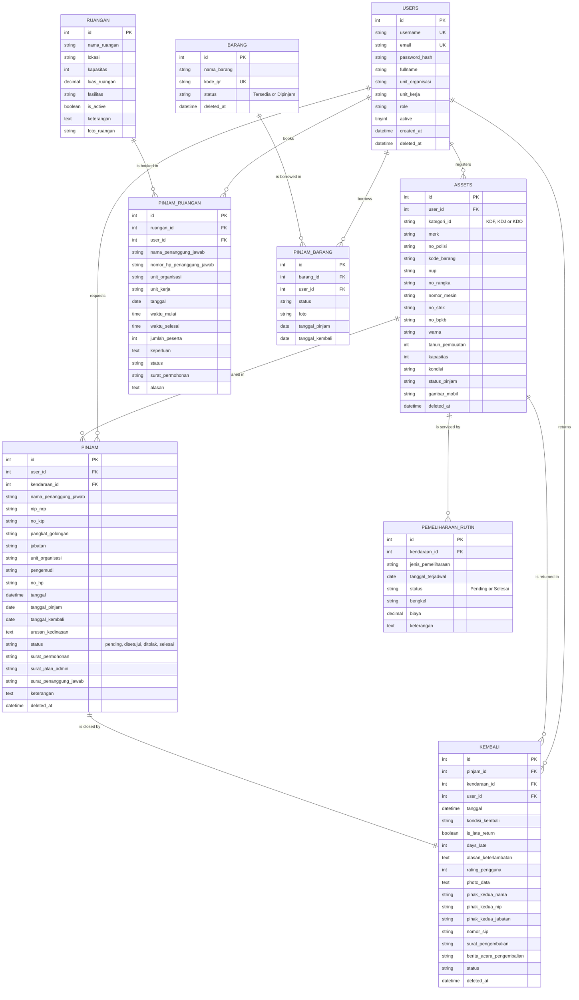

## 7.2 Authentication Subsystem (Myth:Auth — assumed schema)

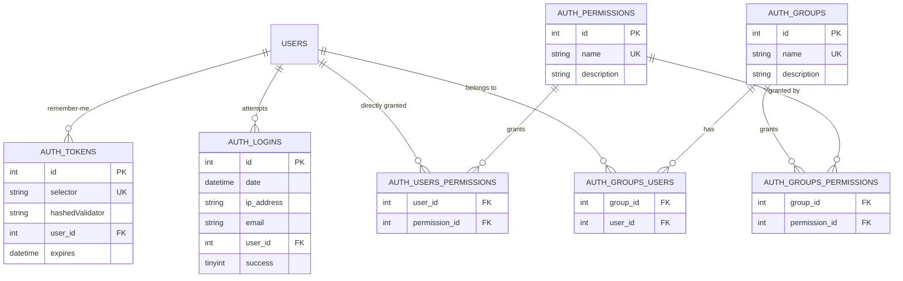

## 7.3 Proposed Target Model (for rebuild)

The current three-parallel-tables design does not extend. A polymorphic booking core would:

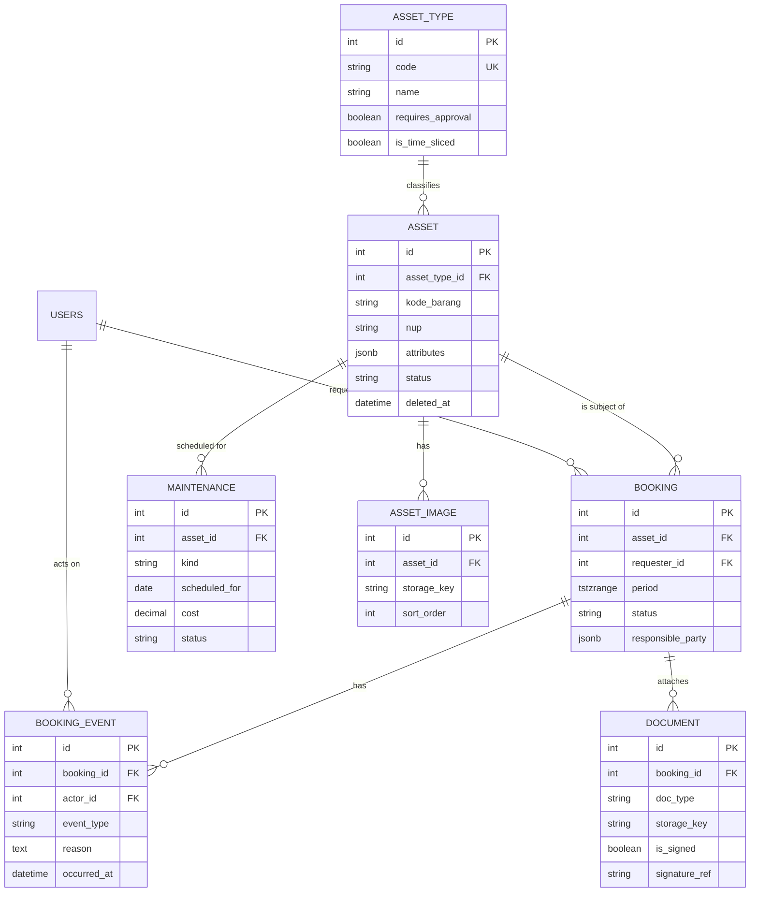

`BOOKING_EVENT` gives the immutable audit trail the current design lacks; `tstzrange` with a PostgreSQL exclusion constraint gives race-free double-booking prevention.

---

# 8. User Roles

## 8.1 What Is Actually Implemented

> **Observation**
>
> The session for the account I examined contained exactly:
> ```
> logged_in     27
> user_role     user
> redirect_url  https://manajemenaset.idampalada.com/mainpage
> _ci_previous_url  https://manajemenaset.idampalada.com/mainpage
> __ci_last_regenerate  1785461963
> ```
>
> The registration form ships a hidden `role` input with value `"user"`. `POST /admin/users/changerole` takes `{ user_id, role }`.

> **Observation**
>
> Myth:Auth's `GroupModel` and `PermissionModel` are loaded on every request, but authorisation decisions are keyed on the bespoke `user_role` session string, not on Myth:Auth groups.

> **Assumption**
>
> The role vocabulary is at minimum `{user, admin}`, and possibly `{user, admin, superadmin}`. **I could not enumerate the values** — the page that would show them (`/admin/daftar-pengguna`) is the one page correctly blocked for my session. Do not treat the role list below as authoritative.

## 8.2 Empirically Measured Access — role `user`

This table records **what I actually got back**, not what should happen.

| Route | Result for `user_role = user` |
|---|---|
| `/mainpage` | ✅ 200 |
| `/homepage` (vehicles, incl. Edit & Hapus buttons) | ✅ 200 |
| `/user/ruangan/*` (incl. "Pengaturan Ruangan — Admin Only" form in DOM) | ✅ 200 |
| `/user/barang/*` (incl. Import/Sync API and Reset Data) | ✅ 200 |
| `/user/scan`, `/user/profile`, `/user/riwayat` | ✅ 200 |
| **`/admin/dashboard`** | ⚠️ **200 — allowed** |
| **`/admin/daftar-aset`** + `/detail/{id}` | ⚠️ **200 — allowed** |
| **`/admin/riwayat`, `/kendaraan`, `/ruangan`, `/barang`** | ⚠️ **200 — allowed** |
| **`/admin/laporan/*`** (pemeliharaan, kerusakan, insiden, kepatuhan, penertiban, statistik-aset, riwayat-pemeliharaan) | ⚠️ **200 — allowed** |
| **`/admin/pemeliharaan-rutin/*`** incl. `get-kendaraan` | ⚠️ **200 — allowed** |
| `/admin/daftar-pengguna` | 🔒 redirect back |
| `/admin/users/pending` | 🔒 **403 Akses Ditolak** |

> **Observation**
>
> Of the ~15 `/admin/*` surfaces I touched with an ordinary `user` session, **only the two user-management routes were protected**. Everything else — the admin dashboard, the full asset register, all history, and all report modules — returned 200.

This is a **broken access control** finding of the first order, discussed further in [§15.3](#153-authorisation--the-primary-finding). It also means the RBAC matrix below is *design intent*, not *current behaviour*.

## 8.3 Inferred Role Model (design intent)

> **Assumption** — reconstructed from the feature set and UI labels. Not verified.

| Role | Description |
|---|---|
| **User / Pegawai** | Ministry staff. Browse assets, submit loan requests, book rooms, scan goods, view own history, edit own profile. |
| **Admin / Verifikator** | Approve/reject loans and returns, adjust booking times, generate and sign letters, manage the asset register, schedule maintenance, file damage/incident reports. |
| **Superadmin** | Everything an Admin can do, plus user management: role assignment, activation, deletion, activity log. |
| **Pimpinan (Management)** | *Speculative.* No evidence of a read-only management role; dashboards are reachable by everyone. Listed because it is a normal requirement for this class of system. |

## 8.4 Target RBAC Matrix (recommended)

Legend: **F** = full · **C** = create · **R** = read · **U** = update · **D** = delete · **A** = approve · **O** = own records only · **—** = no access

| Capability | User | Admin | Superadmin | Pimpinan |
|---|---|---|---|---|
| Browse vehicle catalogue | R | R | R | R |
| Create vehicle | — | C | C | — |
| Edit / delete vehicle | — | U D | U D | — |
| Submit vehicle loan request | C | C | C | — |
| Approve / reject loan | — | A | A | — |
| Submit vehicle return | O | C | C | — |
| Approve / reject return | — | A | A | — |
| Generate surat jalan / penanggung jawab | — | C | C | — |
| Apply electronic signature (TTE) | — | A | A | — |
| Vehicle location map | R | R | R | R |
| Browse rooms | R | R | R | R |
| Create room booking | C | C | C | — |
| Cancel booking | O | D | D | — |
| Approve / amend booking time | — | A U | A U | — |
| Manage rooms (Pengaturan Ruangan) | — | F | F | — |
| Scan QR / borrow goods | C | C | C | — |
| Verify goods borrow / return | — | A | A | — |
| BMN catalogue — view | R | R | R | R |
| BMN catalogue — Import/Sync API | — | C U | C U | — |
| **BMN catalogue — Reset Data** | — | — | **D** | — |
| Maintenance schedule | — | F | F | R |
| Damage / incident / compliance / enforcement | C (report) | F | F | R |
| Admin dashboard | — | R | R | R |
| Asset register (`/admin/daftar-aset`) | — | R | R | R |
| History (`/admin/riwayat/*`) | O | R | R | R |
| Reports & exports | — | R | R | R |
| User list / edit / activate | — | — | F | — |
| **Change user role** | — | — | **U** | — |
| Delete user | — | — | D | — |

> **Recommendation** — `Reset Data` and `Change user role` are the two capabilities that should require Superadmin **and** a second confirmation (re-authentication or a typed confirmation phrase), not a browser `confirm()`.

---

# 9. User Flow

## 9.1 Authentication

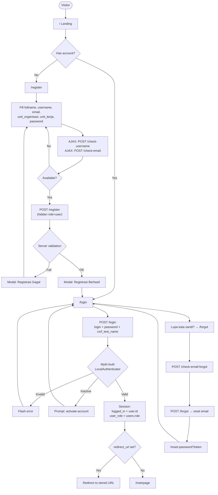

## 9.2 Vehicle Loan Request

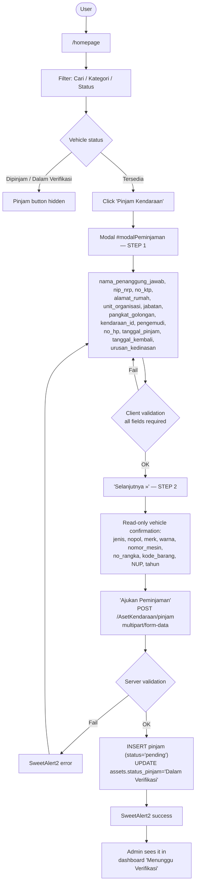

## 9.3 Approval / Verification

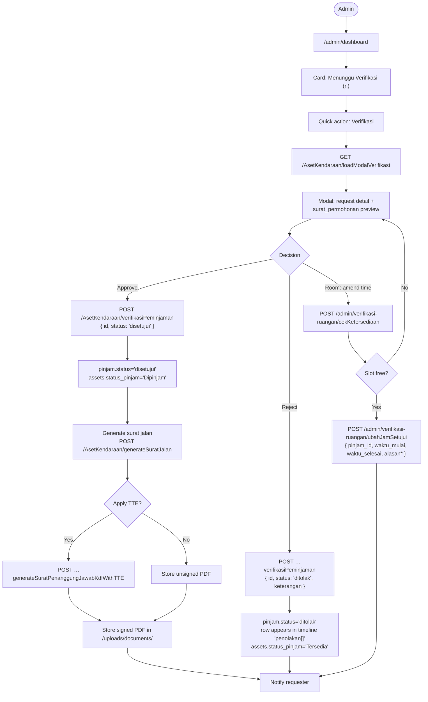

## 9.4 Vehicle Return

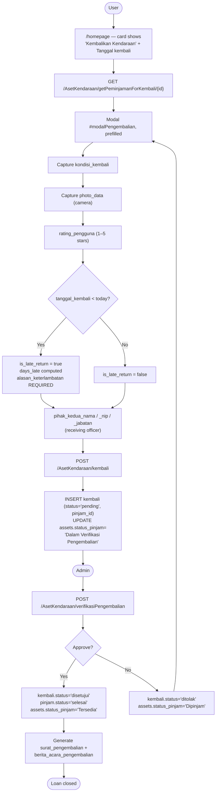

## 9.5 Room Booking

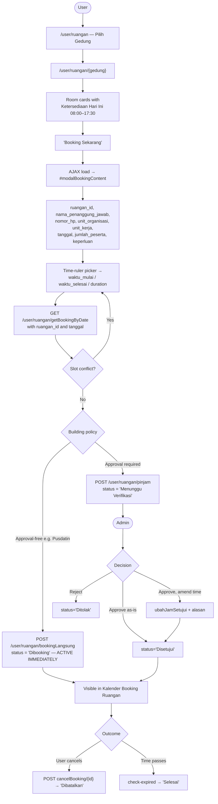

## 9.6 Goods Borrowing via QR

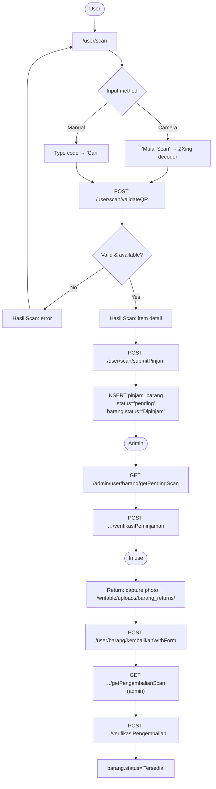

## 9.7 Maintenance Scheduling

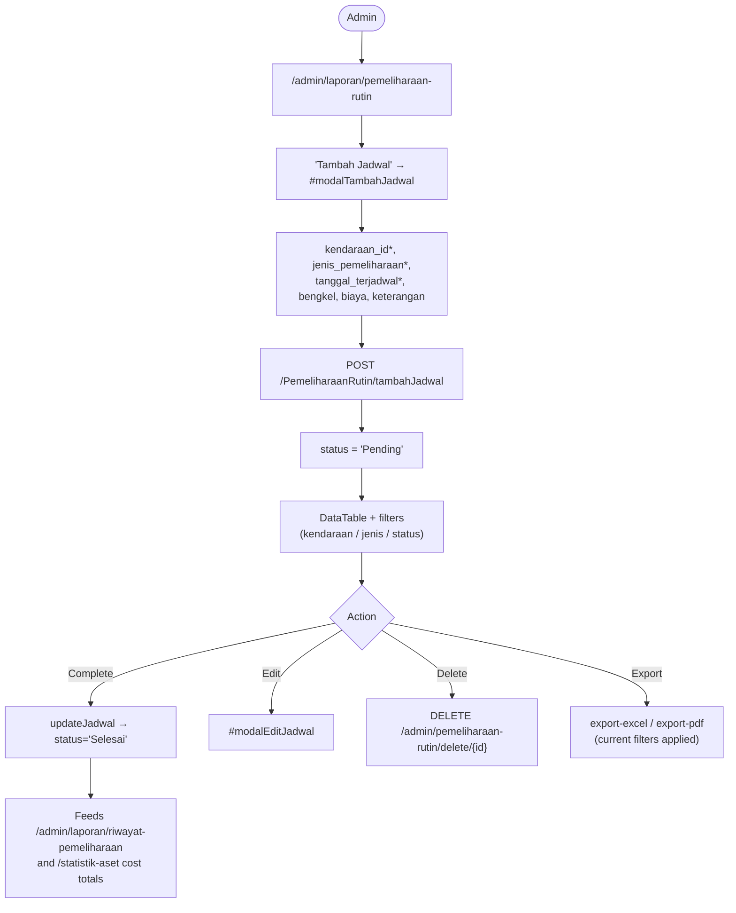

---

# 10. Business Process

## 10.1 Vehicle Procurement & Registration

> **Assumption**
>
> There is **no procurement module**. No routes, forms or tables relate to purchase requests, tender, contracts, supplier/vendor management, purchase price, acquisition value or depreciation. This is a significant scope gap relative to the "asset management system" framing on the landing page — the system manages *utilisation*, not *acquisition* or *valuation*.

Registration as implemented:

| Step | Actor | System action |
|---|---|---|
| 1 | Admin | Open `/homepage`, trigger the add-asset form |
| 2 | Admin | Enter `kategori_id`, `kode_barang`, `nup`, `merk`, `warna`, `tahun_pembuatan`, `kapasitas`, `no_polisi`, `nomor_mesin`, `no_rangka`, `no_stnk`, `no_bpkb`, `kondisi`; upload `gambar_mobil` |
| 3 | System | `POST /admin/AsetKendaraan/tambah` → INSERT with `status_pinjam = 'Tersedia'`, `user_id` = current admin |
| 4 | System | File stored to `/uploads/images/` with a `getRandomName()` filename |
| 5 | System | Asset appears in `/homepage`, `/admin/daftar-aset`, and all statistics |

> **Recommendation** — add `tanggal_perolehan`, `nilai_perolehan`, `sumber_dana`, `metode_penyusutan` and `masa_manfaat` if the register is ever to reconcile with SIMAK-BMN.

## 10.2 Vehicle Distribution (Loan)

Covered in [§9.2](#92-vehicle-loan-request) and [§9.3](#93-approval--verification). Process summary:

| # | Step | Actor | Artefact |
|---|---|---|---|
| 1 | Identify an available vehicle | User | — |
| 2 | Submit request with responsible officer identity | User | `pinjam` (pending) |
| 3 | Confirm vehicle identifiers (step 2 of wizard) | User | — |
| 4 | Asset locks to `Dalam Verifikasi` | System | `assets.status_pinjam` |
| 5 | Review request and supporting letter | Admin | — |
| 6 | Approve or reject | Admin | `pinjam.status` |
| 7 | Generate surat jalan / surat penanggung jawab | Admin | PDFs |
| 8 | Optionally apply electronic signature | Admin | Signed PDFs |
| 9 | Asset becomes `Dipinjam` | System | — |
| 10 | Notify requester | System | Email (`email_helper`) |

## 10.3 Vehicle Return & Handover

Covered in [§9.4](#94-vehicle-return). The distinguishing features are the **condition photograph**, the **two-party handover** (`pihak_kedua_*`), the **late-return quantification**, and the **user satisfaction rating**.

## 10.4 Room Booking Cycle

Covered in [§9.5](#95-room-booking). Two variants — approval-free and approval-required — as discussed in BR-R-01.

## 10.5 Goods Custody Cycle

Covered in [§9.6](#96-goods-borrowing-via-qr).

## 10.6 Maintenance Cycle

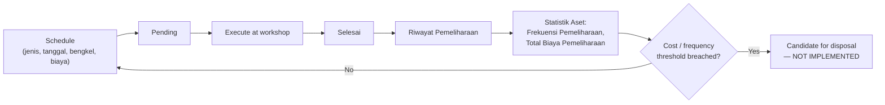

> **Observation** — no reminder mechanism exists for `tanggal_terjadwal`. The only scheduled job in the route table is `cron/check-overdue`, which concerns loans, not maintenance.

## 10.7 Damage, Incident & Enforcement Cycle

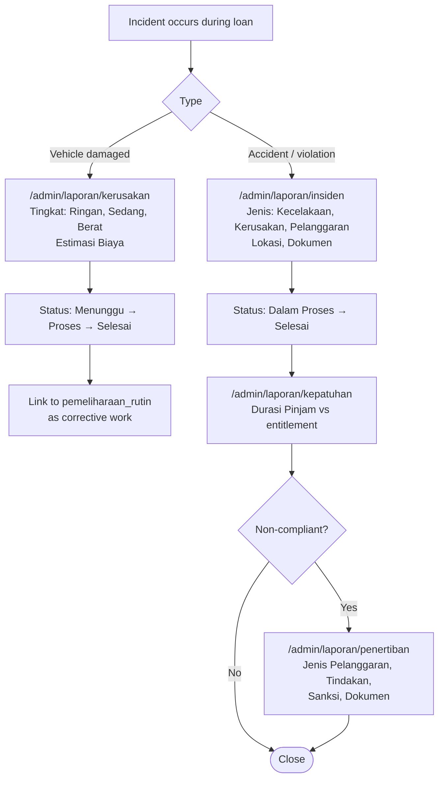

> **Observation** — this is a complete governance chain on paper (damage → incident → compliance → sanction). All four registers rendered empty, so none of it is in use yet.

## 10.8 Asset Mutation & Disposal

> **Observation**
>
> **Not implemented.** There are no routes, forms or fields for `mutasi` (transfer between units), `penghapusan` (write-off), `pemindahtanganan` (disposal/transfer of title), `hibah` (grant), `lelang` (auction), or revaluation. `Hapus` performs a soft delete of the record, which is not the same thing as a BMN disposal — a disposal requires an approval chain, a *Surat Keputusan*, and a corresponding SIMAN entry.

> **Recommendation** — a `mutasi_aset` table with `from_unit`, `to_unit`, `jenis_mutasi`, `nomor_sk`, `tanggal_sk`, `status`, and an approval chain, plus a disposal workflow, is the largest single functional gap.

## 10.9 Asset Audit / Stock-take

> **Observation**
>
> **Not implemented as a workflow.** The building blocks are present — QR scanning, condition fields, timeline history — but there is no `opname`/`inventarisasi` cycle: no audit period, no expected-vs-found reconciliation, no variance report, no sign-off.

> **Recommendation** — this is the highest-value feature to add next, because the QR infrastructure already exists. A stock-take module would reuse `/user/scan` almost unchanged.

## 10.10 Approval Cycle (generalised)

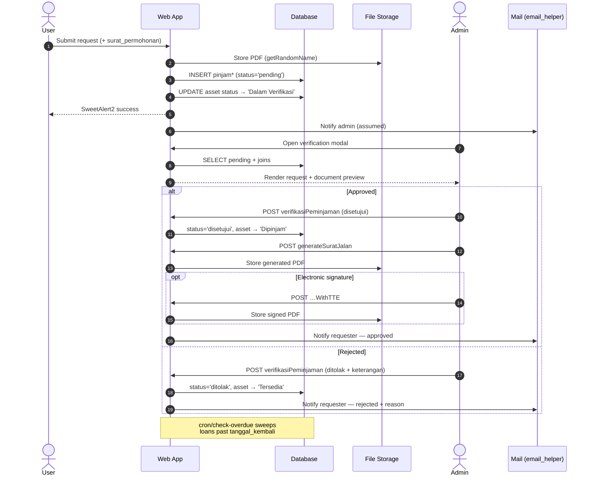

---

# 11. UI Components

## 11.1 Component Inventory

Every entry marked ✅ was seen rendered in the live application.

| Component | Present | Implementation | Notes |
|---|---|---|---|
| **Button** | ✅ | Bootstrap `.btn` + custom | Primary (navy `#1e3a5f`-ish), outline secondary, success green, danger red, icon+label |
| **Card** | ✅ | Bootstrap `.card` | Asset card, room card, statistic card, category tile, photo tile |
| **Statistic card** | ✅ | Custom | Two variants: value+icon (admin dashboard) and coloured panel with 4 sub-tiles and left accent bars (mainpage) |
| **Table** | ✅ | DataTables 1.11.5 / 1.13.6 + Responsive | Indonesian locale; sortable; searchable; page sizes |
| **Simple table** | ✅ | Plain `<table>` | `/admin/daftar-aset` — no DataTables, no pagination |
| **Modal** | ✅ | Bootstrap 5 modal | Confirmed: `#modalPeminjaman`, `#modalPengembalian`, `#modalEditAset`, `#imagePreviewModal`, `#trackingMapModal`, `#modalTimeline`, `#modalPinjamRuangan`, `#modalBookingRuangan`, `#modalDetailRuangan`, `#modalEditRuangan`, `#modalDetailBooking`, `#modalUbahJam`, `#modalTambahJadwal`, `#modalEditJadwal` |
| **Multi-step wizard** | ✅ | Custom in-modal | Vehicle loan: Step 1 → `Selanjutnya »` → Step 2 → `Ajukan Peminjaman` |
| **Form** | ✅ | Bootstrap floating labels (auth) / standard (app) | |
| **Toast / alert** | ✅ | SweetAlert2 v11 | Confirmation, loading (`Swal.showLoading()`), success with `timer: 1500`, error |
| **Dropdown** | ✅ | Bootstrap dropdown | Nav `History`, `Daftar`; `Urutkan Data` |
| **Select** | ✅ | Native `<select>` | No searchable-select library — a problem for the 18+ vehicle and 11-unit lists |
| **Date picker** | ✅ | Native `<input type="date">` | Renders `mm/dd/yyyy` — see §12.7 |
| **Time picker** | ✅ | **Custom time-ruler** | `assets/css/time-picker.css`, `#booking_time_ruler`, live duration display |
| **Search** | ✅ | Text input + DataTables search + GET `?search=` | Three different search mechanisms |
| **Filter bar** | ✅ | Native selects | Vehicles: Cari/Kategori/Status; Maintenance: 3 selects |
| **Pagination** | ✅ | DataTables (`Sebelumnya`/`Selanjutnya`) and custom numeric (`1 2 3`) | Two styles coexist |
| **Badge / pill** | ✅ | Bootstrap badge | Status pills with icons; `BOOKING`; date badge; `Beta Version 1.0` |
| **Tabs** | ✅ | Bootstrap nav-tabs | `Riwayat Peminjaman`\|`Riwayat Pengembalian`; `Booking Ruangan`\|`Daftar Booking Saya`\|`Pengaturan Ruangan` |
| **Breadcrumb** | ✅ | Custom | `Beranda / Mainpage`, `Beranda / Kendaraan` |
| **Accordion / collapse** | ✅ | Bootstrap collapse | Landing FAQ; `Pemberitahuan Booking Ruangan`; `Kalender Booking Ruangan` |
| **Charts** | ✅ | Chart.js + datalabels | Filled line charts with point markers and value labels |
| **Map** | ✅ | Leaflet 1.9.4 | `#trackingMapModal` "Peta Lokasi Kendaraan" |
| **File upload** | ✅ | `<input type="file">` | `gambar_mobil`, `foto_ruangan[]` (multiple, `accept="image/*"`) |
| **Image preview / lightbox** | ✅ | `image-preview.js` + `#imagePreviewModal` | |
| **Camera capture** | ✅ | `getUserMedia` (assumed) | Return condition photo (`photo_data`); QR scanner viewport |
| **QR scanner** | ✅ | ZXing | `/user/scan` |
| **QR generator** | ❌ | — | Codes are consumed but no generation UI was found — **see §22.4** |
| **Barcode** | ⚠️ | Page title says "Scan Barcode" but the UI and library are QR-only | |
| **Star rating** | ✅ | Custom radio group | `rating_pengguna` ×5 |
| **View toggle** | ✅ | Custom | Card ⇄ list on `/homepage` |
| **Calendar** | ✅ | `calendar-booking.js` | Collapsible booking calendar |
| **Timeline** | ✅ | `timeline-peminjaman.js` | Loan/return/rejection history per asset |
| **Stepper / progress** | ⚠️ | The wizard has steps but no visible progress indicator | |
| **Loading overlay** | ✅ | Registration `Loading...`; SweetAlert2 loading | Inconsistent — most pages have none |
| **Empty state** | ✅ | Custom per module | Good quality where present (see §11.2) |
| **Skeleton loader** | ❌ | — | Not used |
| **Notification centre** | ❌ | — | No bell, no inbox |
| **Toast queue** | ❌ | — | SweetAlert2 is modal, not stacked toasts |
| **Avatar** | ❌ | — | Username is plain text |
| **Dark mode toggle** | ❌ | — | See §12.8 |
| **Sidebar** | ❌ | — | Despite loading Mazer's sidebar CSS |

## 11.2 Empty States Observed (verbatim)

These are worth preserving; they are better written than most of the application.

| Location | Text |
|---|---|
| BMN leaf catalogue | *"Tidak ada data untuk kelompok ini. Silakan gunakan tombol 'Import/Sync API' untuk mengimpor data dari API Peralatan dan Mesin Non-TIK kategori 3.05 ke database."* |
| Scan result | *"Belum ada QR Code yang di-scan"* / *"Gunakan kamera atau masukkan kode secara manual"* |
| Scan history | *"Belum ada riwayat peminjaman"* |
| Maintenance table | *"Tidak ada data yang tersedia pada tabel ini"* + *"Menampilkan 0 sampai 0 dari 0 entri"* |
| Table cell, no value | `-` |
| Missing colour value | `Tidak Diketahui` |

## 11.3 Recommended Component Library (rebuild)

| Component | Recommendation |
|---|---|
| Base | shadcn/ui on Radix primitives (accessible by construction) |
| Table | TanStack Table + server-side pagination |
| Forms | React Hook Form + Zod, sharing the schema with the backend |
| Charts | Recharts or ECharts |
| Dialogs | Radix Dialog / AlertDialog (replaces SweetAlert2) |
| Toasts | Sonner (non-blocking, replaces modal alerts for non-destructive feedback) |
| Date/time | react-day-picker + a locale-aware time picker |
| Select | Combobox with search (essential once the fleet exceeds ~30 vehicles) |
| QR | `html5-qrcode` or ZXing **pinned and self-hosted** |
| Maps | MapLibre GL or Leaflet, self-hosted |
| Upload | Uppy or a custom dropzone with client-side resizing |

---

# 12. Design System

## 12.1 Brand

> **Observation** — assets: `assets/images/logoPU.png` (Kementerian PU wordmark, yellow/navy), `assets/images/LogoPUPR.png`, `assets/images/logo/mapuu.png` (SIMANSET logo), `assets/images/logo/siapmembangun.png` ("Sigap Membangun Negeri Untuk Rakyat"). The navbar shows a yellow/navy glyph with `KEMENTERIAN PEKERJAAN UMUM` in navy.

> **Observation — brand inconsistency**
>
> Three different names appear for the same system: **SIMANSET** (login title), **Sistem Manajemen Aset** (page banner), **Manajemen Aset** (landing `<title>`). Copyright lines disagree too: `© 2026` on login/register, `© 2024` in the app footer, undated on the landing page. Two ministry names are used — `Kementerian Pekerjaan Umum` and `Kementerian PUPR` — reflecting the 2024 ministry split.

## 12.2 Colour Palette

> **Assumption** — sampled from screenshots. These are approximations, not values read from a stylesheet.

| Token | Approx. | Usage |
|---|---|---|
| `--brand-navy` | `#1B2A4A` – `#243b6b` | Banners, primary buttons, headings |
| `--brand-yellow` | `#F5A800` | Logo mark |
| `--primary` | `#435ebe` | **Confirmed** — SweetAlert2 `confirmButtonColor: "#435ebe"` in `dashboard.js`. This is Mazer's primary |
| `--danger` | `#dc3545` | **Confirmed** — SweetAlert2 `cancelButtonColor: "#dc3545"` (Bootstrap danger) |
| `--success` | `#28a745`-ish | `Tersedia`, `Disetujui`, `Selesai` badges; Export Excel |
| `--warning` | `#ffc107`-ish | `Menunggu Verifikasi`, Barang accent |
| `--info` | `#17a2b8` / cyan | `Peminjaman Aktif`, `Dipinjam` |
| `--page-bg` | `#EEF4FF` | Very light blue application background |
| `--surface` | `#FFFFFF` | Cards |
| `--text-muted` | `#6c757d` | Labels |

**Semantic colour mapping (consistent across the app — a genuine strength):**

| Status | Colour |
|---|---|
| Tersedia / Disetujui / Selesai | Green |
| Dipinjam / Dibooking / Aktif | Blue / cyan |
| Dalam Verifikasi / Menunggu / Pending | Amber |
| Ditolak / Dibatalkan / Rusak | Red |

## 12.3 Typography

> **Observation** — `Nunito` weights 300, 400, 600, 700, 800 loaded from Google Fonts (`fonts.googleapis.com/css2?family=Nunito:wght@300;400;600;700;800&display=swap`); `fonts.gstatic.com/s/nunito/v32/…woff2` served. Nunito is Mazer's default typeface.

> **Assumption** — approximate scale from screenshots:

| Element | Size | Weight |
|---|---|---|
| Page banner title | ~40 px | 700 |
| Page heading (h1) | ~28–32 px | 700 |
| Section heading | ~20–24 px | 600–700 |
| Card title | ~18–20 px | 600 |
| Statistic value | ~28–32 px | 700 |
| Body | ~14–16 px | 400 |
| Label / caption | ~12–13 px | 400, muted |
| Table header | ~14 px | 600 |

`display=swap` is used — a small but correct performance choice.

## 12.4 Spacing & Grid

> **Assumption** — Bootstrap 5 defaults: 12-column grid, 1.5 rem gutters, `.container` with standard breakpoints (576/768/992/1200/1400 px).

| Observed pattern | Value |
|---|---|
| Card padding | ~24 px |
| Grid gap | ~24 px |
| Section vertical rhythm | ~32–48 px |
| Border radius (card) | ~12–16 px |
| Border radius (button) | ~8 px, room booking button fully rounded (pill) |
| Shadow | Soft, low-opacity, large blur |

**Observed grid behaviour:**

| Screen | Layout |
|---|---|
| Vehicle cards | 4 columns at ~1536 px |
| Statistic cards (admin) | 4 columns |
| Statistic panels (mainpage) | 3 columns |
| BMN category tiles | 4 columns, wrapping to 3 |
| Building tiles | 4 columns |
| Room cards | 3 columns |

## 12.5 Iconography

> **Observation** — three icon systems in parallel:
>
> 1. **Bootstrap Icons 1.11.3** (`bootstrap-icons.woff2`)
> 2. **Iconly Bold** (`assets/vendors/iconly/bold.css`) — Mazer's set
> 3. **Material Symbols ligatures** — the login page renders the literal text `visibility` for the password toggle, which is the Material Symbols convention
>
> Nav icons observed: house (Home), box (Barang), QR grid (Scan), car (Kendaraan), door (Ruangan), user circle (Profile), sliders (Dashboard), list (History), person (Daftar), logout arrow.

> **Observation** — the login page rendering the literal word `visibility` in extracted text indicates the Material Symbols font may not be loaded, in which case users see the word "visibility" instead of an eye icon. Worth verifying visually.

## 12.6 Layout Patterns

| Pattern | Where |
|---|---|
| Split-screen auth | `/login` — brand panel + form panel |
| Dark banner header | `/mainpage`, `/homepage` — title, subtitle, breadcrumb, right-aligned stats |
| Centred hub of tiles | `/user/barang`, `/user/ruangan`, `/admin/riwayat` |
| Filter bar above results | `/homepage`, `/admin/laporan/*` |
| Card grid | Vehicles, rooms, categories |
| Full-width data table | `/admin/daftar-aset`, maintenance |
| Modal-driven CRUD | Everywhere — no dedicated create/edit **pages** exist for vehicles or rooms |
| Collapsible secondary content | Room notifications, booking calendar |

> **Observation** — the application is entirely **modal-driven for writes**. There are no `/create` or `/edit` pages. This keeps context but makes deep-linking to a form impossible, harms back-button behaviour, and makes the vehicle loan wizard cramped.

## 12.7 Responsive Behaviour

> **Observation** — `<meta name="viewport" content="width=device-width, initial-scale=1.0">` is present on all pages. Bootstrap 5 responsive utilities and DataTables Responsive 2.2.9 are loaded, so tables should collapse columns on narrow screens.

> **Assumption** — I inspected at ~1536 × 674 only and did **not** test mobile widths. The following are risks, not findings:
> - The 11-item horizontal navbar will need a hamburger below ~992 px.
> - The custom time-ruler picker is likely difficult on touch.
> - `/admin/daftar-aset` has 9 columns and does **not** use DataTables Responsive.
> - The vehicle loan wizard is two-column and will need to stack.
> - Native `<input type="date">` renders `mm/dd/yyyy` — **US format despite `Locale: id`**. Indonesian users expect `dd/mm/yyyy`. This is a real defect: the browser's date input follows the OS locale, not the app locale, so a custom picker is needed.

## 12.8 Dark Mode

> **Observation** — **not supported.** No theme toggle, no `prefers-color-scheme` handling observed, no `data-bs-theme` attribute, no stored preference.

Mazer ships a dark theme, so the CSS foundation may partly exist unused.

## 12.9 Accessibility

> **Assumption** — not formally audited. Concerns visible from the markup:
>
> | Concern | Detail |
> |---|---|
> | Icon-only buttons | Several action buttons rely on icon + short label; `aria-label` not verified |
> | Colour-only status | Status is conveyed by badge colour **and** text — this is actually **done correctly** |
> | Form labels | Login uses floating labels (associated); the app forms use adjacent `<label>` without verified `for`/`id` pairing |
> | Modal focus trap | Bootstrap 5 handles this natively — likely fine |
> | Keyboard access | The custom time-ruler picker is the highest risk |
> | Contrast | White text on the navy banner is fine; muted grey labels on white may fail 4.5:1 |
| Language | `<html lang="en">` on **every page**, including the authenticated application, despite entirely Indonesian content — **observed**. Screen readers will use English pronunciation rules |
| Skip link | Not present |

---

# 13. API Design

## 13.1 Architectural Character

> **Observation**
>
> The route table contains **748 unique routes**: **546 GET**, **198 POST**, **3 DELETE**, **1 CLI**. There are **no PUT or PATCH routes**.

This is **not a REST API**. It is:

- **RPC over HTTP**, with the verb encoded in the path (`verifikasiPeminjaman`, `generateSuratJalan`, `changerole`, `ubahJamSetujui`).
- **Mixed-purpose**: most GET routes return HTML pages; a subset return JSON. There is no `/api` prefix and no content negotiation — the same controller decides based on the method name.
- **Not versioned.**
- **Session-authenticated**, not token-authenticated. There is no evidence of JWT, OAuth or API keys, which means no mobile client or third-party integration can consume it without cookie sharing.
- **Inconsistently cased**: `/AsetKendaraan/...`, `/admin/user/barang/...` and `/admin/User/Barang/...` all resolve.

Everything below marked **Observed** is taken verbatim from the application's own route table or from a request I actually issued. Request and response bodies are **inferred** unless explicitly shown as a verified payload in [§13.4](#134-verified-response-payloads).

## 13.2 Route Catalogue (observed)

### 13.2.1 Authentication — Myth:Auth

| Method | Route | Purpose |
|---|---|---|
| GET/POST | `/login` | Sign in |
| GET/POST | `/register` | Sign up |
| GET | `/logout` | Sign out |
| GET/POST | `/forgot` | Request password reset |
| GET/POST | `/reset-password` | Complete reset |
| GET | `/activate-account` | Activate |
| GET | `/resend-activate-account` | Resend activation |
| POST | `/check-username`, `/auth/check-username` | AJAX availability check |
| POST | `/check-email`, `/auth/check-email` | AJAX availability check |
| POST | `/check-email-forgot`, `/auth/check-email-forgot` | AJAX existence check |

### 13.2.2 Landing & Home

| Method | Route | Returns |
|---|---|---|
| GET | `/` | HTML — landing |
| GET | `/mainpage` | HTML — user home |
| GET | `/mainpage/status-kendaraan` | HTML/JSON |
| GET | `/mainpage/getStatistikKendaraanAPI` | **JSON — verified** |
| GET | `/mainpage/getStatistikRuanganAPI` | JSON |
| GET | `/mainpage/getStatusKendaraanAPI` | JSON |
| GET | `/mainpage/getStatusRuanganAPI` | JSON |
| GET | `/mainpage/getPeminjamanKendaraanAPI` | JSON |
| GET | `/mainpage/getPeminjamanRuanganAPI` | JSON |

### 13.2.3 Vehicles

| Method | Route | Purpose |
|---|---|---|
| GET | `/homepage` | HTML — catalogue |
| GET | `/user/homepage` | HTML |
| GET | `/AsetKendaraan/getKendaraan` | JSON list |
| GET | `/AsetKendaraan/getKendaraanDipinjam` | **JSON — verified** |
| GET | `/AsetKendaraan/getPeminjamanInfo` | JSON |
| GET | `/AsetKendaraan/getPeminjamanForKembali/{id}` | JSON — prefill return form |
| GET | `/AsetKendaraan/loadModalVerifikasi` | HTML fragment |
| GET | `/AsetKendaraan/checkFile/{path}` | File existence probe |
| GET | `/aset/get-timeline-data/{id}` | **JSON — verified** |
| GET | `/admin/AsetKendaraan/getAsetById/{id}` | JSON |
| GET | `/admin/daftar-aset` | HTML — register |
| GET | `/admin/daftar-aset/detail/{id}` | **JSON — verified** |
| GET | `/admin/aset/getDetail/{id}` | JSON |
| GET | `/tracking-api` | JSON — vehicle position |
| POST | `/AsetKendaraan/pinjam` | Submit loan (multipart) |
| POST | `/AsetKendaraan/kembali` | Submit return (multipart) |
| POST | `/AsetKendaraan/verifikasiPeminjaman` | Approve/reject loan |
| POST | `/AsetKendaraan/verifikasiPengembalian` | Approve/reject return |
| POST | `/admin/AsetKendaraan/tambah` | Create vehicle |
| POST | `/admin/AsetKendaraan/edit/{id}` | Update vehicle |
| POST | `/admin/AsetKendaraan/verifikasiPeminjaman` | Duplicate of above |
| POST | `/admin/AsetKendaraan/verifikasiPengembalian` | Duplicate of above |
| **DELETE** | `/admin/AsetKendaraan/delete/{id}` | Soft delete |

### 13.2.4 Letters & Electronic Signature

| Method | Route |
|---|---|
| POST | `/SuratJalan/generate` |
| POST | `/AsetKendaraan/generateSuratJalan` |
| POST | `/admin/AsetKendaraan/generateSuratJalan` |
| POST | `/AsetKendaraan/generateSuratPenanggungJawabKdf` |
| POST | `/admin/AsetKendaraan/generateSuratPenanggungJawabKdfWithTTE` |
| POST | `/admin/AsetKendaraan/uploadSuratJalan` |
| POST | `/admin/AsetKendaraan/updateSurat` |
| POST | `/admin/AsetKendaraan/updateSuratWithTTE` |
| POST | `/AsetKendaraan/getPeminjamanData`, `/admin/AsetKendaraan/getPeminjamanData` |

### 13.2.5 Rooms

| Method | Route | Purpose |
|---|---|---|
| GET | `/user/ruangan` | Building picker |
| GET | `/user/ruangan/{gedung}` | Room list |
| GET | `/user/ruangan/myBookings`, `/getDaftarBookingSaya` | My bookings |
| GET/POST | `/user/ruangan/getBookingByDate` | Slots for a date |
| GET | `/user/ruangan/checkAvailability`, `/checkBookingAvailability` | Availability |
| GET | `/user/ruangan/getPinjamHariIni[/{gedung}]` | Today's bookings |
| GET | `/user/ruangan/getUserLatestBookingData` | Prefill helper |
| GET | `/user/ruangan/check-expired` | Expiry sweep |
| GET | `/User/Ruangan/getBookingPublik[/{id}]` | Public calendar feed |
| GET | `/admin/ruangan/getDetail/{id}` | Room detail |
| GET | `/admin/User/Ruangan/detail/{id}` | Booking detail |
| GET | `/admin/verifikasi-ruangan/getDetailPeminjaman/{id}` | Booking detail |
| GET | `/admin/verifikasi-ruangan/getPeminjamanByRuangan/{id}` | Bookings per room |
| POST | `/user/ruangan/bookingLangsung` | **Immediate booking** |
| POST | `/user/ruangan/pinjam` | Booking requiring approval |
| POST | `/user/ruangan/requestConfirm` | Confirmation step |
| POST | `/user/ruangan/cancelBooking/{id}`, `/cancelPeminjaman/{id}` | Cancel |
| POST | `/Ruangan/tambah` | Create room |
| POST | `/admin/ruangan/edit/{id}` | Update room |
| POST | `/admin/ruangan/delete/{id}` | Delete room |
| POST | `/admin/ruangan/cancelBooking/{id}` | Admin cancel |
| POST | `/admin/verifikasi-ruangan/verifikasiPeminjaman` | Approve/reject |
| POST | `/admin/verifikasi-ruangan/verifikasiPengembalianRuangan` | Approve return |
| POST | `/admin/verifikasi-ruangan/cekKetersediaan` | Conflict check |
| POST | `/admin/verifikasi-ruangan/ubahJamSetujui` | **Approve with amended time** |
| POST | `/admin/User/Ruangan/verifikasiPeminjaman`, `/verifikasiPengembalian`, `/delete/{id}` | Legacy duplicates |
| POST | `/verifikasi-ruangan/{gedung}` | Per-building (binamarga, ciptakarya, sda, gedungg, heritage, auditorium) |

### 13.2.6 Goods & QR

| Method | Route |
|---|---|
| GET | `/user/barang` |
| GET | `/user/scan` |
| GET | `/user/scan/getMyHistory` |
| GET | `/admin/barang/pending` |
| GET | `/admin/user/barang/getPendingScan` |
| GET | `/admin/user/barang/getDipinjamScan` |
| GET | `/admin/user/barang/getPengembalianScan` |
| GET | `/admin/user/barang/getStatistikScan` |
| GET | `/admin/user/barang/getFoto/{filename}` |
| POST | `/user/scan/validateQR` |
| POST | `/user/scan/submitPinjam` |
| POST | `/user/barang/pinjam` |
| POST | `/user/barang/kembalikan`, `/kembalikanWithForm`, `/kembalikanById` |
| POST | `/admin/barang/tambah`, `/User/Barang/tambah` |
| POST | `/admin/barang/verifikasi[/{id}]` |
| POST | `/admin/user/barang/verifikasiPeminjaman`, `/verifikasiPengembalian` |
| POST | `/admin/User/Barang/verifikasiPeminjaman`, `/verifikasiPengembalian` |

### 13.2.7 BMN Catalogue (repeated per sub-group)

Pattern, applied across every leaf:

```
GET   /user/barang/{golongan}
GET   /user/barang/{golongan}/{bidang}
GET   /user/barang/{golongan}/{bidang}/kelompok{bidang}[/{sub}]
GET   /user/barang/…?search={q}
POST  /user/barang/{golongan}/{bidang}/tambah
POST  /user/barang/{golongan}/{bidang}/edit/{id}
POST  /user/barang/{golongan}/{bidang}/importFromApi
POST  /user/barang/{golongan}/{bidang}/importFromExcel     (komputer only)
POST  /user/barang/{golongan}/{bidang}/resetData
POST  /user/barang/{golongan}/{bidang}/debug-form           ← see note
```

Plus `/user/tanah`, `/user/tanah/kelompoktanah`, `POST /user/tanah/{tambah|importFromApi|resetData}`, and shortcut roots `/user/alatbesardarat`, `/user/alatbantu`, `/user/alatbesarapung`, `/user/alatangkutan`, `/user/komputerunit`, `/user/peralatankomputer`, `/user/asettakberwujud`.

> **Observation** — `POST …/debug-form` routes are registered in production. Debug scaffolding left in the routing table.

### 13.2.8 SIMAN Integration

> **Observation** — the full observed family:

| Route | Inferred purpose |
|---|---|
| `/siman-test` | Connectivity test |
| `/siman-stats` | Sync statistics |
| `/siman-schema` | Inspect upstream schema |
| `/siman-check-columns` | Compare local vs upstream columns |
| `/siman-create-columns` | **Create missing columns at runtime** |
| `/siman-skip-columns` | Exclusion list |
| `/siman-fix-columns` | Repair column definitions |
| `/siman-sync-all`, `/siman-sync/{group}` | Synchronise |
| `/siman-extract-all[/{group}]` | Bulk extract |
| `/siman-extract-batch[/{group}]` | Batched extract |
| `/siman-extract/{group}[/{page}]` | Paged extract |
| `/siman-auto-sync[/{group}]` | Scheduled sync |

> **Observation — these are all GET routes with no `/admin` prefix.** A route that creates or alters database columns should never be a GET, and should never be reachable without an explicit administrative guard. Whether a controller-level check exists is unverified, but the route definition alone is a red flag.

### 13.2.9 Dashboard, Users, Reports, Cron

| Method | Route |
|---|---|
| GET | `/admin/dashboard` |
| GET | `/admin/dashboard/getStatusKendaraanAPI` · `/getPengembalianAPI` · `/getPengembalianRuanganAPI` · `/getRoomUsageAPI` |
| GET | `/admin/dashboard/chart/{peminjaman\|pengembalian}[-bulanan\|-mingguan\|-harian]` |
| GET | `/admin/dashboard/chart/peminjaman-barang-{bulanan\|mingguan\|harian}` |
| GET | `/admin/users` · `/admin/users/edit/{id}` · `/admin/daftar-pengguna` · `/admin/users/getActivity/{id}` · `/admin/users/pending` |
| POST | `/admin/users/changerole` · `/deleteUser` · `/update/{id}` · `/activate` |
| GET | `/user/profile` · `/user/riwayat` · `/user/riwayat/detail/{type}/{id}` |
| POST | `/user/profile/update` |
| GET | `/admin/riwayat[/kendaraan\|/ruangan\|/barang]` |
| GET | `/admin/laporan` · `/get-laporan[/{id}]` · `/statistik` · `/pemeliharaan-rutin` · `/kerusakan` · `/riwayat-pemeliharaan` · `/kepatuhan` · `/insiden` · `/penertiban` · `/statistik-aset` · `/analisis` |
| **DELETE** | `/admin/laporan/delete/{id}` |
| GET | `/admin/pemeliharaan-rutin` · `/get-pemeliharaan[/{id}]` · `/get-kendaraan` · `/export-excel` · `/export-pdf` |
| POST | `/PemeliharaanRutin/tambahJadwal` |
| **DELETE** | `/admin/pemeliharaan-rutin/delete/{id}` |
| **CLI** | `cron/check-overdue` |
| GET | `/cron/check-overdue/{token}` · `/test-overdue` |

> **Observation** — `cron/check-overdue` is registered **both** as a CLI command and as an HTTP GET with a path parameter. **Assumption:** the parameter is a shared secret. If it is not, the job can be triggered by anyone.

## 13.3 Request Conventions

> **Observation**
>
> | Convention | Detail |
> |---|---|
> | CSRF | Hidden `csrf_test_name` on HTML forms; matching `csrf_cookie_name` cookie |
> | AJAX marker | `X-Requested-With: XMLHttpRequest` on `fetch()` calls |
> | Content types | `application/x-www-form-urlencoded` (plain forms), `multipart/form-data` (uploads), `application/json` (`changerole`) |
> | Auth | Cookie `ci_session` |
> | Query params | `?search=` (catalogue), `?ruangan_id=&tanggal=` (availability), `?v=<timestamp>` (asset cache-bust) |

> **Observation — CSRF gap**
>
> The `changerole` request in `dashboard.js` sends `Content-Type: application/json` and `X-Requested-With`, but **no CSRF token**. CodeIgniter's CSRF filter reads the token from POST data or the `X-CSRF-TOKEN` header; a raw JSON body provides neither. Either the CSRF filter excludes this route, or CSRF is globally disabled for JSON. Both are problems for a privilege-escalation endpoint. **I did not test this** — it must be verified in `app/Config/Filters.php`.

## 13.4 Verified Response Payloads

These four were captured live and are exact.

### `GET /admin/daftar-aset/detail/{id}` → 200
```json
{
  "success": true,
  "data": {
    "id": "1",
    "user_id": "1",
    "kategori_id": "KDF",
    "gambar_mobil": "1759826516_626e4e421e7df04280f7.jpg",
    "kode_barang": "A01",
    "merk": "Hiace",
    "tahun_pembuatan": "2020",
    "kapasitas": "7",
    "no_polisi": "B1234S",
    "no_rangka": "123123",
    "kondisi": "Baik",
    "status_pinjam": "Tersedia",
    "created_at": "2025-03-07 15:07:51",
    "updated_at": "2025-10-07 15:41:56",
    "deleted_at": null,
    "nup": null,
    "warna": null,
    "nomor_mesin": null,
    "no_stnk": null,
    "no_bpkb": null
  }
}
```

### `GET /mainpage/getStatistikKendaraanAPI` → 200
```json
[
  { "label": "2025-03", "jumlah": "2" },
  { "label": "2025-04", "jumlah": "4" },
  { "label": "2025-06", "jumlah": "1" },
  { "label": "2025-07", "jumlah": "2" },
  { "label": "2025-10", "jumlah": "6" },
  { "label": "2025-11", "jumlah": "4" },
  { "label": "2025-12", "jumlah": "5" },
  { "label": "2026-01", "jumlah": "2" },
  { "label": "2026-05", "jumlah": "1" },
  { "label": "2026-07", "jumlah": "1" }
]
```
Note: no envelope, and `jumlah` is a **string**.

### `GET /aset/get-timeline-data/{id}` → 200 (abridged)
```json
{
  "success": true,
  "asset": { "...": "full assets row" },
  "kendaraan_id": "15",
  "peminjaman": [
    {
      "id": "16", "user_id": "15", "username": "user4", "fullname": "user4",
      "nama_penanggung_jawab": "exe",
      "tanggal": "2025-04-25 15:08:30", "tanggal_formatted": "25/04/2025",
      "tanggal_pinjam": "2025-04-26", "tanggal_pinjam_formatted": "26/04/2025",
      "tanggal_kembali": "2025-04-27", "tanggal_kembali_formatted": "27/04/2025",
      "status": "selesai", "keterangan": "", "urusan_kedinasan": "sss",
      "surat_permohonan": "1745568510_b2317b74ad0342c281fb.pdf",
      "surat_jalan_admin": "1745568588_67c5ad5815f4c73e84a1.pdf",
      "surat_penanggung_jawab": "", "dokumen_tambahan": "",
      "kendaraan_nama": "Hiace", "kendaraan_id": "1", "is_returned": true
    }
  ],
  "pengembalian": [
    {
      "id": "5", "pinjam_id": "16", "user_id": "15",
      "status": "disetujui", "kondisi_kembali": "",
      "surat_pengembalian": "1745568697_669db7c8ddd8dca9fbe7.pdf",
      "berita_acara_pengembalian": "1745568705_e8ed73bbaccf86110026.pdf"
    }
  ],
  "penolakan": []
}
```

### `GET /admin/dashboard/getStatistikAPI` → **404** (referenced but not routed)
```json
{
  "title": "CodeIgniter\\Exceptions\\PageNotFoundException",
  "type": "CodeIgniter\\Exceptions\\PageNotFoundException",
  "code": 404,
  "message": "Controller method is not found: \"dashboard\"",
  "file": "C:\\xampp\\htdocs\\mapu\\vendor\\codeigniter4\\framework\\system\\CodeIgniter.php",
  "line": 981,
  "trace": [ "… full stack trace with absolute server paths …" ]
}
```

> **This is the error format for every failure in the system.** Class names, absolute Windows paths, framework version and a complete call stack are returned to any client. See [§15](#15-security-design).

## 13.5 Status Codes Observed

| Code | Where |
|---|---|
| 200 | Normal responses |
| 302 | Post-login redirect; unauthorised `redirect()->back()` |
| **403** | `/admin/users/pending` — "Akses Ditolak" |
| **404** | Unrouted paths — **with full stack trace** |
| **500** | `/admin` (`Undefined variable $total_kendaraan`), `/admin/laporan/analisis` — **with full stack trace** |
| **503** | `/js/dashboard_chart.js`, `/assets/js/letterhead-surat.js` |

## 13.6 Recommended API Design (rebuild)

```
Base: /api/v1
Auth: Bearer JWT (access 15 min + refresh 7 d) or session cookie for the SPA
Format: application/json; RFC 9457 problem+json for errors
```

| Method | Endpoint | Purpose |
|---|---|---|
| `GET` | `/api/v1/assets?type=vehicle&status=available&q=&page=&per_page=` | List (paged, filtered) |
| `POST` | `/api/v1/assets` | Create |
| `GET` | `/api/v1/assets/{id}` | Read |
| `PATCH` | `/api/v1/assets/{id}` | Partial update |
| `DELETE` | `/api/v1/assets/{id}` | Soft delete |
| `GET` | `/api/v1/assets/{id}/timeline` | History |
| `GET` | `/api/v1/assets/{id}/availability?from=&to=` | Availability |
| `POST` | `/api/v1/bookings` | Create booking/loan |
| `GET` | `/api/v1/bookings?status=&asset_type=&mine=true` | List |
| `POST` | `/api/v1/bookings/{id}/approve` | Approve (state transition as sub-resource) |
| `POST` | `/api/v1/bookings/{id}/reject` | Reject (requires `reason`) |
| `POST` | `/api/v1/bookings/{id}/reschedule` | Amend times (requires `reason`) |
| `POST` | `/api/v1/bookings/{id}/return` | Submit return |
| `POST` | `/api/v1/bookings/{id}/documents` | Attach document |
| `POST` | `/api/v1/documents/{id}/sign` | Apply TTE |
| `GET` | `/api/v1/maintenance?asset_id=&status=` | Maintenance list |
| `GET` | `/api/v1/reports/utilisation?from=&to=&granularity=month` | Reporting |
| `POST` | `/api/v1/integrations/siman/sync` | Trigger sync (**POST, admin-only, async job**) |

**Standard envelopes:**

```jsonc
// Success — collection
{
  "data": [ /* … */ ],
  "meta": { "page": 1, "per_page": 25, "total": 137, "total_pages": 6 }
}

// Success — single
{ "data": { /* … */ } }

// Error — RFC 9457
{
  "type": "https://simanset.pu.go.id/errors/validation",
  "title": "Validation failed",
  "status": 422,
  "detail": "One or more fields are invalid.",
  "instance": "/api/v1/bookings",
  "errors": {
    "tanggal_kembali": ["must be on or after tanggal_pinjam"],
    "no_ktp": ["must be exactly 16 digits"]
  }
}
```

| Code | Meaning |
|---|---|
| 200 / 201 / 204 | OK / Created / No content |
| 400 | Malformed request |
| 401 | Not authenticated |
| 403 | Authenticated but not permitted |
| 404 | Not found (**no stack trace**) |
| 409 | Conflict — e.g. room double-booking, asset already on loan |
| 422 | Validation failed |
| 429 | Rate limited |
| 500 | Server error — **opaque message + correlation ID only** |

---

# 14. Validation Rules

## 14.1 Evidence Base

> **Observation** — client-side rules are read from the HTML `required` attribute, input `type`, `accept` and the option lists. Server-side rules were **not** tested; I did not submit any form. Everything in the "Server (recommended)" columns is therefore a recommendation, not a description.

**A general finding:** the only client-side validation observed anywhere is native HTML5 `required` plus `type`. There are no `pattern`, `minlength`, `maxlength`, `min` or `max` attributes on any field I inspected — including the national ID number, the phone number and the date range.

## 14.2 Registration (`POST /register`)

| Field | Client (observed) | Server (recommended) |
|---|---|---|
| `fullname` | none | required, 3–150, letters/spaces/apostrophes |
| `username` | none | required, 3–50, `^[a-zA-Z0-9._-]+$`, unique |
| `email` | `type="email"` | required, valid, **unique**, **must end `@pu.go.id`** (stated in the T&C but not enforced in markup) |
| `unit_organisasi` | none | required, must be in the enum |
| `unit_kerja` | none | required, must belong to the chosen `unit_organisasi` |
| `password` | none | required, **min 8**, not in a common-password list, not equal to username/email |
| `pass_confirm` | none | required, `matches[password]` |
| `role` | hidden, `"user"` | **MUST be ignored server-side and forced to `user`** |

## 14.3 Login (`POST /login`)

| Field | Client | Server |
|---|---|---|
| `login` | `required` ✅ | required; resolve as email or username |
| `password` | `required` ✅ | required; **constant-time comparison; identical error for both failure modes** |
| `csrf_test_name` | hidden ✅ | required, valid |

## 14.4 Vehicle Loan (`POST /AsetKendaraan/pinjam`)

| Field | Client (observed) | Server (recommended) |
|---|---|---|
| `nama_penanggung_jawab` | `required` ✅ | required, 3–150 |
| `nip_nrp` | `required` ✅ | required, **18 digits** for NIP (`^\d{18}$`); NRP differs — validate by type |
| `no_ktp` | `required` ✅ | required, **exactly 16 digits** (`^\d{16}$`) |
| `alamat_rumah` | `required` ✅ | required, 10–500 |
| `unit_organisasi` | `required` ✅ | required, in enum |
| `jabatan` | `required` ✅ | required, in enum — **currently an empty select; see §4.2** |
| `pangkat_golongan` | `required` ✅ | required, in enum — **currently Golongan IV only** |
| `kendaraan_id` | `required` ✅ | required, exists, **`status_pinjam = 'Tersedia'`**, not soft-deleted |
| `pengemudi` | `required` ✅ | required, 3–150 |
| `no_hp` | `required` ✅ | required, Indonesian mobile `^(\+62\|62\|0)8[1-9][0-9]{6,10}$` |
| `tanggal_pinjam` | `required`, `type=date` ✅ | required, valid date, **≥ today** |
| `tanggal_kembali` | `required`, `type=date` ✅ | required, **> `tanggal_pinjam`**, ≤ `tanggal_pinjam` + max loan days |
| `urusan_kedinasan` | `required` ✅ | required, 10–1000 |
| — | — | **No overlapping approved loan for this vehicle in the requested range** |

## 14.5 Vehicle Return (`POST /AsetKendaraan/kembali`)

| Field | Client | Server (recommended) |
|---|---|---|
| `kendaraan_id` | hidden | required, exists, currently `Dipinjam` **by this user** |
| `kondisi_kembali` | not marked required | **required**, in {Baik, Rusak Ringan, Rusak Berat} |
| `photo_data` | not marked required | **required**, valid base64 image, ≤ 5 MB, MIME sniffed |
| `rating_pengguna` | radio ×5 | optional, integer 1–5 |
| `is_late_return` | hidden | **computed server-side, never trusted from the client** |
| `days_late` | hidden | **computed server-side** |
| `alasan_keterlambatan` | not marked required | **required if `is_late_return`**, 10–500 |
| `pihak_kedua_nama` | — | required |
| `pihak_kedua_nip` | — | required, 18 digits |
| `pihak_kedua_jabatan` | — | required |
| `nomor_sip` | — | optional |

> **Note** — `is_late_return` and `days_late` being client-submitted hidden fields is a design flaw: a user could suppress their own late flag. Recompute on the server unconditionally.

## 14.6 Vehicle Create / Edit

| Field | Client | Server (recommended) |
|---|---|---|
| `kategori_id` | — | required, in {KDF, KDJ, KDO} |
| `kode_barang` | — | required, **unique**, BMN format |
| `nup` | — | required, numeric, unique within `kode_barang` |
| `merk` | — | required, 2–100 |
| `no_polisi` | — | required, **unique**, normalised (`^[A-Z]{1,2}\s\d{1,4}\s[A-Z]{1,3}$`), whitespace collapsed |
| `nomor_mesin` | — | required, unique |
| `no_rangka` | — | required, **17 chars for VIN**, unique |
| `no_stnk` / `no_bpkb` | — | optional, alphanumeric |
| `tahun_pembuatan` | — | required, 1950 ≤ y ≤ current year + 1 |
| `kapasitas` | — | required, 1–100 |
| `warna` | — | optional, 2–30 |
| `kondisi` | — | required, in enum |
| `gambar_mobil` | file | optional; **MIME sniff**, ≤ 2 MB, jpg/png/webp, re-encode, strip EXIF, random filename |

## 14.7 Room Booking

| Field | Client | Server (recommended) |
|---|---|---|
| `ruangan_id` | — | required, exists, `is_active = 1` |
| `nama_penanggung_jawab` | — | required, 3–150 |
| `nomor_hp_penanggung_jawab` | — | required, ID mobile format |
| `unit_organisasi` / `unit_kerja` | — | required, in enum |
| `tanggal` | — | required, ≥ today, not a public holiday |
| `waktu_mulai` | — | required, ≥ 08:00 |
| `waktu_selesai` | — | required, **> `waktu_mulai`**, ≤ 17:30, min 30 min, max 8 h |
| `jumlah_peserta` | — | required, 1 ≤ n ≤ `ruangan.kapasitas` — **capacity check is essential and currently unverified** |
| `keperluan` | — | required, 5–500 |
| — | — | **No overlapping booking** — enforce with a DB constraint, not just `cekKetersediaan` |

## 14.8 Room Create / Edit

| Field | Client (observed) | Server |
|---|---|---|
| `nama_ruangan` | `required` ✅ | required, unique per `lokasi` |
| `lokasi` | `required` ✅ | required, in enum |
| `kapasitas` | `required`, `type=number` ✅ | required, 1–1000 |
| `luas_ruangan` | `type=number` | optional, > 0, ≤ 10000 |
| `is_active` | checkbox | boolean |
| `fasilitas[]` | checkboxes | each value in enum |
| `keterangan` | textarea | ≤ 1000 |
| `foto_ruangan[]` | `accept="image/*"` ✅ | ≤ 5 files, ≤ 2 MB each, MIME sniffed |

## 14.9 Admin Time Change

| Field | Client (observed) | Server |
|---|---|---|
| `pinjam_id` | hidden | required, exists, status pending/approved |
| `waktu_mulai` / `waktu_selesai` | hidden | required, valid, within operating hours |
| `alasan` | **`required` ✅** | required, 10–500 — **the only well-guarded custom field in the app** |

## 14.10 Maintenance Schedule

| Field | Client (observed) | Server |
|---|---|---|
| `kendaraan_id` | `required` ✅ | required, exists |
| `jenis_pemeliharaan` | `required` ✅ | required, in {Service Rutin, Ganti Oli, Tune Up} |
| `tanggal_terjadwal` | `required`, `type=date` ✅ | required, valid |
| `bengkel` | optional | ≤ 150 |
| `biaya` | `type=number` | ≥ 0, ≤ 999,999,999 |
| `keterangan` | optional | ≤ 1000 |

## 14.11 Profile Update

| Field | Client | Server |
|---|---|---|
| `id` | hidden | **must be ignored — always use the session user id** |
| `username` | — | required, unique **excluding self** |
| `email` | `type=email` | required, unique excluding self; **re-verify on change** |
| `fullname` | — | required, 3–150 |
| `unit_organisasi` / `unit_kerja` | — | required, in enum |

> **Note** — the hidden `id` field on a self-service profile form is an IDOR risk if the server trusts it. Not tested.

## 14.12 Cross-Cutting Rules

| # | Rule |
|---|---|
| VR-01 | Every uploaded file: MIME sniffed (not extension-trusted), size-capped, stored outside the web root, served through a controller that checks authorisation |
| VR-02 | All dates interpreted in `Asia/Jakarta`; store UTC, render local |
| VR-03 | All enums validated against a server-side allow-list, never from the submitted option |
| VR-04 | All numeric IDs checked for **ownership or role** before use, not merely existence |
| VR-05 | All free text escaped on output (CI4's `esc()`); rich text sanitised with an allow-list |
| VR-06 | Client-computed values (`is_late_return`, `days_late`, `id`, `role`) recomputed server-side |
| VR-07 | Booking conflict checks executed inside a transaction with row locking or a DB exclusion constraint |

---

# 15. Security Design

This section is deliberately direct. Several findings are serious, and softening them would not serve the reader.

**Scope note:** every finding below is based on *observation of responses the application volunteered* — reading pages, reading its own debug output, and issuing ordinary GET requests. **No exploitation was attempted, no data was modified, and no destructive endpoint was called.** Where a weakness is inferred rather than demonstrated, that is stated.

## 15.1 Severity Summary

| # | Finding | Severity | Status |
|---|---|---|---|
| S-01 | `CI_ENVIRONMENT = development` in production — debug toolbar, Kint, full stack traces, SQL, route table and file list publicly reachable | **Critical** | **Confirmed** |
| S-02 | Broken access control — `/admin/*` reachable with `user_role = user` | **Critical** | **Confirmed** |
| S-03 | Absolute server paths, framework versions and internal structure disclosed in error responses | **High** | **Confirmed** |
| S-04 | `writable/` reachable over HTTP → document root is the project root, not `public/` | **High** | **Confirmed** |
| S-05 | Production served by PHP's built-in dev server (`cli-server`) | **High** | **Confirmed** |
| S-06 | `role` is a client-controlled hidden field on registration | **High** | Confirmed present; server behaviour untested |
| S-07 | `POST /admin/users/changerole` sends no CSRF token | **High** | Confirmed in client code; filter config untested |
| S-08 | Destructive `resetData` guarded only by a browser `confirm()` | **High** | Confirmed client-side; server guard untested |
| S-09 | Content Security Policy disabled | **Medium** | **Confirmed** |
| S-10 | Third-party JS from CDNs, `@latest`, no SRI | **Medium** | **Confirmed** |
| S-11 | `siman-create-columns` / `siman-fix-columns` are unprefixed GET routes that alter schema | **Medium** | Confirmed as routes; guard untested |
| S-12 | `debug-form` routes registered in production | **Low** | **Confirmed** |
| S-13 | Auth library disclosed to anonymous users (page titled "Myth:Auth") | **Low** | **Confirmed** |

## 15.2 S-01 — Development Mode in Production

> **Observation**
>
> The debug toolbar reports `Environment: development`. From an ordinary browser session I was able to retrieve, without any special tooling:
>
> - The **complete route table** — 748 routes with controller and method names
> - The **executed SQL** for every request, including table and column names
> - The **loaded PHP file list** — all controllers, models, helpers, config classes
> - **Framework and language versions** — CI 4.5.5, PHP 8.2.12
> - The **absolute filesystem path** — `C:\xampp\htdocs\mapu\`
> - **Session contents** — including `logged_in` and `user_role`
> - **Request and response headers**, and the cookie table
> - **Kint** debug output on `/forgot`
> - A **`/__hot-reload`** endpoint
>
> Everything in §6 and §13 of this document was obtained this way. That is the point: an attacker gets the same map, for free, before writing a single payload.

**Remediation (immediate):**
```ini
# .env
CI_ENVIRONMENT = production
```
and confirm `app/Config/Toolbar.php` collectors are disabled and Kint is off.

## 15.3 S-02 — Authorisation, the Primary Finding

> **Observation** — with a session whose `user_role` is `user`, the following returned **HTTP 200 with full content**: `/admin/dashboard`, `/admin/daftar-aset`, `/admin/daftar-aset/detail/{id}`, `/admin/riwayat` and all three sub-pages, `/admin/laporan/pemeliharaan-rutin`, `/kerusakan`, `/insiden`, `/kepatuhan`, `/penertiban`, `/statistik-aset`, `/riwayat-pemeliharaan`, `/admin/pemeliharaan-rutin/get-kendaraan`.
>
> Only `/admin/daftar-pengguna` (redirect) and `/admin/users/pending` (403) were protected.
>
> Additionally, the `Edit` and `Hapus` buttons on every vehicle card, and the "Pengaturan Ruangan — **Admin Only**" form, are rendered in the DOM for a `user` session.

The pattern is clear: **authorisation was applied per-controller as an afterthought, not as a route filter.** Two controllers check; the rest do not.

I did not test whether the *write* endpoints (`/admin/AsetKendaraan/edit/{id}`, `resetData`, `changerole`) also lack checks — doing so would have modified data. **They must be assumed vulnerable until proven otherwise**, because the read endpoints in the same controllers are not protected.

**Remediation:**

```php
// app/Config/Filters.php
public array $filters = [
    'role:admin,superadmin' => ['before' => ['admin/*']],
    'role:superadmin'       => ['before' => [
        'admin/users/*',
        '*/resetData',
        'siman-*',
    ]],
];
```

Then: (a) migrate `user_role` onto Myth:Auth groups so there is one authorisation source; (b) hide UI controls the user cannot use — but never rely on hiding as the control; (c) add an authorisation integration test per admin route so this cannot regress.

## 15.4 S-03 / S-04 / S-05 — Deployment Hardening

| Finding | Evidence | Remediation |
|---|---|---|
| Stack traces | `/admin` → 500 exposing `app/Views/admin/index.php:25`; `/…/getStatistikAPI` → 404 with full trace | `CI_ENVIRONMENT=production`; custom 404/500 pages; log server-side with a correlation ID |
| `writable/` exposed | `scanbarang.js` reads `/writable/uploads/barang_returns/{foto}` | Set the web root to `public/`; move uploads outside the web root; serve via an authorising controller |
| Dev server | `PHP SAPI: cli-server` | Deploy behind Nginx/Apache + PHP-FPM (or containerise) |

## 15.5 Authentication

> **Observation** — Myth:Auth, which provides by default: bcrypt via `password_hash()`, remember-me tokens (`auth_tokens`), login-attempt logging (`auth_logins`), throttling (`auth_reset_attempts`, `auth_activation_attempts`), email activation, and password reset with expiring hashes.

Myth:Auth's defaults are sound. The risk here is configuration, not library choice.

| Control | Status | Note |
|---|---|---|
| Password hashing | ✅ bcrypt (library default) | Verify `$hashAlgorithm` / cost in `app/Config/Auth.php` |
| Minimum length | ❓ | Myth:Auth default is 8; **no `minlength` on the field** |
| Password strength checks | ❓ | Myth:Auth ships `NothingPersonalValidator`, `DictionaryValidator`, `PwnedValidator` — enable all three |
| Login throttling | ❓ | `auth_logins` exists; verify throttling is enabled |
| Remember me | ❓ | Not seen on the login form |
| 2FA / MFA | ❌ | Not supported by Myth:Auth |
| Session fixation | ✅ | `__ci_last_regenerate` present — CI4 regenerates the session ID |
| Session timeout | ❓ | Verify `Config\Session::$expiration` |
| Cookie flags | ❓ | **Verify `HttpOnly`, `Secure`, `SameSite=Lax` on `ci_session`** — not testable from JS if `HttpOnly` is set correctly |
| Account enumeration | ⚠️ | `POST /check-email` and `/check-username` are unauthenticated existence oracles — rate-limit them |

## 15.6 CSRF

> **Observation** — CI4's CSRF protection is active for HTML forms: every form carries `csrf_test_name`, and a `csrf_cookie_name` cookie is set (value observed: `baa400ece6c79d7263b52640feb85220`). Tokens differ per request, indicating regeneration is on.
>
> But `dashboard.js` posts JSON to `/admin/users/changerole` with **no token** in body or header.

**Remediation:** add `X-CSRF-TOKEN` to every `fetch()`:
```js
const token = document.querySelector('meta[name="csrf-token"]').content;
fetch(url, { headers: { 'X-CSRF-TOKEN': token, 'Content-Type': 'application/json' }, … });
```
and add `<meta name="csrf-token" content="<?= csrf_hash() ?>">` to the layout. **Verified absent:** no `csrf-token` meta tag exists on any page inspected, so there is currently no token available to client-side JavaScript at all.

## 15.7 Client-Trusted Data

Three fields are submitted by the client and would be dangerous if trusted:

| Field | Where | Risk |
|---|---|---|
| `role` (hidden, `"user"`) | `/register` | Privilege escalation |
| `id` (hidden) | `/user/profile/update` | IDOR — edit another user's profile |
| `is_late_return`, `days_late` | Vehicle return form | Evade late-return accountability |

None were tested. All three should be dropped server-side and derived from the session or recomputed.

## 15.8 Content Security & Supply Chain

> **Observation** — `Content Security Policy Enabled: No`. Scripts load from `cdn.jsdelivr.net`, `cdnjs.cloudflare.com`, `code.jquery.com`, `unpkg.com`, `cdn.datatables.net`, `cdn.tailwindcss.com`, `fonts.googleapis.com`. **No `integrity` attributes were observed on any of them.** `@zxing/library@latest` and `sweetalert2@11` are unpinned or loosely pinned.

Any of those origins publishing malicious code executes it in an authenticated ministry session. **Remediation:** self-host or pin exact versions with SRI hashes, and enable a CSP.

## 15.9 Input Validation & Injection

> **Observation** — CodeIgniter's Query Builder is in use (the captured SQL shows the builder's characteristic identifier escaping and `?`-style binding), which mitigates SQL injection for builder-constructed queries.

> **Assumption** — with 748 routes and evident schema churn (`siman-create-columns`), raw queries almost certainly exist somewhere. A source-code grep for `->query(`, `db->simpleQuery`, and string-concatenated SQL should be part of the remediation.

XSS: CI4 provides `esc()` but does not auto-escape. **Assumption:** given the coding style elsewhere, some outputs are unescaped. Given CSP is off, a stored XSS would be unmitigated.

## 15.10 Audit Logging

> **Observation** — no audit table was found. Myth:Auth's `auth_logins` records authentication attempts, but nothing records:
> - who approved or rejected which request, and when
> - who changed whose role
> - who triggered `resetData` or a SIMAN sync
> - who edited or soft-deleted an asset
>
> `deleted_at` records *that* something was deleted, not *by whom*.

For a government asset-custody system this is a compliance gap as much as a security one. **Remediation:** an append-only `audit_log` (`actor_id`, `action`, `entity_type`, `entity_id`, `before`, `after`, `ip`, `user_agent`, `occurred_at`), written for every state transition and every privileged action.

## 15.11 Rate Limiting

> **Observation** — no rate limiting was observed. CI4 ships a `throttler` service that does not appear to be in use.

Endpoints needing limits: `/login`, `/forgot`, `/check-email`, `/check-username`, `/check-email-forgot`, `/user/scan/validateQR`, all `siman-*`, and the export endpoints.

## 15.12 Data Protection

> **Observation** — the system stores **KTP numbers (national ID), NIP/NRP, home addresses, mobile numbers and photographs**. This is personal data under Indonesia's UU PDP No. 27/2022.

| Requirement | Status |
|---|---|
| Encryption in transit | ✅ HTTPS via Cloudflare |
| Encryption at rest | ❓ Not verifiable externally — **recommend column-level encryption for `no_ktp` and `alamat_rumah`** |
| Access logging for personal data | ❌ |
| Retention / erasure policy | ❌ |
| Data-subject rights | ❌ |
| Privacy notice | ⚠️ Present, but **written for a URL-shortening service** — legally ineffective |

## 15.13 Prioritised Remediation Plan

**Do first (hours):**
1. Set `CI_ENVIRONMENT=production` and confirm the toolbar, Kint and hot-reload are gone.
2. Add a `role` filter over `admin/*` and `siman-*` in `app/Config/Filters.php`.
3. Point the web root at `public/`.

**Do next (days):**
4. Move behind Nginx/Apache + PHP-FPM.
5. Force `role` server-side on registration; ignore the client `id` on profile update; recompute the late-return fields.
6. Add CSRF tokens to all JSON `fetch()` calls.
7. Enable rate limiting on auth and lookup endpoints.
8. Enable a Content Security Policy; pin and SRI-hash or self-host all third-party JS.

**Do after (weeks):**
9. Implement the `audit_log`.
10. Consolidate `user_role` into Myth:Auth groups; write an authorisation test per admin route.
11. Encrypt `no_ktp` and `alamat_rumah`; write a retention policy.
12. Replace the placeholder Terms & Privacy text.
13. Remove `debug-form` routes and the duplicate legacy verification routes.

---

# 16. File Storage

## 16.1 Observed Layout

| Path | Content | Evidence |
|---|---|---|
| `/uploads/images/{filename}` | Vehicle photographs | `dashboard.js`: `` `/uploads/images/${gambar}` `` |
| `/uploads/documents/{filename}` | Room booking request letters (PDF) | `daftar-booking.js`: `` `/uploads/documents/${booking.surat_permohonan}` `` |
| `/writable/uploads/barang_returns/{filename}` | Goods return photographs | `scanbarang.js` |
| `/assets/images/no-image.jpg` | Fallback placeholder | `dashboard.js` |
| `/assets/images/logo/*` | Brand assets | Login page |

> **Assumption** — vehicle loan documents (`surat_permohonan`, `surat_jalan_admin`, `surat_penanggung_jawab`, `surat_pengembalian`, `berita_acara_pengembalian`) are also stored under `/uploads/documents/`. Their filenames follow the same convention and `AsetKendaraan/checkFile/{path}` exists to probe for them, but I did not observe the serving URL.

## 16.2 Naming Convention

> **Observation** — filenames follow CodeIgniter's `UploadedFile::getRandomName()`: `<unix_timestamp>_<20 hex chars>.<ext>`.
>
> Verified examples: `1759826516_626e4e421e7df04280f7.jpg` · `1745204984_2c3f72bfe54d55a5caac.jpeg` · `1745568510_b2317b74ad0342c281fb.pdf` · `1745568705_e8ed73bbaccf86110026.pdf`

This is a reasonable choice: it prevents collisions and path traversal via the original name. It does **not** provide access control — the names are guessable within a time window if the hex portion leaks, and more importantly the files are served **statically**, so anyone with a URL can fetch them regardless of session.

## 16.3 Storage Model

> **Observation** — file references are stored as a **filename string in the owning row**, not in a files table:
>
> - `assets.gambar_mobil`
> - `pinjam.surat_permohonan`, `.surat_jalan_admin`, `.surat_penanggung_jawab`, `.dokumen_tambahan`
> - `kembali.surat_pengembalian`, `.berita_acara_pengembalian`
> - `ruangan.foto_ruangan`
> - `pinjam_ruangan.surat_permohonan`
> - `pinjam_barang.foto`

> **Observation — the format inconsistency again:** `gambar_mobil` holds either `"file.jpg"` or `"[\"file.jpg\"]"`. `foto_ruangan[]` and `dokumen_tambahan` are multi-valued and presumably JSON-encoded too.

## 16.4 Weaknesses

| # | Issue | Impact |
|---|---|---|
| F-01 | **Files served statically with no authorisation** | Any URL holder can read a KTP-bearing letter, a vehicle condition photo, or a signed document, with no session |
| F-02 | **`writable/` is web-reachable** | Confirms the web root is misconfigured; also exposes logs, cache and session files if they live there |
| F-03 | **No files table** | No metadata: no uploader, no upload time, no size, no MIME, no checksum, no version |
| F-04 | **Mixed encodings** | Every reader must sniff |
| F-05 | **No deduplication or virus scanning** | |
| F-06 | **No lifecycle policy** | Orphaned files accumulate after soft deletes |
| F-07 | **Local disk only** | No object storage, no CDN, no redundancy; backup is whatever backs up the Windows host |
| F-08 | **`checkFile` endpoint** | An existence oracle; if it accepts arbitrary paths it is a traversal risk (untested) |

## 16.5 Recommended Strategy

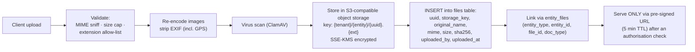

| Concern | Recommendation |
|---|---|
| Backend | MinIO (on-prem) or S3-compatible object storage |
| Access | **Never static.** Pre-signed URLs issued after an authorisation check |
| Encryption | SSE at rest; TLS in transit; consider client-side encryption for KTP-bearing documents |
| Metadata | Dedicated `files` + `entity_files` tables |
| Images | Re-encode to WebP, generate thumbnails, strip EXIF (GPS in a vehicle photo is a genuine privacy leak) |
| Documents | Preserve the original PDF byte-for-byte where a signature must remain valid; store a SHA-256 for integrity |
| Retention | Policy per document type; hard-delete on schedule; log every deletion |
| Quota | Per-user and per-entity caps |

---

# 17. Notification System

## 17.1 What Exists

| Channel | Status | Evidence |
|---|---|---|
| **In-page modal alerts** | ✅ Confirmed | SweetAlert2 v11 — confirmation, loading, success (`timer: 1500`), error |
| **Inline status badges** | ✅ Confirmed | Colour-coded status pills throughout |
| **Room booking notices** | ✅ Confirmed | 🔔 *"Pemberitahuan Booking Ruangan"* collapsible panel on `/user/ruangan/{gedung}` |
| **Registration modals** | ✅ Confirmed | *Registrasi Berhasil* / *Registrasi Gagal* |
| **Empty-state messaging** | ✅ Confirmed | See §11.2 |
| **Email** | ⚠️ Likely | `APPPATH/Helpers/email_helper.php` is loaded on every request; Myth:Auth requires email for activation and password reset |
| **Overdue detection** | ✅ Confirmed | `CLI cron/check-overdue` + `GET cron/check-overdue/{token}` + `test-overdue` |
| **In-app notification centre** | ❌ | No bell, no badge, no inbox, no `notifications` table |
| **Push (Web Push / FCM)** | ❌ | No service worker, no manifest observed |
| **SMS / WhatsApp** | ❌ | `no_hp` is collected but no gateway integration observed |
| **Maintenance reminders** | ❌ | `tanggal_terjadwal` exists but no scheduled reminder job |

## 17.2 Observed Alert Patterns

> **Observation** — from `dashboard.js`, the exact role-change interaction:
>
> ```js
> Swal.fire({
>   title: "Konfirmasi",
>   text: "Apakah Anda yakin ingin mengubah role pengguna ini?",
>   icon: "warning",
>   showCancelButton: true,
>   confirmButtonText: "Ya, Ubah",
>   cancelButtonText: "Batal",
>   confirmButtonColor: "#435ebe",
>   cancelButtonColor: "#dc3545",
> })
> ```
> followed by a loading dialog (`Swal.showLoading()`, `allowOutsideClick: false`) and, on success, `{ icon: "success", title: "Berhasil!", showConfirmButton: false, timer: 1500 }` then `window.location.reload()`.

A consistent, well-formed pattern — Indonesian labels, semantic icons, disabled dismissal during processing. The weakness is that **every** notification is a blocking modal; there is no non-blocking toast for low-severity feedback, and a full page reload after each action loses scroll position and filter state.

## 17.3 Notification Gaps by Workflow

| Event | Should notify | Currently |
|---|---|---|
| Loan request submitted | Admin | Only visible if the admin opens the dashboard |
| Loan approved | Requester | Assumed email; no in-app record |
| Loan rejected + reason | Requester | Assumed email |
| Surat jalan issued | Requester | None observed |
| Return due tomorrow | Borrower | **None** |
| Return overdue | Borrower + admin | `cron/check-overdue` runs; **delivery channel unverified** |
| Booking approved / time amended | Requester | None observed — and time amendment *must* be notified |
| Booking cancelled by admin | Requester | None observed |
| Goods borrow pending verification | Admin | Polling only |
| Maintenance due | Fleet officer | **None** |
| Damage report filed | Fleet officer | **None** |
| Role changed | Affected user | **None** |
| New user awaiting activation | Superadmin | `/admin/users/pending` exists; no push |

## 17.4 Recommended Design

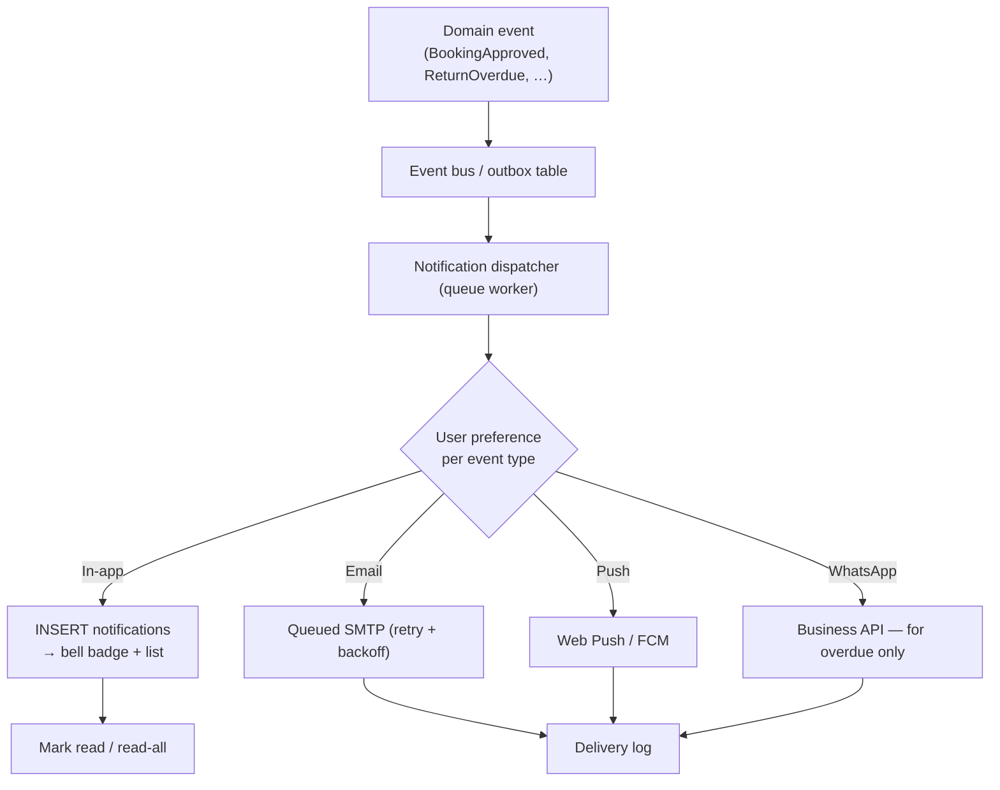

**Proposed `notifications` table:** `id`, `user_id`, `type`, `title`, `body`, `action_url`, `entity_type`, `entity_id`, `channel`, `read_at`, `sent_at`, `created_at`.

**Severity mapping:**

| Severity | UI |
|---|---|
| Success | Non-blocking toast, 3 s, auto-dismiss |
| Info | Toast + notification-centre entry |
| Warning | Toast + entry + email |
| Error | Modal with retry, entry, logged with correlation ID |
| Approval required | Entry + email + badge |
| Overdue | Entry + email + escalation to line manager after N days |

---

# 18. Reports

## 18.1 Implemented Reports

| Report | Route | Columns | Filters | Export |
|---|---|---|---|---|
| **Jadwal Pemeliharaan Rutin** | `/admin/laporan/pemeliharaan-rutin` | No, Kendaraan, Jenis Pemeliharaan, Tanggal Terjadwal, Status, Bengkel, Biaya, Aksi | Kendaraan, Jenis, Status, global search | **Excel + PDF** ✅ |
| **Riwayat Pemeliharaan** | `/admin/laporan/riwayat-pemeliharaan` | Tanggal, Kendaraan, Jenis, Deskripsi, Biaya, Bengkel, Status, Dokumen | Kendaraan, Jenis | Not observed |
| **Laporan Kerusakan** | `/admin/laporan/kerusakan` | No, Kendaraan, Jenis Kerusakan, Tingkat, Tanggal Lapor, Status, Estimasi Biaya, Aksi | Kendaraan, Tingkat, Status | Not observed |
| **Laporan Insiden** | `/admin/laporan/insiden` | Tanggal, Kendaraan, Jenis Insiden, Lokasi, Tingkat, Pengguna, Status, Dokumen, Aksi | Jenis, Tingkat, Status | Not observed |
| **Pemantauan Kepatuhan** | `/admin/laporan/kepatuhan` | Tanggal, Kendaraan, Pengguna, Durasi Pinjam, Status, Keterangan, Tindakan | Not observed | Not observed |
| **Tindakan Penertiban** | `/admin/laporan/penertiban` | Tanggal, Jenis Pelanggaran, Kendaraan, Pengguna, Tindakan, Sanksi, Status, Dokumen, Aksi | Not observed | Not observed |
| **Statistik Aset Kendaraan** | `/admin/laporan/statistik-aset` | Kendaraan, Total Peminjaman, Durasi Rata-rata, Frekuensi Pemeliharaan, Total Biaya Pemeliharaan, Status | Not observed | Not observed |
| **Riwayat Peminjaman/Pengembalian** | `/admin/riwayat/{kendaraan\|ruangan\|barang}` | See §5.12 | Tabs | Not observed |
| **Statistik** | `/admin/laporan/statistik` | Renders but returned no parseable content | — | — |
| **Analisis** | `/admin/laporan/analisis` | **HTTP 500** | — | — |

> **Observation** — of the ten report surfaces, one is broken (500), one renders empty, and **only maintenance has export buttons**. Every table I opened contained zero rows, so the reporting layer is built but unexercised.

## 18.2 Dashboard Analytics

Covered in §3.3. Summary:

| Element | Detail |
|---|---|
| Statistic cards | 12 on `/admin/dashboard`, 12 across 3 panels on `/mainpage` |
| Charts | 3 panels × 3 granularities (Bulanan / Mingguan / Harian) = 9 endpoints |
| Chart type | Chart.js filled line chart, point markers, `chartjs-plugin-datalabels` value labels |
| Trend charts (mainpage) | "Tren Peminjaman Kendaraan", "Tren Peminjaman Ruangan" |
| Data tables | Status Kendaraan (paged 1-2-3), Status Ruangan |

> **Observation — the statistics disagree across pages** (see §3.3). Any redesign should compute each metric once, in one place, and have all three consumers read the same value.

## 18.3 Export Capability

| Format | Status | Route |
|---|---|---|
| **Excel** | ✅ Confirmed | `GET /admin/pemeliharaan-rutin/export-excel` |
| **PDF** | ✅ Confirmed | `GET /admin/pemeliharaan-rutin/export-pdf` |
| **CSV** | ❌ Not observed | — |
| **Print stylesheet** | ❌ Not observed | — |

> **Observation** — `laporan.js` appends the active filter query string to the export URL (`${ROUTES.exportExcel}${searchParams}`), so exports respect the current filter. Good behaviour, and worth preserving.

> **Assumption** — PhpSpreadsheet and Dompdf/mPDF respectively. Not verified. Exports appear to be **synchronous**, which will time out on large datasets — particularly on the single-threaded `cli-server`.

## 18.4 Missing Reports

For a ministry asset system, the following are conspicuous by their absence:

| Report | Why it matters |
|---|---|
| **Laporan BMN / SIMAK-BMN reconciliation** | Statutory |
| **Asset valuation & depreciation** | Statutory; no `nilai_perolehan` field exists at all |
| **Utilisation rate per asset** | Justifies fleet size; the raw data exists |
| **Cost per kilometre / per loan** | Budgeting |
| **Idle asset report** | Identifies disposal candidates |
| **Booking rejection analysis** | Capacity planning; `penolakan[]` data already exists |
| **User activity report** | `/admin/users/getActivity/{id}` exists but the aggregate does not |
| **Late-return league table** | `is_late_return` / `days_late` are captured but never aggregated |
| **Room occupancy heatmap** | `getRoomUsageAPI` exists; no visualisation |
| **Satisfaction trend** | `rating_pengguna` is collected and, as far as I can see, never displayed anywhere |
| **Audit trail report** | No audit data exists |

> The last two are worth emphasising: the system **collects** a 5-star satisfaction rating on every vehicle return and **quantifies** every late return in days, then does nothing with either. That is free insight already sitting in the database.

## 18.5 Recommended Reporting Architecture

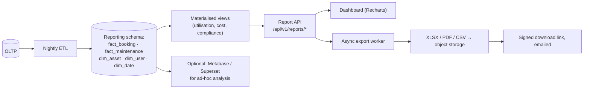

Key changes: **one** metric definition per measure; **asynchronous** exports with a download link (removes the timeout risk); scheduled report subscriptions; and a date dimension so "Tahun 2025" is never hardcoded again.

---

# 19. Non-functional Requirements

## 19.1 Performance

> **Observation** — measured from the debug toolbar and network capture:
>
> | Metric | Value |
> |---|---|
> | `/admin/daftar-aset` server time | **493.6 ms** |
> | Peak memory | **8.594 MB** |
> | PHP files loaded per request | **416** (195 reported in one panel, 416 unique across pages) |
> | Requests to render `/admin/dashboard` | **98** |
> | Queries on `/admin/daftar-aset` | 2 |
> | Queries on `/mainpage` | 17 |
> | Largest JS asset | `dashboard.js` — 92,718 bytes, unminified |

Roughly 500 ms of server time to render 18 rows is slow, and the 98-request page load is the main front-end cost. Notable contributors:

- **~18 JavaScript files loaded on every page**, regardless of whether the page uses them. `/user/scan` loads Leaflet; `/homepage` loads the QR scanner.
- **No minification, no bundling, no tree-shaking.**
- **Duplicate libraries** — two DataTables, two Bootstraps, two copies of `dashboard.js`.
- **The debug toolbar itself** adds cost to every request.
- **Single-threaded `cli-server`** serialises requests.

| Requirement | Target | Current |
|---|---|---|
| Page TTFB (p95) | < 300 ms | ~500 ms observed |
| Full page load (p95) | < 2 s | Unmeasured; 98 requests |
| API response (p95) | < 200 ms | Unmeasured |
| Concurrent users | 200+ | **Very low** — `cli-server` is single-threaded |
| JS payload | < 300 KB gzipped | > 500 KB uncompressed |
| DB queries per page | < 15 | 17 on `/mainpage` |

**Quick wins:** turn off the debug toolbar (production mode); load scripts per page; minify and bundle; drop duplicate libraries; enable HTTP/2 push or preload; add Cloudflare caching rules for `/assets/*`.

## 19.2 Availability

> **Observation** — no evidence of redundancy. Single Windows host, single PHP process, local filesystem, local database. Two assets already return **503**, indicating intermittent failure.

| Requirement | Target | Current |
|---|---|---|
| Uptime | 99.5% (office hours 07:00–18:00 WIB) | Unknown; single point of failure |
| RTO | < 4 h | Undefined |
| RPO | < 1 h | Undefined |
| Health endpoint | Required | None observed |
| Graceful degradation | Required | `mainpage.js` has an API-failure fallback comment — partial |

## 19.3 Scalability

Current data volumes are tiny — 18 vehicles, 18–19 rooms, 8 goods, ~27 users. But several design choices will not survive growth:

| Bottleneck | Trigger |
|---|---|
| `/admin/daftar-aset` renders all rows with no pagination | ~500 assets |
| `/homepage` ships all vehicles and filters client-side | ~200 vehicles |
| Synchronous Excel/PDF export | ~5,000 rows |
| Single-threaded web server | ~10 concurrent users |
| Local filesystem for uploads | Single host only; blocks horizontal scaling |
| Per-request statistics queries with no caching | Any dashboard traffic |
| SIMAN sync as a blocking HTTP request | Any real catalogue volume |

## 19.4 Maintainability

Honest assessment, based on what is externally visible:

| Aspect | Rating | Reasoning |
|---|---|---|
| Code organisation | ⚠️ Fair | Sensible `Controllers/{Admin,User}` structure, but duplicated routes and mixed casing |
| Route hygiene | ❌ Poor | 748 routes; the same action at 2–3 spellings; `debug-form` routes in production |
| Naming consistency | ❌ Poor | `no_rangka`/`nomor_rangka`; `assets` vs `kendaraan_id`; `/homepage` = vehicles |
| Frontend architecture | ❌ Poor | No build step; global script loading; two CSS frameworks; duplicate libraries |
| Data model | ⚠️ Fair | Reasonable core, but no polymorphism, dual encodings, heavy denormalisation |
| Test coverage | ❓ Unknown | No evidence either way from outside |
| Documentation | ❓ Unknown | — |
| Dead code | ❌ Poor | Two 503 assets, a 500 route, a 404 endpoint referenced by live JS, unlinked BMN tiles |
| Configuration | ❌ Poor | Development environment in production |

## 19.5 Accessibility

Covered in §12.9. **Target: WCAG 2.1 AA.** Current conformance is unassessed but unlikely to pass — `lang="en"` on every page despite Indonesian content, no skip link, a custom time picker of unknown keyboard accessibility, and unverified contrast on muted text. The one thing done well is that status is conveyed by text as well as colour.

## 19.6 Security

Covered in §15. Current posture is **inadequate for a production government system**, primarily because of the development-mode exposure and broken access control.

## 19.7 Responsiveness

Covered in §12.7. Bootstrap and DataTables Responsive are loaded, but mobile was not tested, and `/admin/daftar-aset` (9 columns, no responsive plugin) plus the custom time-ruler picker are the likely failure points. The `mm/dd/yyyy` date input is a confirmed localisation defect.

## 19.8 Logging & Observability

| Capability | Status |
|---|---|
| Application error logs | ⚠️ CI4 writes to `writable/logs/` — **which is web-reachable** |
| Structured logging | ❌ |
| Correlation IDs | ❌ |
| APM / tracing | ❌ |
| Uptime monitoring | ❌ |
| Business-metric monitoring | ❌ |
| Alerting | ❌ |
| Client analytics | ⚠️ Cloudflare Web Analytics beacon only |

## 19.9 Backup & Recovery

> **Observation** — no evidence available externally. Given a Windows/XAMPP host with local storage, **assume** file-copy backups at best.

| Requirement | Recommendation |
|---|---|
| DB backup | Nightly full + WAL/binlog continuous; 30-day retention |
| File backup | Object storage with versioning + cross-region replication |
| Restore testing | Quarterly, documented |
| Offsite | Mandatory |
| Encryption | At rest and in transit for all backups |

## 19.10 Compliance

| Framework | Relevance | Status |
|---|---|---|
| **UU PDP No. 27/2022** | KTP, NIP, address, photos are personal data | ⚠️ No retention policy; privacy notice is boilerplate from another system |
| **PP 27/2014 & PMK on BMN** | State asset management | ⚠️ Partial — no valuation, mutation or disposal |
| **Perpres 95/2018 (SPBE)** | E-government architecture | ⚠️ Partial — no interoperability layer, no formal security posture |
| **UU ITE / TTE (PP 71/2019)** | Electronic signatures must use a certified provider (BSrE) | ❓ Unverified |
| **SNI ISO/IEC 27001** | ISMS | ❌ Not evidenced |

---

# 20. Future Improvements

Ordered by value-to-effort, with an honest note on what already exists.

## 20.1 Priority 1 — Foundational (0–3 months)

| # | Improvement | Rationale | Effort |
|---|---|---|---|
| 1 | **Production hardening** — `CI_ENVIRONMENT=production`, web root to `public/`, real web server, role filter over `admin/*` | Nothing else matters until this is done | S |
| 2 | **Complete RBAC** | Currently a `user` can read the entire admin surface | M |
| 3 | **Audit trail** | No record of who approved, rejected, reset or changed a role | M |
| 4 | **Fix the broken surfaces** | `/admin` 500, `/admin/laporan/analisis` 500, `getStatistikAPI` 404, two 503 assets, unlinked BMN tiles 3.10–3.19 | S |
| 5 | **Reconcile the statistics** | Three pages report different totals for the same metric | S |
| 6 | **Replace the placeholder legal text** | The privacy policy describes a URL shortener | S |
| 7 | **Normalise `gambar_mobil`** | Two encodings in one column | S |
| 8 | **Fix the date input locale** | `mm/dd/yyyy` shown to Indonesian users | S |

## 20.2 Priority 2 — Feature Completion (3–9 months)

| # | Improvement | Note |
|---|---|---|
| 9 | **QR asset tracking, end to end** | Scanning **already exists** for goods. Extend to vehicles and rooms, and add a **QR generation and label-printing** module — currently codes are consumed but nothing generates them |
| 10 | **Barcode support** | The page is titled "Scan Barcode" but only QR is implemented; ZXing already supports Code128/EAN |
| 11 | **Stock-take / Inventarisasi (opname)** | Highest-value gap. The QR infrastructure exists; add audit period, expected-vs-found, variance report, sign-off |
| 12 | **Asset mutation & disposal** | `mutasi`, `penghapusan`, `hibah`, `lelang` with an SK-based approval chain |
| 13 | **Asset valuation & depreciation** | `nilai_perolehan`, `masa_manfaat`, `metode_penyusutan`, `nilai_buku` — required for BMN reporting and currently entirely absent |
| 14 | **Bulk import** | `importFromExcel` exists for `komputer` only; generalise with a template, dry-run preview, per-row error report |
| 15 | **Notification centre** | See §17.4 |
| 16 | **Maintenance reminders** | `tanggal_terjadwal` is stored but never triggers anything |
| 17 | **Use the data already collected** | Surface `rating_pengguna` and late-return statistics — both are captured and discarded |
| 18 | **Vehicle handover checklist** | Fuel level, odometer, tools, spare tyre, documents — the return form captures condition but not inventory |
| 19 | **Approval delegation** | Cover approver absence |
| 20 | **Room booking recurrence** | Weekly recurring meetings are a universal need |

## 20.3 Priority 3 — Platform (9–18 months)

| # | Improvement | Note |
|---|---|---|
| 21 | **Mobile app (PWA first)** | Field officers scan and photograph; a PWA reuses the web codebase and gets camera + install for free |
| 22 | **Offline sync** | IndexedDB queue + background sync for stock-take in basements and warehouses with no signal |
| 23 | **Real telematics** | `tracking-api` and the Leaflet modal exist; connect a GPS provider for live position, geofencing and trip logs |
| 24 | **RFID** | For high-volume goods where QR line-of-sight is impractical; bulk read at gates |
| 25 | **Workflow engine** | Configurable approval chains (BPMN-lite) instead of hardcoded two-step approval — necessary once units want different rules |
| 26 | **AI-assisted search** | Natural-language search over the asset register ("available 8-seat vehicles next Tuesday") using embeddings + structured filters |
| 27 | **Predictive maintenance** | Once `pemeliharaan_rutin` has history, predict failure from mileage, age, incident rate and cost curve |
| 28 | **Executive analytics** | Utilisation, cost per asset, idle assets, disposal candidates |
| 29 | **SIMAN two-way sync** | Currently pull-only, synchronous, and schema-mutating. Make it asynchronous, queued, idempotent and observable |
| 30 | **Public API + SSO** | OAuth2/OIDC against the ministry identity provider; API keys for downstream systems |

## 20.4 What Already Exists (do not rebuild)

Worth stating explicitly, because these are strengths:

| Capability | Status |
|---|---|
| QR scanning for goods | ✅ Working (ZXing) |
| Electronic signature scaffolding | ⚠️ Routes and JS exist; verify before rebuilding |
| Excel/PDF export with filter passthrough | ✅ Working for maintenance |
| Vehicle location map | ⚠️ Modal + Leaflet + `tracking-api` exist |
| Overdue detection job | ✅ Route exists |
| Approve-with-amended-time | ✅ Working, and a genuinely good design |
| Late-return quantification | ✅ Captured |
| User satisfaction rating | ✅ Captured (but unused) |
| Damage/incident/compliance/enforcement registers | ✅ Built, unused |
| BMN classification hierarchy | ✅ Correct and complete to bidang level |
| Semantic status colour system | ✅ Consistent across the app |
| Indonesian-language empty states | ✅ Well written |

---

# 21. Rebuild Recommendation

## 21.1 Should It Be Rebuilt?

A fair answer requires separating three things.

**The domain model is sound.** Three asset classes, a request→approve→use→return→verify lifecycle, statutory documentation, a BMN-aligned catalogue, and a governance chain from damage through to sanction. Whoever specified this understood the problem.

**The implementation is a prototype.** Development mode in production, a dev web server, 748 routes with duplicates, no build pipeline, two CSS frameworks, broken access control, no audit trail. The "Beta Version 1.0" badge is accurate.

**The data is small.** 18 vehicles, ~19 rooms, 8 goods, ~27 users, a few dozen transactions. Migration cost is negligible — which is exactly the argument for rebuilding now rather than later.

### Recommendation

| Option | Verdict |
|---|---|
| **A — Harden in place** | **Do this immediately regardless.** §15.13 items 1–3 are hours of work and remove the critical exposure. But CI4 + jQuery + no build step limits the ceiling. |
| **B — Incremental modernisation** | Keep CI4, add a build pipeline, consolidate routes, add filters and tests. Lowest risk, ~6–9 months, ends with a better version of the same architecture. Reasonable if the team is PHP-only. |
| **C — Full rebuild** ✅ | **Recommended.** Do A first as an emergency measure, then rebuild on a modern stack over 9–12 months with a strangler-fig migration. The data volume makes this cheap, and the domain is well understood enough to specify properly. |

## 21.2 Recommended Stack

| Layer | Recommendation | Why |
|---|---|---|
| **Frontend** | **Next.js 15 (App Router) + TypeScript** | SSR for fast first paint on ministry networks; React Server Components reduce client JS; strong ecosystem; large Indonesian talent pool |
| **UI** | **Tailwind CSS + shadcn/ui (Radix)** | Accessible primitives; one design vocabulary — the current split between Tailwind and Bootstrap disappears |
| **State** | **TanStack Query** (server state) + **Zustand** (UI state) | Caching, background refetch, optimistic updates; avoids Redux boilerplate |
| **Forms** | **React Hook Form + Zod** | The Zod schema is shared with the backend — one definition, both sides |
| **Backend** | **NestJS + TypeScript** ⭐ *or* **Laravel 11** | NestJS: one language across the stack, DI, first-class OpenAPI, queues. Laravel: keeps the team in PHP, mature ecosystem, Filament for admin. **Choose on team skills, not on technology fashion.** |
| **API** | **REST + OpenAPI 3.1**, versioned `/api/v1` | Generated clients and docs; tRPC if the frontend is the only consumer |
| **Database** | **PostgreSQL 16** | Native `tstzrange` + **exclusion constraints** solve room double-booking at the database level — the single strongest technical argument here. Also JSONB, full-text search, partitioning, row-level security |
| **ORM** | **Prisma** (NestJS) or **Eloquent** (Laravel) | Type-safe queries, versioned migrations |
| **Auth** | **Keycloak** or **Auth.js** + ministry SSO (OIDC) | Centralised identity, MFA, session management. Do not hand-roll |
| **Authorisation** | **CASL** or **Casbin** — policy-based, centrally defined | Prevents the current per-controller drift |
| **File storage** | **MinIO** (on-prem, S3-compatible) | Pre-signed URLs, versioning, encryption, replication |
| **Cache / Queue** | **Redis** + **BullMQ** | Sessions, statistics caching, async exports, SIMAN sync, notifications |
| **Search** | **PostgreSQL FTS** initially; **Meilisearch** if the catalogue grows | Avoid Elasticsearch complexity until justified |
| **PDF** | **Gotenberg** (Chromium in a container) | HTML templates → PDF; far easier to maintain than Dompdf |
| **Excel** | **ExcelJS** / **Laravel Excel** | Streaming for large exports |
| **QR** | **`html5-qrcode`** (scan) + **`qrcode`** (generate) | Self-hosted, pinned |
| **Maps** | **MapLibre GL** + self-hosted tiles | No vendor lock-in |
| **Email** | **Nodemailer/Symfony Mailer** + ministry SMTP; **MJML** templates | |
| **Deployment** | **Docker Compose** (small) or **Kubernetes** (if the ministry has a platform) | |
| **CI/CD** | **GitLab CI** or **GitHub Actions** | Lint → typecheck → unit → integration → e2e → build → scan → deploy |
| **Monitoring** | **OpenTelemetry** → **Grafana + Loki + Tempo + Prometheus**, **Sentry** | Distributed tracing, structured logs, error tracking |
| **Testing** | **Vitest** (unit) · **Supertest/Pest** (API) · **Playwright** (e2e) | **Minimum: one authorisation test per protected route** |

## 21.3 Target Architecture

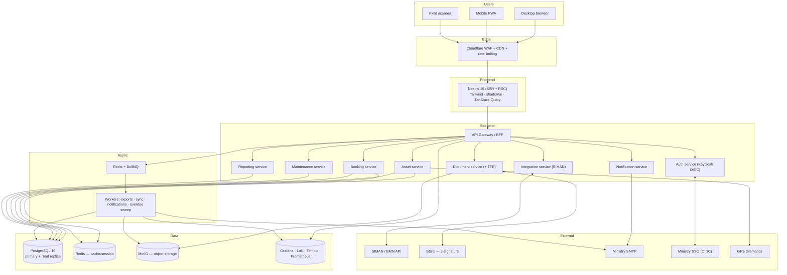

> **Note** — the service boxes are **bounded contexts**, not necessarily separate deployables. Start as a **modular monolith** with clear module boundaries. Extract services only when a specific scaling or ownership need appears. Premature microservices would be a serious mistake at this data volume.

## 21.4 The Double-Booking Argument for PostgreSQL

The current design prevents overlapping bookings with an application-level `cekKetersediaan` call, which is racy: two simultaneous requests can both pass the check and both insert. PostgreSQL solves this declaratively:

```sql
CREATE EXTENSION IF NOT EXISTS btree_gist;

CREATE TABLE booking (
  id           bigserial PRIMARY KEY,
  asset_id     bigint NOT NULL REFERENCES asset(id),
  requester_id bigint NOT NULL REFERENCES "user"(id),
  period       tstzrange NOT NULL,
  status       text NOT NULL,
  CONSTRAINT no_double_booking
    EXCLUDE USING gist (
      asset_id WITH =,
      period   WITH &&
    ) WHERE (status IN ('approved', 'active'))
);
```

The database now makes overlap **impossible**, regardless of concurrency or application bugs. This single constraint replaces the whole `cekKetersediaan` / `checkAvailability` / `checkBookingAvailability` family and removes an entire class of defect.

## 21.5 Migration Strategy — Strangler Fig

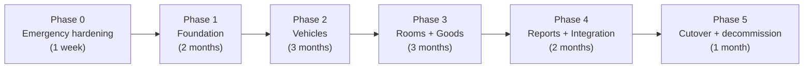

| Phase | Deliverables | Exit criteria |
|---|---|---|
| **0** | `CI_ENVIRONMENT=production`; role filter on `admin/*`; web root → `public/` | No debug output; admin routes 403 for `user` |
| **1** | Repo, CI/CD, PostgreSQL schema, Keycloak SSO, design system, OpenAPI spec, migration scripts | A user can log in to the new shell; old data imported to staging |
| **2** | Vehicle catalogue, loan, approval, return, documents, TTE. Reverse-proxy `/homepage` and `/AsetKendaraan/*` to the new app | Vehicle flows fully on the new stack; old routes redirect |
| **3** | Rooms (with the exclusion constraint) and goods with QR; PWA shell | Room and goods flows migrated |
| **4** | Reporting schema, async exports, notification centre, SIMAN sync as a queued job | All reports reproduce legacy figures ±0 |
| **5** | Data reconciliation, UAT, training, cutover, decommission | Legacy offline; 30-day rollback window |

## 21.6 Effort Estimate

> **This is a rough order of magnitude, not a quote.** It assumes a team of 1 tech lead, 2 backend, 2 frontend, 1 QA, 1 designer (part-time), and a product owner from the Ministry. Real effort depends heavily on how much of the TTE and SIMAN integration turns out to work.

| Phase | Duration | Person-months (approx.) |
|---|---|---|
| 0 — Hardening | 1 week | 0.5 |
| 1 — Foundation | 2 months | 8 |
| 2 — Vehicles | 3 months | 15 |
| 3 — Rooms + Goods | 3 months | 15 |
| 4 — Reports + Integration | 2 months | 8 |
| 5 — Cutover | 1 month | 4 |
| **Total** | **~11 months** | **~50 person-months** |

**Largest uncertainties, in order:** (1) whether TTE/BSrE integration exists and works; (2) the SIMAN API contract, which I could not see at all; (3) the true role vocabulary; (4) whether undocumented business rules live in controller code. Each could move the estimate materially.

## 21.7 If a Full Rebuild Is Not Approved

A pragmatic middle path, roughly 3 months:

1. Phase 0 hardening (non-negotiable).
2. Add **Vite** for asset bundling; remove duplicate libraries; split scripts per page.
3. Consolidate the duplicate routes; delete `debug-form` and legacy verification spellings.
4. Add a **route-filter-based RBAC** layer plus an authorisation test per admin route.
5. Add the **audit log** table and write to it on every state transition.
6. Add **PostgreSQL exclusion constraints** (or equivalent unique indexes) for booking overlap.
7. Normalise `gambar_mobil`; add unique constraints on `no_polisi` and `kode_barang`.
8. Move uploads out of the web root behind an authorising controller.
9. Fix the broken routes and reconcile the statistics.
10. Replace the placeholder legal text.

That retires the critical risk and most of the maintainability debt without changing the stack.

---

# 22. Appendix

## 22.1 Inferred Module Inventory

| # | Module | Status | Confidence |
|---|---|---|---|
| 1 | Authentication & Registration (Myth:Auth) | Working | Confirmed |
| 2 | Public landing / marketing | Working | Confirmed |
| 3 | User home dashboard (`/mainpage`) | Working | Confirmed |
| 4 | Admin dashboard | Working | Confirmed |
| 5 | Vehicle asset register | Working | Confirmed |
| 6 | Vehicle loan (peminjaman) | Working | Confirmed |
| 7 | Vehicle return (pengembalian) | Working | Confirmed |
| 8 | Loan/return verification | Working | Confirmed (routes + JS) |
| 9 | Vehicle timeline | Working | Confirmed (JSON) |
| 10 | Vehicle location map | Present | Confirmed (modal + route) |
| 11 | Official letter generation | Present | Confirmed (routes) |
| 12 | Electronic signature (TTE) | Present | Routes only — **unverified** |
| 13 | Room catalogue (8 buildings) | Working | Confirmed |
| 14 | Room booking | Working | Confirmed |
| 15 | Booking calendar | Present | Confirmed (JS) |
| 16 | Admin booking time change | Present | Confirmed (JS + routes) |
| 17 | Room management (Pengaturan Ruangan) | Working | Confirmed (form) |
| 18 | Goods QR scanning | Working | Confirmed |
| 19 | Goods borrow/return + verification | Present | Confirmed (routes) |
| 20 | BMN catalogue hierarchy | Partial | Confirmed — 3.10–3.19 unlinked |
| 21 | SIMAN synchronisation | Present | Confirmed (routes) — behaviour unverified |
| 22 | Excel import (komputer only) | Present | Confirmed (route) |
| 23 | Maintenance scheduling | Working, empty | Confirmed |
| 24 | Maintenance history | Present, empty | Confirmed |
| 25 | Damage register | Present, empty | Confirmed |
| 26 | Incident register | Present, empty | Confirmed |
| 27 | Compliance monitoring | Present, empty | Confirmed |
| 28 | Enforcement actions | Present, empty | Confirmed |
| 29 | Asset statistics report | Present, empty | Confirmed |
| 30 | Loan/return history (3 domains) | Working | Confirmed |
| 31 | User management | Present | **Blocked** for role `user` |
| 32 | Profile self-service | Working | Confirmed |
| 33 | Excel/PDF export | Working (maintenance) | Confirmed |
| 34 | Overdue detection cron | Present | Confirmed (route) |
| 35 | Email notification | Likely | `email_helper` loaded |
| 36 | Analysis report | **Broken (500)** | Confirmed |

## 22.2 Complete Assumption Register

Every inference in this document, gathered in one place, with its basis and how to verify it.

| # | Assumption | Basis | How to verify |
|---|---|---|---|
| A-01 | DBMS is PostgreSQL or SQLite, not MySQL | Double-quoted identifiers in captured SQL | Read `app/Config/Database.php` |
| A-02 | Myth:Auth tables (`auth_*`) exist | Library is confirmed; `GroupModel`/`PermissionModel` loaded | Inspect the schema |
| A-03 | `nip_nrp`, `no_ktp`, `alamat_rumah` etc. are columns on `pinjam` | Present on the submit form, absent from the timeline projection | Read migrations |
| A-04 | `photo_data` is a base64 camera capture | Field name; not a file input | Read the controller |
| A-05 | TTE = BSrE integration | Indonesian government convention; route naming | Read the TTE controller/config |
| A-06 | SIMAN = DJKN's national asset system | Route naming; the "API Non-TIK" help text | Read the integration config |
| A-07 | Admin theme is Mazer | Asset paths match Mazer exactly | Check `composer.json` / asset origin |
| A-08 | Excel export uses PhpSpreadsheet | De facto CI4 standard | `composer.json` |
| A-09 | PDF export uses Dompdf or mPDF | Common choices | `composer.json` |
| A-10 | Vehicle filtering is client-side | All rows shipped; counter reads "18 dari 18"; no XHR on filter | Read `homepage.js` |
| A-11 | Room `lokasi` has a lookup table | Edited via `<select>`, displayed as text | Read `RuanganModel` |
| A-12 | `fasilitas` is stored as JSON or a delimited string | Multi-select checkboxes; comma-rendered | Inspect the column |
| A-13 | Deployment is a dev build behind a Cloudflare tunnel | `cli-server` SAPI + public HTTPS + XAMPP | Ask the operator |
| A-14 | The role vocabulary includes `admin` and possibly `superadmin` | `changerole` endpoint; two protected routes | Read the users table |
| A-15 | Duplicate routes are legacy accretion | Two–three spellings per verification action | Read `Routes.php` |
| A-16 | Server ignores the client `role` field | Standard safe practice — **not verified** | Read the register controller |
| A-17 | `cron/check-overdue/{param}` is secret-guarded | Common pattern | Read the controller |
| A-18 | Room booking has two modes (direct vs approval) | Policy text contradicts the verification endpoints | Read `User\Ruangan` |
| A-19 | Loan documents live in `/uploads/documents/` | Same naming convention as room letters | Inspect the filesystem |
| A-20 | Exports are synchronous | No job queue evidence | Read the export controller |
| A-21 | "Kendaraan Dinamis" is a typo for "Kendaraan Dinas" | Domain terminology | Ask the product owner |
| A-22 | No formal test suite exists | No external evidence | Inspect the repository |
| A-23 | `KomputerModel` implies a `komputer` catalogue table | Model name + `importFromExcel` route | Inspect the schema |
| A-24 | Session cookies carry `HttpOnly`/`Secure`/`SameSite` | Not readable from JS if set correctly | Read `Config\Cookie` |

## 22.3 Possible Missing Pages

Reachable in principle but not inspected, or referenced but never rendered:

| Page / route | Note |
|---|---|
| `/admin/daftar-pengguna` | **Blocked** — the user register, the role list, and the activity log all live here |
| `/admin/users/edit/{id}` | Not inspected |
| `/admin/users/pending` | **403** |
| `/admin/users/getActivity/{id}` | Activity log format unknown |
| Vehicle **add** form | Route `POST /admin/AsetKendaraan/tambah` exists; the form was not located in the DOM |
| Room **add** form | `POST /Ruangan/tambah` |
| Goods **add** form | `POST /admin/barang/tambah` |
| `Verifikasi` modal contents | `loadModalVerifikasi` returns a fragment — never opened |
| `Dokumen` modal (borrowed vehicle) | Not opened |
| `Status` / Peta Lokasi modal | Not opened |
| `Timeline` modal rendering | JSON captured, UI not opened |
| `Daftar Booking Saya` tab | Not opened |
| `Kalender Booking Ruangan` | Not expanded |
| `Pemberitahuan Booking Ruangan` | Not expanded |
| `/admin/laporan/statistik` | Rendered no parseable content |
| `/admin/laporan/analisis` | **500** |
| `/user/riwayat/detail/{type}/{id}` | Not inspected |
| BMN 3.10–3.19 | Tiles render without links |
| `Tambah Laporan` / `Tambah Insiden` forms | Not opened |
| `/reset-password`, `/activate-account` | Myth:Auth defaults, not exercised |
| List view on `/homepage` | Toggle not exercised |

## 22.4 Unknown / Unverified Features

| Feature | What is unknown |
|---|---|
| **TTE / electronic signature** | Provider, protocol, certificate handling, whether it works at all. `letterhead-surat.js` returns 503 |
| **SIMAN integration** | Upstream host, authentication, payload, cadence, error handling, and what `siman-create-columns` actually alters |
| **Vehicle tracking** | Whether `tracking-api` returns live GPS, last-known position, or a stub. No coordinate column exists on `assets` |
| **QR generation** | The system consumes QR codes but no generator or label-printing UI was found. How do codes get onto physical items? |
| **Email delivery** | `email_helper` is loaded; which events actually send mail is unknown |
| **Overdue job** | What `cron/check-overdue` does on detection — notify, flag, escalate? |
| **Role vocabulary** | Only `user` confirmed |
| **Server-side validation** | No form was submitted; all server rules in §14 are recommendations |
| **`resetData` authorisation** | Client-side `confirm()` observed; server guard untested |
| **`changerole` CSRF** | No token in the client request; filter configuration untested |
| **Password policy** | Myth:Auth validators may or may not be enabled |
| **Session lifetime & cookie flags** | Not externally determinable |
| **Backup, DR, monitoring** | No external evidence |
| **Test coverage** | Unknown |
| **`jabatan` list** | The select is empty; populated by JS or genuinely broken |
| **Statistics discrepancy** | Which of the three totals is correct |

## 22.5 Verbatim Evidence Index

Key strings quoted exactly, for traceability.

| Evidence | Source |
|---|---|
| `CodeIgniter Version: 4.5.5`, `PHP Version: 8.2.12`, `PHP SAPI: cli-server`, `Environment: development`, `Timezone: Asia/Jakarta`, `Locale: id`, `Content Security Policy Enabled: No` | Debug toolbar → System Configuration |
| `C:\xampp\htdocs\mapu\vendor\codeigniter4\framework\system\CodeIgniter.php` | 404 exception payload |
| `Undefined variable $total_kendaraan` @ `app/Views/admin/index.php:25` | `/admin` → 500 |
| `VENDORPATH\myth\auth\src\Views\forgot.php` | `/forgot` DEBUG-VIEW comment |
| `csrf_test_name`, `csrf_cookie_name`, `ci_session` | Form markup + cookie table |
| `logged_in 27`, `user_role user` | Debug toolbar → Session User Data |
| `748 unique routes — 546 GET, 198 POST, 3 DELETE, 1 CLI` | Debug toolbar → Routes |
| `assets, barang, kembali, pemeliharaan_rutin, pinjam, pinjam_barang, pinjam_ruangan, ruangan, users` | Debug toolbar → Database |
| `493.6 ms   8.594 MB` | Debug toolbar header, `/admin/daftar-aset` |
| `"kategori_id": "KDF"`, `"deleted_at": null` | `/admin/daftar-aset/detail/1` |
| `"[\"1744076379_24851240572c5a9f0adc.jpg\"]"` | `/AsetKendaraan/getKendaraanDipinjam` |
| *"User dapat melakukan booking ruangan secara bebas tanpa perlu persetujuan admin."* | `/user/ruangan/pusdatin` |
| *"Import/Sync API: Mengambil data dari API Peralatan dan Mesin Non-TIK kategori 3.05"* | BMN leaf page |
| *"Syarat & Ketentuan Shortlink"* | `/register` modal |
| `name="role" value="user"` | `/register` markup |
| `Akses Ditolak` | `/admin/users/pending` → 403 |
| `503` on `/js/dashboard_chart.js`, `/assets/js/letterhead-surat.js` | Network capture |

## 22.6 Reverse-Engineering Method

For reproducibility and for the reader to judge the reliability of the above.

| Step | Technique |
|---|---|
| 1 | Fetched public pages (`/`, `/login`, `/register`) and read the markup |
| 2 | Fingerprinted the stack from form fields (`csrf_test_name` → CodeIgniter 4) and script tags |
| 3 | The account holder authenticated in their own browser; no credentials were seen or entered by me |
| 4 | Captured the accessibility tree and page text of every reachable page |
| 5 | Recorded network requests for a full page load (98 requests) to inventory libraries and XHR endpoints |
| 6 | Fetched and statically analysed all 18 application JS files, extracting endpoint literals and field names |
| 7 | Enumerated forms, modals and inputs via DOM inspection — including hidden and inactive ones |
| 8 | Issued **read-only** GET requests to JSON endpoints and recorded exact payloads |
| 9 | Read the application's own CodeIgniter Debug Toolbar for routes, SQL, loaded files, session and configuration |
| 10 | Probed route existence with GET requests and recorded status codes and redirects |
| 11 | Cross-checked every claim against at least one primary artefact before marking it **Observation** |

**Explicitly not done:** no form was submitted; no record was created, updated or deleted; no destructive endpoint (`resetData`, `deleteUser`, `changerole`, `delete/{id}`) was called; no authentication was bypassed; no injection, traversal or brute-force testing was performed; no personal data was extracted beyond what the pages rendered. Sample data quoted in this document comes from what the user identified as a **staging/demo dataset**.

## 22.7 Immediate Actions for the Owner

If only three things are done as a result of this document:

1. **Set `CI_ENVIRONMENT = production`.** Everything in §6 and §13 was obtained because it is not. This is a one-line change.
2. **Add a role filter over `admin/*`.** An ordinary user can currently read the admin dashboard, the full asset register, all history and all reports.
3. **Move the web root to `public/`.** `writable/` — logs, cache, uploads — is currently served over HTTP.

---

## Document Control

| Field | Value |
|---|---|
| Author | Reverse-engineering analysis |
| Version | 1.0 |
| Date | 31 July 2026 |
| Target system | SIMANSET — `https://manajemenaset.idampalada.com/` |
| System version at time of analysis | CodeIgniter 4.5.5 / PHP 8.2.12 / "Beta Version 1.0" |
| Access level | Authenticated, `user_role = user` |
| Method | Non-destructive black-box + grey-box observation |
| Classification | **Internal — contains security findings.** Handle accordingly |
| Status | Draft for review |

### Reliability Statement

Sections 1–5, 11–13 and 15 are predominantly **observation** and can be relied upon. Section 6 is observation for `assets`, `pinjam` and `kembali`, and inference elsewhere. Sections 14 and 17–21 are predominantly **recommendation** and represent professional judgement rather than description of the current system. Section 22.2 lists every assumption with a verification route.

No claim in this document should be taken as a substitute for reading the source code. Where the two disagree, the source code is correct.
